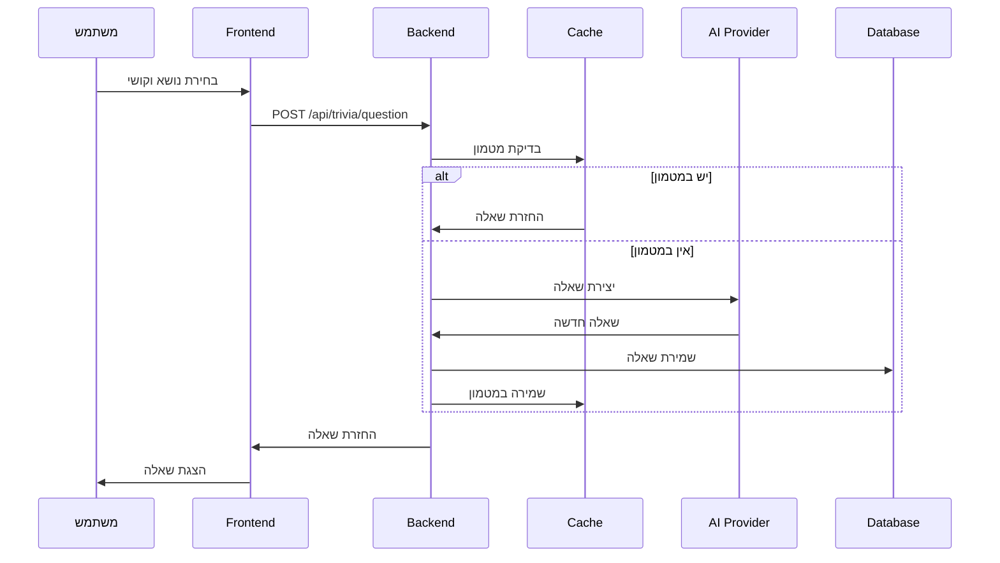
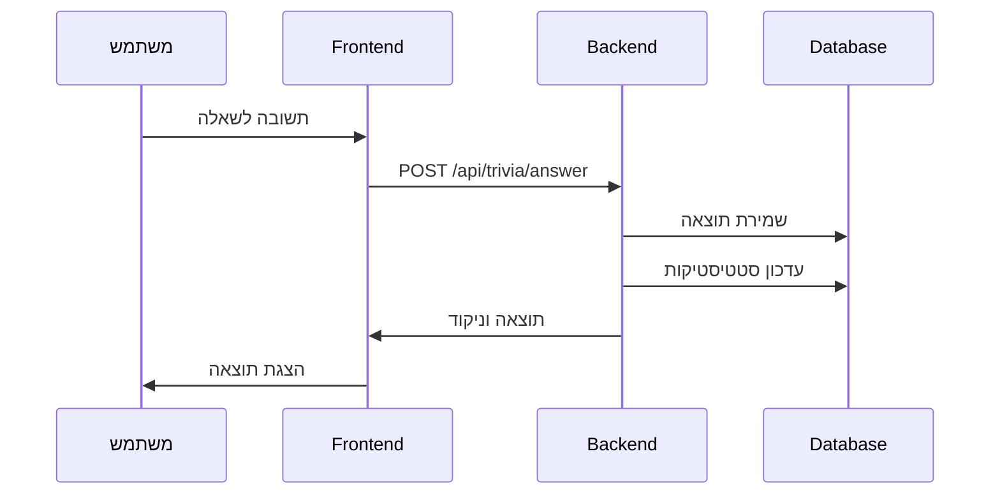

# EveryTriv - ארכיטקטורה כללית

## סקירה כללית

EveryTriv הוא פלטפורמת טריוויה חכמה המבוססת על AI עם ארכיטקטורה מודרנית של Frontend ו-Backend נפרדים. המערכת משלבת טכנולוגיות מתקדמות ליצירת חוויית משחק מרתקת ואינטראקטיבית.

> **הערת סנכרון תרשימים**: חלק מהמודולים המופיעים בדיאגרמות מוצגים כגבולות נפרדים לצרכי הבהרה אך ממומשים ממוזגים בפועל. לפרטים מלאים ראו: [סנכרון תרשימים ↔ קוד](./DIAGRAMS.md#diagram-sync-status), [זרימת ליבת NestJS](./DIAGRAMS.md#nestjs-core-flow), [מפת תלות Shared](./DIAGRAMS.md#shared-deps-map).

## Stack טכנולוגי

### Frontend
- **React 18** - ספריית UI מודרנית עם Hooks
- **TypeScript** - טיפוסים חזקים ובטיחות קוד
- **Redux Toolkit** - ניהול מצב גלובלי
- **Tailwind CSS** - מערכת עיצוב utility-first
- **Vite** - כלי בנייה מהיר
- **React Router** - ניווט בין דפים

### Backend
- **NestJS** - מסגרת Node.js מודולרית
- **TypeScript** - טיפוסים חזקים
- **TypeORM** - ORM למסד נתונים
- **PostgreSQL** - מסד נתונים יחסי
- **Redis** - מטמון וניהול session

### AI ו-Infrastructure
- **OpenAI GPT-4** - ייצור שאלות איכותיות
- **Anthropic Claude** - שאלות מורכבות
- **Google AI Gemini** - גיוון בשאלות
- **Docker** - containerization
- **Docker Compose** - אורכיסטרציה

## מבנה הפרויקט

```
EveryTriv/
├── client/                    # React Frontend
│   ├── src/
│   │   ├── views/            # דפי האפליקציה
│   │   │   ├── admin/        # דף מנהל
│   │   │   ├── analytics/    # דף אנליטיקה
│   │   │   ├── gameHistory/  # היסטוריית משחקים
│   │   │   ├── home/         # דף הבית והמשחק
│   │   │   ├── leaderboard/  # לוח תוצאות
│   │   │   ├── login/        # דף התחברות
│   │   │   ├── payment/      # תשלומים
│   │   │   ├── registration/ # דף רישום
│   │   │   ├── unauthorized/ # דף לא מורשה
│   │   │   └── user/         # פרופיל משתמש
│   │   ├── components/       # רכיבי UI
│   │   │   ├── animations/   # אנימציות
│   │   │   ├── audio/        # בקרת אודיו
│   │   │   ├── auth/         # רכיבי אימות
│   │   │   ├── error/        # רכיבי שגיאות
│   │   │   ├── forms/        # רכיבי טפסים
│   │   │   ├── game/         # רכיבי משחק
│   │   │   ├── gameMode/     # בחירת מצב משחק
│   │   │   ├── home/         # רכיבי דף הבית
│   │   │   ├── icons/        # ספריית אייקונים
│   │   │   ├── layout/       # רכיבי פריסה
│   │   │   ├── leaderboard/  # רכיבי לוח תוצאות
│   │   │   ├── navigation/   # רכיבי ניווט
│   │   │   ├── points/       # רכיבי נקודות
│   │   │   ├── stats/        # רכיבי סטטיסטיקות
│   │   │   ├── subscription/ # רכיבי מנוי
│   │   │   ├── ui/           # רכיבי UI בסיסיים
│   │   │   └── user/         # רכיבי משתמש
│   │   ├── hooks/            # React Hooks
│   │   │   ├── api/          # Hooks ל-API
│   │   │   └── layers/       # Hooks בשכבות (ui/utils)
│   │   ├── redux/            # ניהול מצב
│   │   │   └── slices/       # Redux slices
│   │   ├── services/         # שירותי API
│   │   ├── types/            # טיפוסי TypeScript
│   │   ├── utils/            # פונקציות עזר
│   │   ├── constants/        # קבועים
│   │   └── styles/           # עיצובים
│   └── package.json
├── server/                    # NestJS Backend
│   ├── src/
│   │   ├── features/         # מודולים לפי תחום
│   │   │   ├── auth/         # אימות והרשאות
│   │   │   ├── user/         # ניהול משתמשים
│   │   │   ├── game/         # לוגיקת משחק (כולל trivia)
│   │   │   ├── points/       # מערכת נקודות
│   │   │   ├── payment/      # תשלומים
│   │   │   ├── subscription/ # מנויים
│   │   │   ├── analytics/    # אנליטיקה
│   │   │   └── leaderboard/  # לוח תוצאות
│   │   ├── internal/         # קוד פנימי משותף
│   │   │   ├── constants/    # קבועים פנימיים
│   │   │   ├── controllers/  # controllers פנימיים
│   │   │   ├── entities/     # ישויות TypeORM
│   │   │   ├── middleware/   # middleware
│   │   │   ├── modules/      # מודולים פנימיים
│   │   │   ├── repositories/ # repositories
│   │   │   ├── types/        # טיפוסים פנימיים
│   │   │   └── utils/        # כלים פנימיים
│   │   ├── common/           # קוד משותף גלובלי
│   │   │   ├── auth/         # שירותי אימות
│   │   │   ├── decorators/   # דקורטורים
│   │   │   ├── guards/       # שומרי נתיבים
│   │   │   ├── interceptors/ # interceptors
│   │   │   ├── pipes/        # pipes
│   │   │   └── validation/   # ולידציה
│   │   ├── config/           # קונפיגורציה
│   │   ├── migrations/       # מיגרציות מסד נתונים
│   │   ├── app.controller.ts
│   │   ├── app.module.ts
│   │   └── main.ts
│   └── package.json
├── shared/                    # קוד משותף בין client ו-server
│   ├── types/                # טיפוסי TypeScript משותפים
│   │   ├── core/             # טיפוסי ליבה
│   │   ├── domain/           # טיפוסי תחום
│   │   ├── infrastructure/   # טיפוסי תשתית
│   │   ├── ui.types.ts       # טיפוסי UI
│   │   ├── payment.types.ts  # טיפוסי תשלומים
│   │   ├── points.types.ts   # טיפוסי נקודות
│   │   ├── subscription.types.ts # טיפוסי מנוי
│   │   └── language.types.ts # טיפוסי שפה
│   ├── constants/            # קבועים משותפים
│   │   ├── business/         # קבועי עסק
│   │   ├── core/            # קבועי ליבה
│   │   ├── infrastructure/  # קבועי תשתית
│   │   └── navigation/      # קבועי ניווט
│   ├── utils/                # פונקציות עזר משותפות
│   ├── validation/           # ולידציה משותפת
│   ├── services/             # שירותים משותפים
│   └── package.json
└── docs/                     # תיעוד
```

## ארכיטקטורת Frontend

### ניהול מצב (State Management)

#### Redux Toolkit
```typescript
// מבנה ה-Store
{
  game: {
    currentQuestion: Question | null,
    gameMode: GameMode,
    score: number,
    isPlaying: boolean
  },
  user: {
    profile: UserProfile | null,
    isAuthenticated: boolean,
    points: number
  },
  stats: {
    topicsPlayed: Record<string, number>,
    successRateByDifficulty: DifficultyStats
  },
  favorites: {
    topics: FavoriteTopic[]
  },
  gameMode: {
    selectedMode: GameMode,
    customDifficulty: CustomDifficulty
  }
}
```

#### React Hooks בשכבות
- **שכבת UI**: `useOptimizedAnimations`, `useUISounds`
- **שכבת עסקים**: `useGameLogic`, `usePoints`, `useTriviaValidation`
- **שכבת API**: `useAuth`, `useTrivia`, `usePoints`
- **שכבת כלים**: `useAsync`, `useDebounce`, `useLocalStorage`

### רכיבי UI עיקריים

#### רכיבי משחק
- **Game.tsx** - הרכיב הראשי של המשחק
- **GameTimer.tsx** - טיימר המשחק
- **TriviaForm.tsx** - טופס שאלות טריוויה
- **TriviaGame.tsx** - משחק טריוויה מלא

#### רכיבי UI בסיסיים
- **Button.tsx** - כפתורים עם וריאנטים
- **Card.tsx** - כרטיסים
- **Modal.tsx** - חלונות מודאליים
- **Input.tsx** - שדות קלט
- **Select.tsx** - רשימות נפתחות
- **Avatar.tsx** - תמונות פרופיל
- **ErrorBoundary.tsx** - טיפול בשגיאות

#### רכיבי אנימציה ואודיו
- **AnimatedBackground.tsx** - רקע מונפש
- **AnimationEffects.tsx** - אפקטי אנימציה
- **AnimationLibrary.tsx** - ספריית אנימציות
- **AudioControls.tsx** - בקרת אודיו

#### רכיבי משתמש וסטטיסטיקות
- **UserStatsCard.tsx** - כרטיס סטטיסטיקות משתמש
- **ScoringSystem.tsx** - מערכת ניקוד
- **GameSessionStats.tsx** - סטטיסטיקות משחק
- **CustomDifficultyHistory.tsx** - היסטוריית קושי מותאם

### מערכת הניווט
- **AppRoutes.tsx** - הגדרת הנתיבים
- **Navigation.tsx** - תפריט ניווט
- **Layout** - פריסה כללית

## ארכיטקטורת Backend

### מבנה מודולרי

#### מודול Auth
```typescript
features/auth/
├── controllers/      # API endpoints
├── services/        # לוגיקה עסקית
├── guards/          # שומרי נתיבים
├── strategies/      # אסטרטגיות אימות
└── auth.module.ts   # הגדרת המודול
```

#### מודול Game (כולל Trivia)
```typescript
features/game/
├── controllers/     # API endpoints
├── services/        # לוגיקה עסקית
├── logic/           # לוגיקת משחק ו-AI providers
│   ├── providers/   # ספקי AI
│   │   ├── implementations/ # מימושים של ספקים
│   │   ├── management/      # ניהול ספקים
│   │   └── prompts/         # תבניות שאלות
│   └── triviaGeneration.service.ts
├── dtos/            # Data Transfer Objects
└── game.module.ts   # הגדרת המודול
```

#### מודול AI Providers
```typescript
features/game/logic/providers/management/
├── providers.controller.ts  # API לניהול ספקים
├── providers.service.ts     # שירות ניהול ספקים
└── index.ts
```

### שירותים משותפים

#### שירותי AI
- **BaseProvider** - ממשק בסיס לספקי AI
- **OpenAIProvider** - אינטגרציה עם OpenAI
- **AnthropicProvider** - אינטגרציה עם Anthropic
- **GoogleProvider** - אינטגרציה עם Google AI
- **MistralProvider** - אינטגרציה עם Mistral
- **ProvidersService** - ניהול ספקי AI
- **ProvidersController** - API לניהול ספקים

#### שירותי תשתית
- **LoggerService** - מערכת לוגים (מ-shared)
- **CacheService** - ניהול מטמון Redis
- **StorageService** - ניהול אחסון
- **ValidationService** - ולידציה (מ-shared)
- **AuthenticationManager** - ניהול אימות
- **JWTTokenService** - ניהול JWT tokens
- **PasswordService** - ניהול סיסמאות

### מבנה מסד הנתונים

#### טבלאות עיקריות
- **users** - משתמשים
- **trivia** - שאלות טריוויה
- **gameHistory** - היסטוריית משחקים
- **userStats** - סטטיסטיקות משתמשים
- **leaderboard** - לוח תוצאות
- **paymentHistory** - היסטוריית תשלומים
- **pointTransaction** - עסקאות נקודות
- **subscription** - מנויים

## זרימת נתונים

### יצירת שאלה חדשה


### שמירת תוצאות


## מערכת מטמון (Cache)

### סוגי מטמון
- **User Stats Cache**: סטטיסטיקות משתמש (TTL: 30 דקות)
- **Session Cache**: מידע session (TTL: 24 שעות)
- **Question Cache**: שאלות נפוצות (TTL: 60 דקות)
- **Rate Limiting**: הגבלת קצב בקשות (TTL: 15 דקות)

### אסטרטגיות מטמון
- **LRU Cache**: למטמון שאלות
- **TTL Cache**: לסטטיסטיקות
- **Distributed Cache**: למטמון session

## אבטחה

### אימות והרשאות
- **JWT Tokens**: לאימות משתמשים
- **Refresh Tokens**: לחידוש session
- **Password Hashing**: עם bcrypt
- **Role-based Access Control**: בקרת גישה מבוססת תפקידים

### הגנות נוספות
- **API Rate Limiting**: הגבלת קצב בקשות
- **Input Validation**: ולידציה של קלט
- **CORS Configuration**: הגדרת CORS
- **Helmet**: כותרות אבטחה

## ביצועים

### אופטימיזציות Frontend
- **Code Splitting**: עם React.lazy
- **Memoization**: עם React.memo
- **Virtual Scrolling**: לרשימות ארוכות
- **Image Optimization**: אופטימיזציית תמונות
- **Bundle Optimization**: אופטימיזציית חבילות

### אופטימיזציות Backend
- **Database Indexing**: אינדקסים למסד נתונים
- **Connection Pooling**: בריכת חיבורים
- **Response Caching**: מטמון תגובות
- **Query Optimization**: אופטימיזציית שאילתות

## Monitoring ו-Logging

### מערכת לוגים
- **Structured Logging**: עם מערכת לוגים מותאמת אישית
- **צבעים מותאמים**: תמיכה בצבעים לכל פורמט (קונסול, קובץ, דפדפן)
- **ניקוי אוטומטי**: הלוג מתנקה בכל הפעלה של השרת או Docker
- **זמן מקומי**: תמיכה בעברית עם timestamp מקומי בלבד
- **Log Levels**: error, warn, info, debug
- **Log Storage**: בקבצים ובמסד נתונים
- **Log Rotation**: ניקוי אוטומטי בכל הפעלה

### Metrics
- **Response Times**: זמני תגובה
- **Database Performance**: ביצועי מסד נתונים
- **Cache Hit Rates**: אחוזי פגיעה במטמון
- **Error Rates**: אחוזי שגיאות

## סביבות פיתוח

### Development
```bash
# הפעלת פיתוח מקומי
pnpm run dev  # מפעיל client ו-server במקביל
```

### Production
```bash
# בנייה והפעלה לייצור
pnpm run build     # בונה production builds
pnpm run start:prod # מפעיל בסביבת production
```

### Docker
```bash
# הפעלה עם Docker
docker-compose up  # מפעיל עם Docker
```

## טכנולוגיות חיצוניות

### AI Providers
- **OpenAI GPT-4**: ייצור שאלות איכותיות
- **Anthropic Claude**: שאלות מורכבות
- **Google AI Gemini**: גיוון בשאלות
- **Mistral**: ספק AI נוסף
