# תרשימים - EveryTriv

> הערת יישום (סנכרון קוד ↔ תרשימים) 12/09/2025:
> התרשימים מציגים באופן מושגי מודולים נפרדים: Trivia, Game History, Logger. במימוש בפועל:
> - Trivia + Game History מאוחדים בתוך `GameModule` (ניהול טריוויה, יצירת שאלות, היסטוריית משחק, ניקוד ו-AI Providers)
> - Logger ממומש כשירות משותף `serverLogger` מתוך חבילת Shared ולא כ-LoggerModule עצמאי
> לכן שלושת הישויות מסומנות כ-Conceptual (מסגרת מקווקוות). ראו סעיף "סנכרון תרשימים ↔ מימוש קוד" בהמשך מסמך זה.

<a id="diagram-sync-status"></a>
## סנכרון תרשימים ↔ מימוש קוד

מסמך זה (הסעיף הממוזג) מרכז את הפערים (אם קיימים) בין תרשימי הארכיטקטורה לבין המימוש בפועל בקוד.

### מטרות
- שקיפות: מה מושגי בלבד ומה קיים כקוד.
- מניעת הנחות שגויות בעת חונכות/הצטרפות.
- בסיס להחלטה: לעדכן תרשים או להוסיף מודול.

### טבלת סטטוס מודולים
| תרשים | מצב בקוד בפועל | קובץ / מודול קיים | הערות | החלטה עתידית |
|-------|----------------|--------------------|--------|---------------|
| Trivia Module | ממומש חלקית בתוך `GameModule` | `server/src/features/game/game.module.ts` | כולל יצירת שאלות, ספקי AI, ולידציה ייעודית | לשקול פיצול אם גדילה | 
| Game History Module | ממוזג בתוך `GameModule` (שירות היסטוריה/ישויות) | `GameService` + ישויות `GameHistoryEntity` | לא קיים מודול עצמאי | להשאיר מאוחד בשלב זה |
| Logger Module | שירות משותף (לא Nest Module) | `shared` ייצוא `serverLogger` | משמש בכל שכבות; תיעוד ב-`architecture/LOGGING_MONITORING.md` | להישאר כשירות Shared |
| AI Module | חלק מ-Game (Providers) | `logic/providers/*` בתוך game | התרשים מציג מודול נפרד למיקוד תפיסתי | להישאר משולב |
| Validation Module | קיים | `common/validation/validation.module.ts` | תואם תרשים | — |
| Client Logs Controller | קיים (יש לאמת בקר קונקרטי) | חיפוש נדרש | יש לוודא שם קובץ ספציפי | לבדיקה בסבב הבא |

### קריטריונים לפיצול עתידי
- קו שירות > 800 שורות קוד נטו
- קצב שינוי עצמאי > 30% מהקומיטים שבועית
- תלות חוצה > 5 מודולים צורכים ישירות
- חציית גבולות Domain ברורים

### תהליך עדכון תרשים
1. שינוי מבני -> לפתוח Issue "diagram-sync".
2. לעדכן קוד / תרשים -> להריץ `pnpm run docs:check`.
3. לאשר PR עם תיוג `docs`.

### פסאודו תרשים מושגי (Modules מקווקווים = איחוד בקוד)
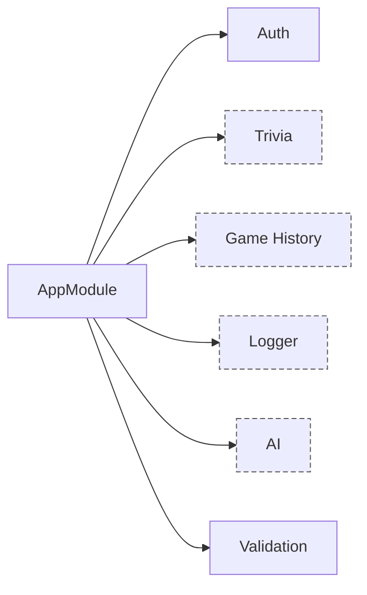

### קישורים רלוונטיים
- `architecture/LOGGING_MONITORING.md`
- `server/src/features/game/`
- `shared/`


## סקירה כללית

מסמך זה מכיל את כל התרשימים של פרויקט EveryTriv, כולל ארכיטקטורה, זרימת נתונים, ומבנה המערכת.

## ארכיטקטורה כללית

### מבנה המערכת עם Shared Package
```mermaid
graph TB
    subgraph "Frontend (React)"
        A[Client App]
        B[Redux Store]
        C[React Hooks]
        D[Audio System]
        E[Performance Context]
        F[Error Boundary]
    end
    
    subgraph "Shared Package"
        G[Types]
        H[Constants]
        I[Validation Schemas]
        J[Utility Functions]
        K[Interfaces]
        L[DTOs]
    end
    
    subgraph "Backend (NestJS)"
        M[API Gateway]
        N[Auth Module]
        O[Trivia Module]
        P[User Module]
        Q[Payment Module]
        R[Points Module]
        S[Game History Module]
        T[Logger Module]
        U[AI Module]
        V[Validation Module]
        W[Client Logs Controller]
        X[Global Exception Filter]
    end
    
    subgraph "Database Layer"
        Y[(PostgreSQL)]
        Z[(Redis Cache)]
    end
    
    subgraph "External Services"
        AA[OpenAI API]
        BB[Anthropic API]
        CC[Google AI API]
        DD[Stripe API]
        EE[Google OAuth]
    end
    
    %% Frontend connections to Shared
    A --> G
    A --> H
    A --> I
    A --> J
    A --> K
    A --> L
    
    %% Backend connections to Shared
    M --> G
    M --> H
    M --> I
    M --> J
    M --> K
    M --> L
    
    %% Frontend to Backend
    A --> M
    
    %% Backend modules
    M --> N
    M --> O
    M --> P
    M --> Q
    M --> R
    M --> S
    M --> W
    M --> X
    
    %% Database connections
    N --> Y
    O --> Y
    P --> Y
    Q --> Y
    R --> Y
    S --> Y
    
    %% Cache connections
    O --> Z
    P --> Z
    S --> Z
    
    %% External services
    O --> AA
    O --> BB
    O --> CC
    Q --> DD
    N --> EE
    %% Conceptual styling (modules המיוצגים אך מאוחדים במימוש)
    classDef conceptual stroke-dasharray:5 3,stroke:#555;
    class O,S,T conceptual;
```

**הערה:** מודולים מקווקווים = ייצוג לוגי; יישום ממוזג או שירות משותף.

<a id="nestjs-core-flow"></a>
## אבני יסוד NestJS ושרשרת בקשה

סעיף זה מרכז בצורה מרוכזת את רכיבי הליבה של NestJS וכיצד בקשה עוברת ביניהם.

### תרשים רצף – Request Lifecycle
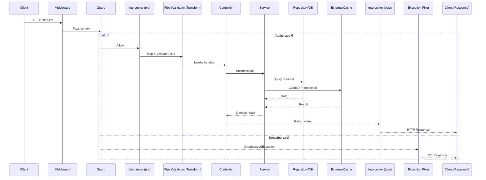

### תרשים קשרים – רכיבי ליבה
```mermaid
graph TD
    Req[Request] --> MW[Middleware]
    MW --> G[Guard]
    G -->|Authorized| INT[Interceptor (pre)]
    INT --> P[Pipe]
    P --> CTR[Controller]
    CTR --> S[Service]
    S --> R[(Repository)]
    S --> C[(Cache)]
    S --> EXT[External API]
    R --> S
    C --> S
    EXT --> S
    S --> CTR
    CTR --> INT2[Interceptor (post)]
    INT2 --> RES[Response]
    CTR -->|Error| F[Exception Filter]
    INT -->|Error| F
    P -->|Validation Error| F
    F --> RES

    classDef layer fill:#f5f5f5,stroke:#555;
    class Req,RES layer;
```

### טבלת אחריות
| רכיב | רץ מתי | אחריות עיקרית | דוגמאות שימוש | לא בשביל |
|------|--------|----------------|----------------|-----------|
| Middleware | לפני Guards | עיבוד טכני גלובלי (Context, Trace Id) | בקשת מזהה, לוג בסיסי | ולידציה דומיין |
| Guard | לפני Controller | הרשאות / בקרת גישה | AuthGuard JWT | טרנספורמציית DTO |
| Pipe | לפני Handler | ולידציה + טרנספורמציה | ValidationPipe | הרשאות |
| Interceptor | סביב Handler | מדידה, שינוי תשובה, Cache | LoggingInterceptor | ולידציה ראשית |
| Controller | נקודת כניסה | מיפוי HTTP → שירות | GET /points | לוגיקה עסקית ארוכה |
| Service | לוגיקה עסקית | חוקים, אגרגציות, אינטגרציות | חישוב נקודות | ניהול חיבור DB ישיר מרובים |
| Repository | גישת נתונים | CRUD / שאילתות | findById | לוגיקה עסקית |
| Exception Filter | בעת חריגה | מיפוי חריגות למבנה תשובה | GlobalExceptionFilter | לוגיקה דומיין |

### עקרונות שימוש מהיר
- אחריות אחת לכל שכבה – אין ולידציה עסקית ב-Middleware.
- Interceptor לפני/אחרי מאפשר הוספת מדדים ללא זיהום הלוגיקה.
- Pipe מבטיח ש-Service מקבל אובייקט כבר תקין טיפוסית.
- Guard לא דולף לוגיקה עסקית – רק החלטת Allow/Deny.

---

### מבנה תיקיות מפורט
```mermaid
graph TB
    subgraph "EveryTriv Project"
        subgraph "Client (React)"
            A1[src/]
            A2[public/]
            A3[package.json]
        end
        
        subgraph "Server (NestJS)"
            B1[src/]
            B2[package.json]
            B3[docker-compose.yaml]
        end
        
        subgraph "Shared Package"
            C1[types/]
            C2[constants/]
            C3[validation/]
            C4[utils/]
            C5[interfaces/]
            C6[dto/]
            C7[package.json]
        end
        
        subgraph "Documentation"
            D1[docs/]
            D2[README.md]
        end
    end
    
    %% Client structure
    A1 --> A11[components/]
    A1 --> A12[hooks/]
    A1 --> A13[store/]
    A1 --> A14[services/]
    A1 --> A15[utils/]
    
    %% Server structure
    B1 --> B11[features/]
    B1 --> B12[common/]
    B1 --> B13[shared/]
    B1 --> B14[config/]
    
    %% Shared structure
    C1 --> C11[api.types.ts]
    C1 --> C12[game.types.ts]
    C1 --> C13[user.types.ts]
    C1 --> C14[validation.types.ts]
    C1 --> C15[analytics.types.ts]
    C1 --> C16[auth.types.ts]
    C1 --> C17[payment.types.ts]
    C1 --> C18[points.types.ts]
    C1 --> C19[ai.types.ts]
    C1 --> C20[logging.types.ts]
    C1 --> C21[storage.types.ts]
    C1 --> C22[error.types.ts]
    C1 --> C23[http.types.ts]
    C1 --> C24[response.types.ts]
    C1 --> C25[data.types.ts]
    C1 --> C26[metadata.types.ts]
    C1 --> C27[subscription.types.ts]
    C1 --> C28[cache.types.ts]
    C1 --> C29[ui.types.ts]
    C1 --> C30[typeorm.types.ts]
    C1 --> C31[component.types.ts]
    C1 --> C32[language.types.ts]
    
    C2 --> C21[api.constants.ts]
    C2 --> C22[game.constants.ts]
    C2 --> C23[validation.constants.ts]
    
    C3 --> C31[schemas.ts]
    C3 --> C32[validation.utils.ts]
    
    C4 --> C41[format.utils.ts]
    C4 --> C42[date.utils.ts]
    C4 --> C43[time.utils.ts]
    C4 --> C44[data.utils.ts]
    
    %% Dependencies
    A1 -.-> C1
    A1 -.-> C2
    A1 -.-> C3
    A1 -.-> C4
    A1 -.-> C5
    A1 -.-> C6
    
    B1 -.-> C1
    B1 -.-> C2
    B1 -.-> C3
    B1 -.-> C4
    B1 -.-> C5
    B1 -.-> C6
    
    %% Package dependencies
    A3 -.-> C7
    B2 -.-> C7
```


## ארכיטקטורת Shared Package

### מבנה מפורט של Shared Package
```mermaid
graph TB
    subgraph "📦 Shared Package"
        subgraph "🔧 Types"
            T1[api.types.ts]
            T2[game.types.ts]
            T3[user.types.ts]
            T4[validation.types.ts]
            T5[analytics.types.ts]
            T6[auth.types.ts]
            T7[payment.types.ts]
            T8[points.types.ts]
            T9[ai.types.ts]
            T10[logging.types.ts]
            T11[storage.types.ts]
            T12[error.types.ts]
            T13[http.types.ts]
            T14[response.types.ts]
            T15[data.types.ts]
            T16[metadata.types.ts]
            T17[subscription.types.ts]
            T18[cache.types.ts]
            T19[ui.types.ts]
            T20[typeorm.types.ts]
            T21[component.types.ts]
            T22[language.types.ts]
        end
        
        subgraph "📋 Constants"
            C1[api.constants.ts]
            C2[game.constants.ts]
            C3[validation.constants.ts]
            C4[info.constants.ts]
            C5[error.constants.ts]
            C6[payment.constants.ts]
            C7[storage.constants.ts]
            C8[navigation.constants.ts]
            C9[logging.constants.ts]
            C10[language.constants.ts]
            C12[social.constants.ts]
            C13[infrastructure.constants.ts]
            C14[http.constants.ts]
        end
        
        subgraph "✅ Validation"
            V1[schemas.ts]
            V2[validation.utils.ts]
            V3[decorators.ts]
        end
        
        subgraph "🛠️ Utils"
            U1[format.utils.ts]
            U2[date.utils.ts]
            U3[time.utils.ts]
            U4[data.utils.ts]
            U5[sanitization.utils.ts]
        end
        
        subgraph "🔗 Interfaces"
            I1[api.interfaces.ts]
            I2[game.interfaces.ts]
            I3[user.interfaces.ts]
        end
        
        subgraph "📤 DTOs"
            D1[request.dto.ts]
            D2[response.dto.ts]
            D3[game.dto.ts]
            D4[user.dto.ts]
        end
    end
    
    subgraph "🎯 Usage"
        subgraph "📱 Client Usage"
            CL1[import types]
            CL2[import constants]
            CL3[import utils]
            CL4[import validation]
        end
        
        subgraph "⚙️ Server Usage"
            SV1[import types]
            SV2[import constants]
            SV3[import validation]
            SV4[import decorators]
        end
    end
    
    %% Type dependencies
    T1 --> T2
    T1 --> T3
    T2 --> T4
    T3 --> T4
    
    %% Constant dependencies
    C1 --> C2
    C2 --> C3
    C3 --> C4
    
    %% Validation dependencies
    V1 --> V2
    V2 --> V3
    V1 --> T4
    
    %% Utils dependencies
    U1 --> U2
    U2 --> U3
    U4 --> U5
    
    %% Interface dependencies
    I1 --> T1
    I2 --> T2
    I3 --> T3
    
    %% DTO dependencies
    D1 --> T1
    D2 --> T1
    D3 --> T2
    D4 --> T3
    
    %% Client usage
    CL1 -.-> T1
    CL1 -.-> T2
    CL1 -.-> T3
    CL2 -.-> C1
    CL2 -.-> C2
    CL3 -.-> U1
    CL3 -.-> U2
    CL4 -.-> V1
    CL4 -.-> V2
    
    %% Server usage
    SV1 -.-> T1
    SV1 -.-> T2
    SV1 -.-> T3
    SV2 -.-> C1
    SV2 -.-> C2
    SV3 -.-> V1
    SV3 -.-> V2
    SV4 -.-> V3
```

<a id="shared-deps-map"></a>
## מפת תלות Shared

התרשים הבא ממפה סוגי סימבולים מתוך החבילה המשותפת (Shared) לצרכנים בצד השרת והלקוח, עם הבחנה בין שימוש Compile-Time בלבד (חצים מקווקווים) לבין שימוש Runtime (חצים מלאים).

### תרשים תלות
```mermaid
graph LR
    subgraph Shared
        T[Types]
        DTO[DTOs]
        VAL[Validation Schemas]
        CONST[Constants]
        U[Utils]
        IF[Interfaces]
    end

    subgraph Server(NestJS)
        MOD[Feature Modules]
        CTR[Controllers]
        SVC[Services]
        REP[Repositories]
        FLT[Exception Filters]
    end

    subgraph Client(React)
        ST[State / Slices]
        CMP[Components]
        HK[Hooks]
        API[API Layer]
    end

    %% Compile-time consumption (dashed)
    ST -.-> T
    CMP -.-> T
    HK -.-> T

    %% API Contract
    API --> DTO
    CTR --> DTO
    MOD --> DTO
    SVC --> DTO

    %% Validation (Runtime Server)
    CTR --> VAL
    SVC --> VAL

    %% Business logic consumption
    SVC --> CONST
    SVC --> U
    REP --> IF

    %% Return Path
    SVC --> DTO --> API --> CMP

    classDef contract stroke:#1e88e5,stroke-width:2,fill:#e3f2fd;
    class DTO,VAL contract;
```

### סיווג סימבולים
| קבוצה | מקור אמת | Runtime Client | Runtime Server | הערות |
|-------|----------|----------------|----------------|--------|
| DTOs | Shared | ❌ (Tiping only) | ✅ (Serialize/Validate) | Base API contract |
| Validation Schemas | Shared | ❌ | ✅ | רץ בשרת בלבד |
| Types | Shared | ✅ (Compile-time) | ✅ | חלקם פנימיים – להגביל ייצוא עודף |
| Constants | Shared | ✅ | ✅ | להבחין בין Public/Private במידת הצורך |
| Utils | Shared | ✅ (Pure) | ✅ | להימנע מתלויות Node ב-Client |
| Interfaces | Shared | ✅ | ✅ | משמשות ארכיטקטורה / Injection |

### עקרונות
- שינוי ב-DTO → מחייב Build לשני הצדדים (שבירת חוזה מזוהה מהר).
- ולידציה מתבצעת פעמיים לוגית (Client אופציונלי, Server מחייב) – מקור אמת בסכמות Shared.
- Utils צריכים להיות Pure כדי לאפשר tree-shaking בצד הלקוח.
- לוגיקת דומיין נשארת בשירותי השרת; הלקוח משתמש ב-Types בלבד לצורך מצבים ותצוגה.

---

## זרימת נתונים

### זרימת נתונים עם Shared Package
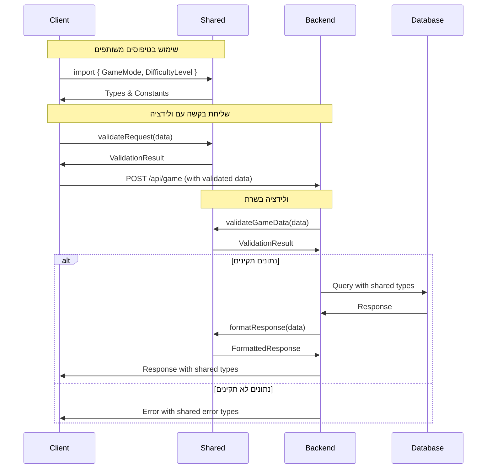

### יצירת שאלה חדשה
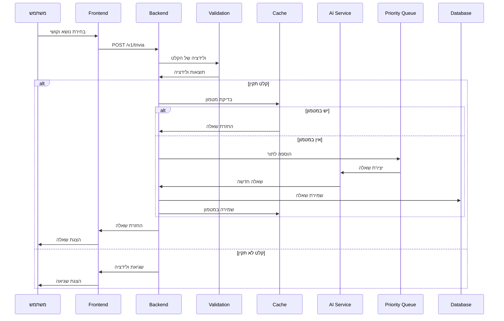

### שמירת תוצאות משחק
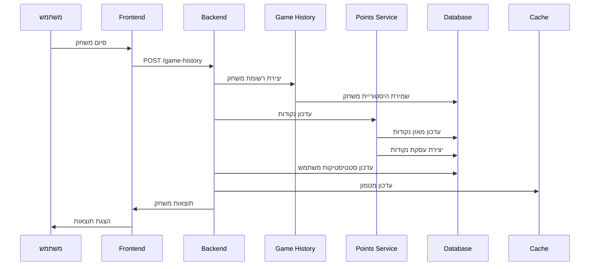

### זרימת טיפול בשגיאות
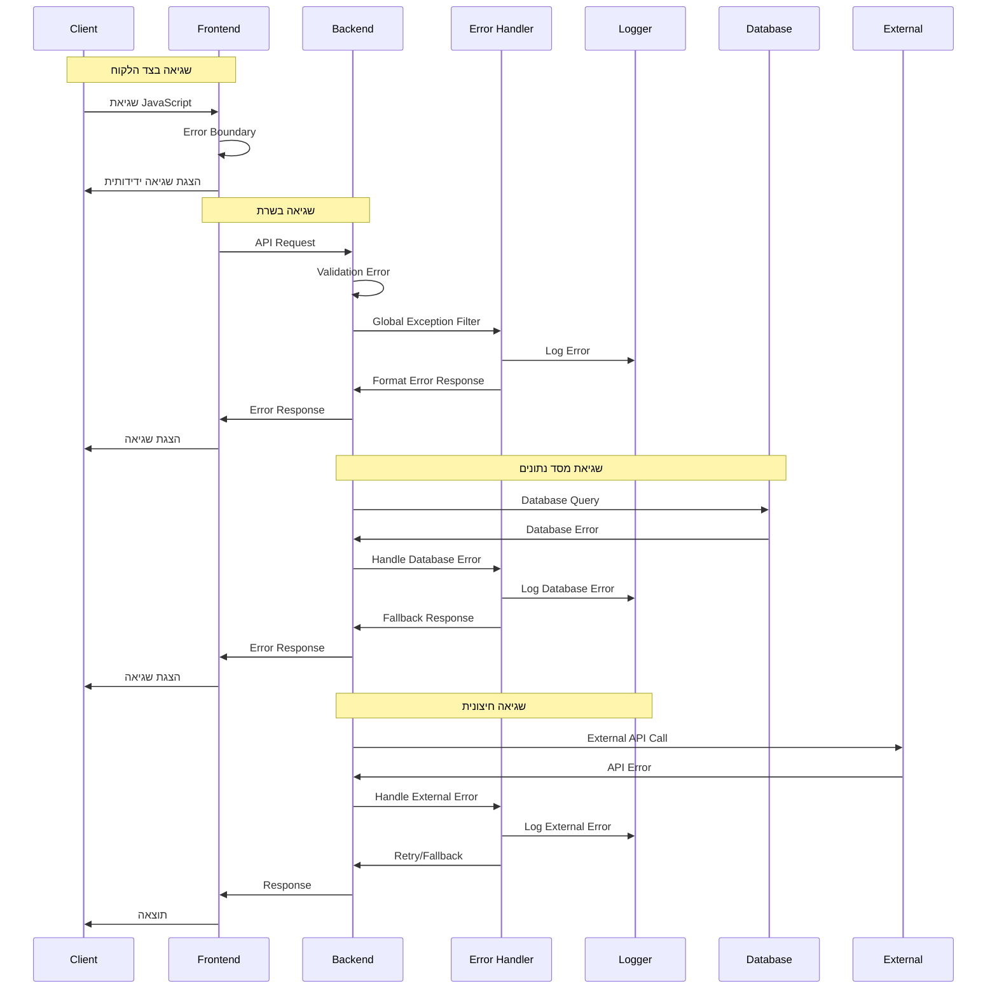

### אימות משתמש (Google OAuth)
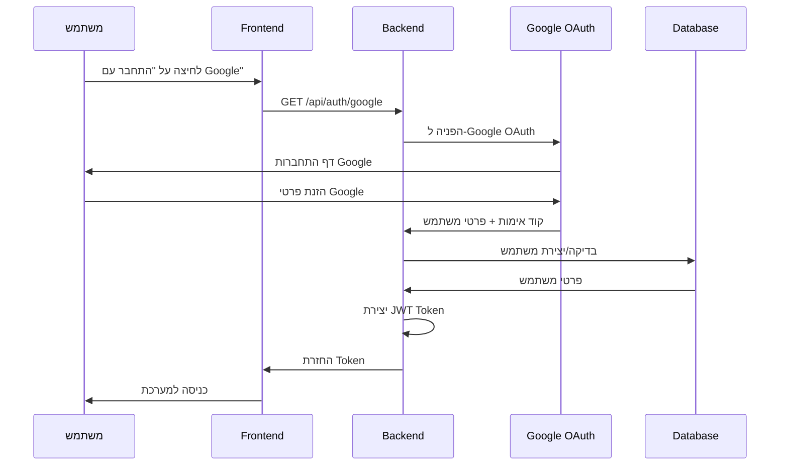

## מבנה מסד הנתונים

### סכמת מסד הנתונים
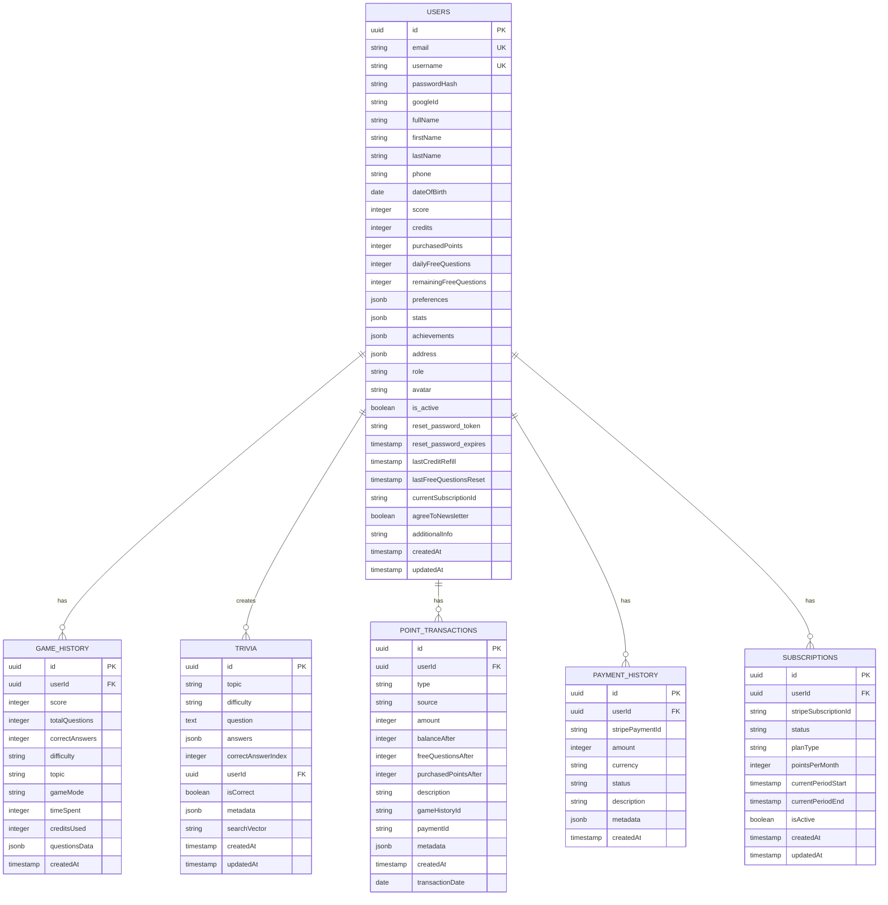

## ארכיטקטורת Frontend

### מבנה Redux Store
```mermaid
graph TD
    A[Root Store] --> B[Game Slice]
    A --> C[User Slice]
    A --> D[Stats Slice]
    A --> E[Favorites Slice]
    A --> F[GameMode Slice]

    B --> G[Current Question]
    B --> H[Score & Streak]
    B --> I[Game State]
    B --> J[Favorites]
    B --> K[Game Stats]
    B --> L[Selected Answer]
    B --> M[Loading State]

    C --> N[User Profile]
    C --> O[Authentication]
    C --> P[Point Balance]
    C --> Q[Credits]
    C --> R[Preferences]
    C --> S[Avatar]
    C --> T[Subscription]

    D --> U[Topics Played]
    D --> V[Success Rate]
    D --> W[Achievements]
    D --> X[Difficulty Stats]
    D --> Y[Total Games]
    D --> Z[Streak History]

    E --> AA[Favorite Topics]
    E --> BB[Custom Settings]
    E --> CC[Recently Used]
    E --> DD[Custom Difficulties]
    E --> EE[Topic History]

    F --> FF[Selected Mode]
    F --> GG[Custom Difficulty]
    F --> HH[Timer State]
    F --> II[Game Limits]
    F --> JJ[Pause State]
```

### React Hooks Architecture
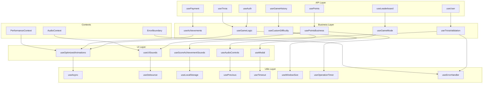

## ארכיטקטורת Backend

### מבנה מודולרי
```mermaid
graph TD
    A[App Module] --> B[Auth Module]
    A --> C[Trivia Module]
    A --> D[User Module]
    A --> E[Points Module]
    A --> F[Payment Module]
    A --> G[Game History Module]
    A --> H[Logger Module]
    A --> I[AI Module]
    A --> J[Validation Module]
    A --> K[Client Logs Controller]
    A --> L[Global Exception Filter]

    B --> M[Auth Controller]
    B --> N[Auth Service]
    B --> O[JWT Strategy]
    B --> P[Google Strategy]

    C --> Q[Trivia Controller]
    C --> R[Trivia Analytics Controller]
    C --> S[Trivia Service]
    C --> T[AI Providers]
    C --> U[Queue Module]

    D --> V[User Controller]
    D --> W[User Service]

    E --> X[Points Controller]
    E --> Y[Points Service]

    F --> Z[Payment Controller]
    F --> AA[Stripe Service]
    F --> BB[Subscription Service]

    G --> CC[Game History Controller]
    G --> DD[Game History Service]

    H --> EE[Logger Service]
    I --> FF[AI Service]
    J --> GG[Input Validation Service]
    K --> HH[Client Logs Service]
    L --> II[Exception Handler]
```

### שירותי AI
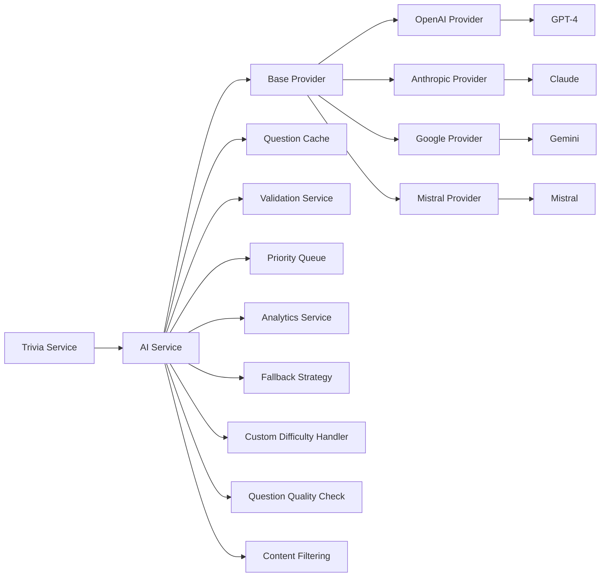

## זרימת משחק

### תהליך משחק מלא
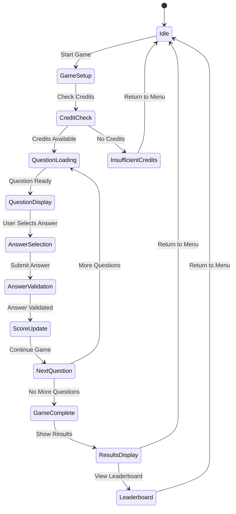

### מצבי משחק
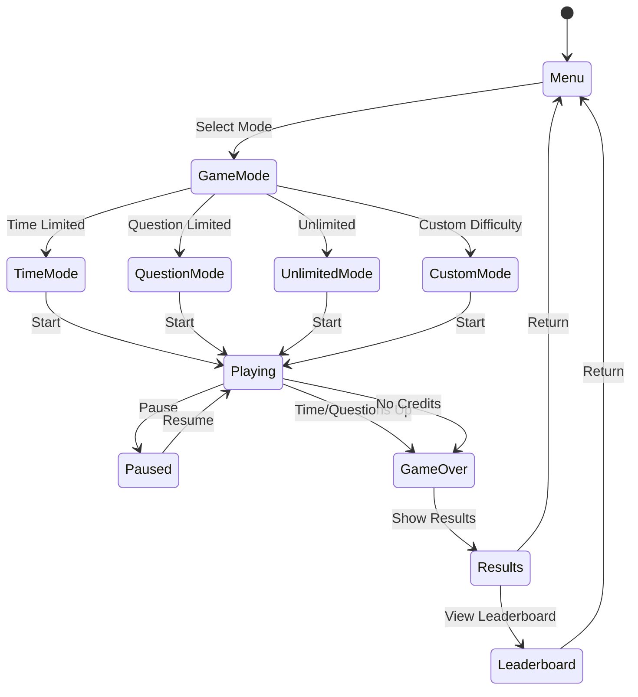

## מערכת מטמון

### אסטרטגיות מטמון
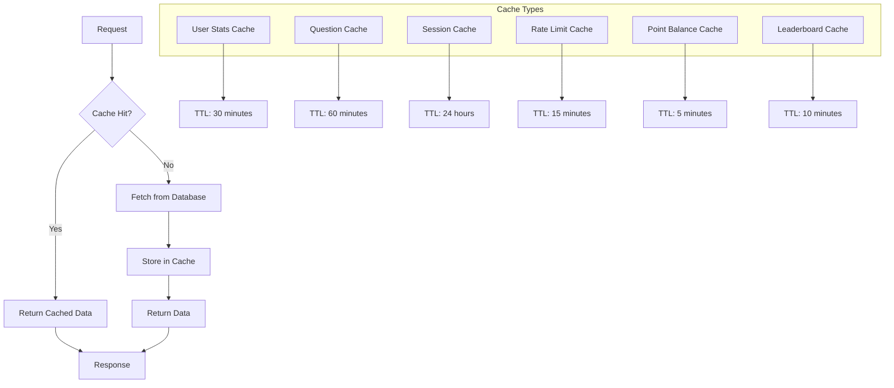

## מערכת אבטחה

### אימות API Requests
```mermaid
sequenceDiagram
    participant C as Client
    participant M as Auth Middleware
    participant A as Auth Service
    participant D as Database
    participant J as JWT Service
    participant H as Route Handler

    C->>M: API Request with JWT
    M->>J: Verify JWT Token
    J->>M: Token Valid/Invalid
    alt Token Valid
        M->>A: Get User Data
        A->>D: Fetch User
        D->>A: User Data
        A->>M: User Object
        M->>H: Request with User
        H->>C: API Response
    else Token Invalid
        M->>C: 401 Unauthorized
    end
```

### בקרת גישה
```mermaid
graph TD
    A[Request] --> B[Logging Middleware]
    B --> C[Rate Limit Middleware]
    C --> D[Country Check Middleware]
    D --> E[Auth Middleware]
    E --> F{Valid Token?}
    F -->|No| G[401 Unauthorized]
    F -->|Yes| H[Role Check Middleware]
    H --> I{Has Permission?}
    I -->|No| J[403 Forbidden]
    I -->|Yes| K[Body Validation Middleware]
    K --> L{Valid Body?}
    L -->|No| M[400 Bad Request]
    L -->|Yes| N[Route Handler]
    N --> O[Response]
```

## ביצועים

### אופטימיזציות מערכת
```mermaid
graph TB
    subgraph "🎨 Frontend Optimizations"
        A1[Code Splitting]
        A2[Lazy Loading]
        A3[Bundle Optimization]
        A4[Tree Shaking]
        A5[Minification]
        A6[Gzip Compression]
        
        B1[Memoization]
        B2[React.memo]
        B3[useMemo]
        B4[useCallback]
        
        C1[Virtual Scrolling]
        C2[Large Lists]
        C3[Performance]
        
        D1[Audio Optimization]
        D2[Audio Preloading]
        D3[Audio Compression]
        D4[Audio Caching]
        
        E1[Animation Optimization]
        E2[CSS Transitions]
        E3[Hardware Acceleration]
        E4[Smooth Animations]
        
        F1[State Management]
        F2[Redux Optimization]
        F3[Selective Re-renders]
        F4[State Persistence]
        
        G1[Network Optimization]
        G2[Request Caching]
        G3[Background Sync]
        G4[Offline Support]
    end
    
    subgraph "⚙️ Backend Optimizations"
        H1[Database Indexing]
        H2[Query Optimization]
        H3[Connection Pooling]
        H4[Response Caching]
        H5[Load Balancing]
        
        I1[Rate Limiting]
        I2[API Protection]
        I3[Resource Management]
        
        J1[Background Jobs]
        J2[Queue Processing]
        J3[Async Operations]
        
        K1[AI Optimization]
        K2[Provider Fallback]
        K3[Question Caching]
        K4[Priority Queue]
        
        L1[Validation Optimization]
        L2[Input Sanitization]
        L3[Custom Difficulty Validation]
        L4[Rate Limiting per User]
        
        M1[Security Optimization]
        M2[JWT Optimization]
        M3[Session Management]
        M4[Encryption]
        
        N1[Monitoring Optimization]
        N2[Performance Tracking]
        N3[Error Tracking]
        N4[Log Aggregation]
    end
    
    subgraph "🔄 Shared Optimizations"
        O1[Type Safety]
        O2[Code Reusability]
        O3[Consistent Validation]
        O4[Shared Constants]
        O5[Utility Functions]
    end
    
    %% Frontend connections
    A1 --> A2 --> A3 --> A4 --> A5 --> A6
    B1 --> B2 --> B3 --> B4
    C1 --> C2 --> C3
    D1 --> D2 --> D3 --> D4
    E1 --> E2 --> E3 --> E4
    F1 --> F2 --> F3 --> F4
    G1 --> G2 --> G3 --> G4
    
    %% Backend connections
    H1 --> H2 --> H3 --> H4 --> H5
    I1 --> I2 --> I3
    J1 --> J2 --> J3
    K1 --> K2 --> K3 --> K4
    L1 --> L2 --> L3 --> L4
    M1 --> M2 --> M3 --> M4
    N1 --> N2 --> N3 --> N4
    
    %% Shared connections
    O1 --> O2 --> O3 --> O4 --> O5
    
    %% Cross-layer connections
    A6 -.-> H4
    F4 -.-> M3
    G2 -.-> H4
    L3 -.-> O3
```

## פריסה

### Docker Architecture
```mermaid
graph TB
    subgraph "Docker Compose"
        A[Nginx Reverse Proxy]
        B[React Frontend]
        C[NestJS Backend]
        D[PostgreSQL Database]
        E[Redis Cache]
        F[Shared Package]
        G[Client Logs]
    end

    A --> B
    A --> C
    C --> D
    C --> E
    B --> F
    C --> F
    B --> G

    subgraph "External Services"
        H[AI Providers]
        I[Stripe]
        J[Google OAuth]
        K[Monitoring]
    end

    C --> H
    C --> I
    C --> J
    C --> K
```

### Production Deployment
```mermaid
graph LR
    A[Load Balancer] --> B[Web Server 1]
    A --> C[Web Server 2]
    A --> D[Web Server 3]
    
    B --> E[Database Cluster]
    C --> E
    D --> E
    
    B --> F[Redis Cluster]
    C --> F
    D --> F
    
    G[CDN] --> A
    H[SSL Certificate] --> A
    I[Monitoring] --> A
    J[Logging] --> A
    K[Backup System] --> E
    L[Auto Scaling] --> A
    M[Health Checks] --> A
```

## Monitoring

### מערכת ניטור מאוחדת
```mermaid
graph TB
    subgraph "🏥 Health Checks"
        A1[Health Check Service]
        A2[Database Check]
        A3[Redis Check]
        A4[AI Providers Check]
        A5[Stripe API Check]
        A6[Google OAuth Check]
        A7[Memory Usage Check]
        A8[Disk Space Check]
        
        A1 --> A2
        A1 --> A3
        A1 --> A4
        A1 --> A5
        A1 --> A6
        A1 --> A7
        A1 --> A8
        
        A2 --> B1{DB Healthy?}
        A3 --> B2{Redis Healthy?}
        A4 --> B3{AI APIs Healthy?}
        A5 --> B4{Stripe Healthy?}
        A6 --> B5{Google OAuth Healthy?}
        A7 --> B6{Memory OK?}
        A8 --> B7{Disk OK?}
        
        B1 -->|Yes| C1[Status: Healthy]
        B1 -->|No| C2[Status: Unhealthy]
        B2 -->|Yes| C1
        B2 -->|No| C2
        B3 -->|Yes| C1
        B3 -->|No| C2
        B4 -->|Yes| C1
        B4 -->|No| C2
        B5 -->|Yes| C1
        B5 -->|No| C2
        B6 -->|Yes| C1
        B6 -->|No| C2
        B7 -->|Yes| C1
        B7 -->|No| C2
    end
    
    subgraph "📊 Metrics Collection"
        D1[Application Metrics]
        D2[Performance Metrics]
        D3[Business Metrics]
        D4[Error Metrics]
        D5[AI Analytics]
        D6[Security Metrics]
        
        D1 --> D2
        D1 --> D3
        D1 --> D4
        D1 --> D5
        D1 --> D6
        
        D2 --> E1[Response Times]
        D2 --> E2[Throughput]
        D2 --> E3[Resource Usage]
        D2 --> E4[Cache Hit Rates]
        D2 --> E5[Database Performance]
        
        D3 --> F1[User Engagement]
        D3 --> F2[Game Statistics]
        D3 --> F3[Revenue Metrics]
        D3 --> F4[Point Transactions]
        D3 --> F5[Subscription Metrics]
        
        D4 --> G1[Error Rates]
        D4 --> G2[Exception Tracking]
        D4 --> G3[Log Analysis]
        D4 --> G4[Client Logs]
        D4 --> G5[API Errors]
        
        D5 --> H1[Question Generation Stats]
        D5 --> H2[AI Provider Performance]
        D5 --> H3[Custom Difficulty Usage]
        D5 --> H4[Question Quality Metrics]
        
        D6 --> I1[Authentication Attempts]
        D6 --> I2[Rate Limit Violations]
        D6 --> I3[Security Incidents]
    end
    
    subgraph "📈 Monitoring Dashboard"
        J1[Real-time Dashboard]
        J2[Alert System]
        J3[Performance Reports]
        J4[Error Reports]
        J5[Business Reports]
        
        C1 --> J1
        C2 --> J2
        E1 --> J3
        G1 --> J4
        F1 --> J5
    end
    
    %% Connections
    C1 -.-> D1
    C2 -.-> D1
```

## תרשים מערכת מאוחד - EveryTriv

### סקירה כללית של המערכת
```mermaid
graph TB
    %% User Layer
    subgraph "👤 User Layer"
        U[משתמש]
        U1[משתמש חדש]
        U2[משתמש רשום]
    end

    %% Frontend Layer
    subgraph "🎨 Frontend Layer (React)"
        subgraph "📱 Client Application"
            FA[React App]
            FB[Redux Store]
            FC[React Hooks]
            FD[Audio System]
            FE[Performance Context]
            FF[Error Boundary]
        end
        
        subgraph "🎮 Game Components"
            FG[Game Interface]
            FH[Question Display]
            FI[Score Tracking]
            FJ[Leaderboard]
            FK[User Profile]
        end
    end

    %% Backend Layer
    subgraph "⚙️ Backend Layer (NestJS)"
        subgraph "🔐 Authentication"
            BA[Auth Module]
            BA1[JWT Strategy]
            BA2[Google OAuth]
            BA3[Auth Controller]
            BA4[Auth Service]
        end
        
        subgraph "🧠 AI & Questions"
            BB[Trivia Module]
            BB1[Trivia Controller]
            BB2[AI Service]
            BB3[Question Cache]
            BB4[Priority Queue]
            BB5[OpenAI Provider]
            BB6[Anthropic Provider]
            BB7[Google AI Provider]
            BB8[Mistral Provider]
        end
        
        subgraph "👤 User Management"
            BC[User Module]
            BC1[User Controller]
            BC2[User Service]
            BC3[Profile Management]
        end
        
        subgraph "💰 Payments & Points"
            BD[Payment Module]
            BD1[Payment Controller]
            BD2[Stripe Service]
            BD3[Subscription Service]
            BE[Points Module]
            BE1[Points Controller]
            BE2[Points Service]
        end
        
        subgraph "📊 Game History"
            BF[Game History Module]
            BF1[Game History Controller]
            BF2[Game History Service]
        end
        
        subgraph "🛠️ Infrastructure"
            BG[Logger Module]
            BG1[Logger Service]
            BH[Validation Module]
            BH1[Input Validation]
            BI[Client Logs Controller]
            BI1[Client Logs Service]
            BJ[Global Exception Filter]
        end
    end

    %% Data Layer
    subgraph "🗄️ Data Layer"
        subgraph "📊 PostgreSQL Database"
            DA[USERS Table]
            DB[TRIVIA Table]
            DC[GAME_HISTORY Table]
            DD[POINT_TRANSACTIONS Table]
            DE[PAYMENT_HISTORY Table]
            DF[SUBSCRIPTIONS Table]
        end
        
        subgraph "⚡ Redis Cache"
            DG[User Stats Cache]
            DH[Question Cache]
            DI[Session Cache]
            DJ[Rate Limit Cache]
            DK[Point Balance Cache]
            DL[Leaderboard Cache]
        end
    end

    %% External Services
    subgraph "🌐 External Services"
        subgraph "🤖 AI Providers"
            EA[OpenAI API]
            EB[Anthropic API]
            EC[Google AI API]
            ED[Mistral API]
        end
        
        subgraph "💳 Payment Services"
            EE[Stripe API]
            EF[Google OAuth]
        end
        
        subgraph "📈 Monitoring"
            EG[Health Checks]
            EH[Metrics Collection]
            EI[Error Tracking]
        end
    end

    %% Infrastructure
    subgraph "🏗️ Infrastructure"
        subgraph "🐳 Docker Environment"
            FA[Nginx Reverse Proxy]
            FB[React Frontend Container]
            FC[NestJS Backend Container]
            FD[PostgreSQL Container]
            FE[Redis Container]
        end
        
        subgraph "🚀 Production"
            FF[Load Balancer]
            FG[Web Servers Cluster]
            FH[Database Cluster]
            FI[Redis Cluster]
            FJ[CDN]
            FK[SSL Certificate]
            FL[Auto Scaling]
        end
    end

    %% Connections - User to Frontend
    U --> FA
    U1 --> BA2
    U2 --> BA1

    %% Frontend to Backend
    FA --> BA
    FA --> BB
    FA --> BC
    FA --> BD
    FA --> BE
    FA --> BF
    
    FG --> BB1
    FH --> BB1
    FI --> BE2
    FJ --> BF1
    FK --> BC1

    %% Backend to Data
    BA4 --> DA
    BB2 --> DB
    BC2 --> DA
    BD2 --> DE
    BE2 --> DD
    BF2 --> DC
    BE2 --> DF

    %% Backend to Cache
    BB2 --> DH
    BC2 --> DG
    BE2 --> DK
    BF2 --> DL
    BA4 --> DI
    BB1 --> DJ

    %% Backend to External
    BB2 --> EA
    BB2 --> EB
    BB2 --> EC
    BB2 --> ED
    BD2 --> EE
    BA2 --> EF

    %% Infrastructure Connections
    FA --> FB
    FA --> FC
    FC --> FD
    FC --> FE
    
    FF --> FG
    FG --> FH
    FG --> FI
    FJ --> FF
    FK --> FF
    FL --> FF

    %% Monitoring
    EG --> EA
    EG --> EB
    EG --> EC
    EG --> ED
    EG --> EE
    EG --> EF
    
    EH --> FC
    EI --> FC

    %% Styling
    classDef userLayer fill:#e1f5fe,stroke:#01579b,stroke-width:2px
    classDef frontendLayer fill:#f3e5f5,stroke:#4a148c,stroke-width:2px
    classDef backendLayer fill:#e8f5e8,stroke:#1b5e20,stroke-width:2px
    classDef dataLayer fill:#fff3e0,stroke:#e65100,stroke-width:2px
    classDef externalLayer fill:#fce4ec,stroke:#880e4f,stroke-width:2px
    classDef infraLayer fill:#f1f8e9,stroke:#33691e,stroke-width:2px

    class U,U1,U2 userLayer
    class FA,FB,FC,FD,FE,FF,FG,FH,FI,FJ,FK frontendLayer
    class BA,BA1,BA2,BA3,BA4,BB,BB1,BB2,BB3,BB4,BB5,BB6,BB7,BB8,BC,BC1,BC2,BC3,BD,BD1,BD2,BD3,BE,BE1,BE2,BF,BF1,BF2,BG,BG1,BH,BH1,BI,BI1,BJ backendLayer
    class DA,DB,DC,DD,DE,DF,DG,DH,DI,DJ,DK,DL dataLayer
    class EA,EB,EC,ED,EE,EF,EG,EH,EI externalLayer
    class FA,FB,FC,FD,FE,FF,FG,FH,FI,FJ,FK,FL infraLayer
```

### זרימת נתונים מאוחדת - מקצה לקצה
```mermaid
sequenceDiagram
    participant U as 👤 משתמש
    participant F as 🎨 Frontend
    participant A as 🔐 Auth
    participant T as 🧠 Trivia
    participant P as 💰 Points
    participant G as 📊 Game History
    participant C as ⚡ Cache
    participant D as 🗄️ Database
    participant AI as 🤖 AI Providers
    participant S as 💳 Stripe

    %% User Registration/Login
    U->>F: התחברות/הרשמה
    F->>A: POST /auth/google
    A->>AI: Google OAuth
    AI->>A: User Data
    A->>D: Create/Update User
    A->>F: JWT Token
    F->>U: כניסה למערכת

    %% Game Flow
    U->>F: בחירת נושא וקושי
    F->>T: POST /trivia
    T->>C: בדיקת מטמון
    alt יש במטמון
        C->>T: החזרת שאלה
    else אין במטמון
        T->>AI: יצירת שאלה
        AI->>T: שאלה חדשה
        T->>D: שמירת שאלה
        T->>C: שמירה במטמון
    end
    T->>F: החזרת שאלה
    F->>U: הצגת שאלה

    %% Answer Submission
    U->>F: בחירת תשובה
    F->>T: POST /trivia/answer
    T->>D: שמירת תשובה
    T->>F: תוצאה + נקודות
    F->>U: הצגת תוצאה

    %% Game Completion
    U->>F: סיום משחק
    F->>G: POST /game-history
    G->>D: שמירת היסטוריית משחק
    
    F->>P: עדכון נקודות
    P->>D: עדכון מאזן נקודות
    P->>D: יצירת עסקת נקודות
    
    G->>C: עדכון מטמון
    P->>C: עדכון מטמון נקודות
    F->>U: הצגת תוצאות סופיות

    %% Payment Flow
    U->>F: רכישת נקודות
    F->>S: יצירת תשלום
    S->>F: Payment Intent
    F->>U: דף תשלום
    U->>S: אישור תשלום
    S->>F: אישור תשלום
    F->>P: הוספת נקודות
    P->>D: עדכון מאזן
    P->>C: עדכון מטמון
    F->>U: אישור רכישה
```

### מפת תלויות מערכת
```mermaid
graph TD
    %% Core Dependencies
    subgraph "🎯 Core System"
        A[Frontend React App]
        B[Backend NestJS]
        C[PostgreSQL Database]
        D[Redis Cache]
    end

    %% Frontend Dependencies
    subgraph "📱 Frontend Dependencies"
        A1[Redux Store]
        A2[React Hooks]
        A3[Audio System]
        A4[Performance Context]
        A5[Error Boundary]
    end

    %% Backend Dependencies
    subgraph "⚙️ Backend Dependencies"
        B1[Auth Module]
        B2[Trivia Module]
        B3[User Module]
        B4[Points Module]
        B5[Payment Module]
        B6[Game History Module]
        B7[Logger Module]
        B8[Validation Module]
    end

    %% External Dependencies
    subgraph "🌐 External Dependencies"
        E1[OpenAI API]
        E2[Anthropic API]
        E3[Google AI API]
        E4[Mistral API]
        E5[Stripe API]
        E6[Google OAuth]
    end

    %% Infrastructure Dependencies
    subgraph "🏗️ Infrastructure"
        F1[Nginx Reverse Proxy]
        F2[Docker Containers]
        F3[Load Balancer]
        F4[CDN]
        F5[SSL Certificate]
        F6[Monitoring]
    end

    %% Dependency Connections
    A --> A1
    A --> A2
    A --> A3
    A --> A4
    A --> A5
    
    A --> B
    B --> B1
    B --> B2
    B --> B3
    B --> B4
    B --> B5
    B --> B6
    B --> B7
    B --> B8
    
    B --> C
    B --> D
    
    B2 --> E1
    B2 --> E2
    B2 --> E3
    B2 --> E4
    B5 --> E5
    B1 --> E6
    
    F1 --> A
    F1 --> B
    F2 --> A
    F2 --> B
    F2 --> C
    F2 --> D
    F3 --> F1
    F4 --> F3
    F5 --> F3
    F6 --> B

    %% Critical Path Highlighting
    A -.->|Critical Path| B
    B -.->|Critical Path| C
    B2 -.->|Critical Path| E1
    B5 -.->|Critical Path| E5

    %% Styling
    classDef core fill:#ffebee,stroke:#c62828,stroke-width:3px
    classDef frontend fill:#e3f2fd,stroke:#1565c0,stroke-width:2px
    classDef backend fill:#e8f5e8,stroke:#2e7d32,stroke-width:2px
    classDef external fill:#fff3e0,stroke:#ef6c00,stroke-width:2px
    classDef infra fill:#f3e5f5,stroke:#6a1b9a,stroke-width:2px

    class A,B,C,D core
    class A1,A2,A3,A4,A5 frontend
    class B1,B2,B3,B4,B5,B6,B7,B8 backend
    class E1,E2,E3,E4,E5,E6 external
    class F1,F2,F3,F4,F5,F6 infra
```

---

**הערות על התרשים המאוחד:**
- **צבעים**: כל שכבה צבועה בצבע שונה לזיהוי קל
- **חצים**: מראים את כיוון הזרימה והתלויות
- **חצים מקווקווים**: מראים נתיבים קריטיים במערכת
- **קבוצות**: מאורגנות לפי שכבות לוגיות
- **פרטים**: כולל את כל הרכיבים החשובים במערכת

**שימוש בתרשים:**
1. **הבנה כללית**: תצוגה מהירה של כל המערכת
2. **זיהוי תלויות**: מי תלוי במי ואיפה נקודות החולשה
3. **תכנון שינויים**: איך שינוי באזור אחד משפיע על אחרים
4. **ארכיטקטורה**: הבנת המבנה הכללי של המערכת
