# דיאגרמות - EveryTriv

קובץ זה מכיל את כל הדיאגרמות המתארות את הארכיטקטורה, הקשרים והיחסים בפרויקט EveryTriv.

## דיאגרמת ארכיטקטורה כללית

```mermaid
graph LR
    subgraph "Client - React Frontend"
        A[App.tsx] --> B[AppRoutes.tsx]
        B --> C[Views]
        B --> D[Components]
        C --> E[HomeView]
        C --> F[GameSessionView]
        C --> G[GameSummaryView]
        C --> H[CustomDifficultyView]
        C --> I[UserProfile]
        C --> J[GameHistory]
        C --> K[AnalyticsView]
        C --> L[AdminDashboard]
        C --> M[LeaderboardView]
        C --> N[PaymentView]
        C --> O[CreditsView]
        C --> P[SettingsView]
        C --> Q[LoginView]
        C --> R[RegistrationView]
        C --> S[UnauthorizedView]
        D --> T[Game Components]
        D --> U[UI Components]
        D --> V[Layout Components]
        D --> W[Navigation Components]
        D --> X[AudioControls]
        D --> Y[ProtectedRoute]
        A --> Z[Redux Store]
        Z --> AA[gameSlice]
        Z --> AB[userSlice]
        Z --> AC[statsSlice]
        Z --> AD[favoritesSlice]
        Z --> AE[gameModeSlice]
        A --> AF[React Query]
        A --> AG[Services]
        AG --> AH[api.service]
        AG --> AI[auth.service]
        AG --> AJ[user.service]
        AG --> AK[credits.service]
        AG --> AL[payment.service]
        AG --> AM[gameHistory.service]
        AG --> AN[customDifficulty.service]
        AG --> AO[audio.service]
        AG --> AP[storage.service]
        AG --> AQ[score.service]
        AG --> AR[queryClient.service]
        A --> AS[Hooks]
        AS --> AT[useAuth]
        AS --> AU[useTrivia]
        AS --> AV[useCredits]
        AS --> AW[useUser]
        AS --> AX[useUserStats]
        AS --> AY[useAnalyticsDashboard]
        AS --> AZ[useAdminAnalytics]
    end

    subgraph "Shared Package"
        BA[Types] --> BB[Domain Types]
        BA --> BC[Core Types]
        BA --> BD[Infrastructure Types]
        BB --> BE[Game Types]
        BB --> BF[User Types]
        BB --> BG[Analytics Types]
        BB --> BH[Subscription Types]
        BB --> BI[Language Types]
        BC --> BJ[Data Types]
        BC --> BK[Error Types]
        BC --> BL[Response Types]
        BD --> BM[API Types]
        BD --> BN[Auth Types]
        BD --> BO[Cache Types]
        BP[Constants] --> BQ[Business Constants]
        BP --> BR[Core Constants]
        BP --> BS[Domain Constants]
        BP --> BT[Infrastructure Constants]
        BQ --> BU[Info Constants]
        BQ --> BV[Language Constants]
        BQ --> BW[Social Constants]
        BR --> BX[API Constants]
        BR --> BY[Auth Constants]
        BR --> BZ[Error Constants]
        BR --> CA[Game Server Constants]
        BR --> CB[Performance Constants]
        BR --> CC[Validation Constants]
        BS --> CD[Game Constants]
        BS --> CE[User Constants]
        BS --> CF[Payment Constants]
        BS --> CG[Credits Constants]
        BT --> CH[HTTP Constants]
        BT --> CI[Infrastructure Constants]
        BT --> CJ[Localhost Constants]
        BT --> CK[Logging Constants]
        BT --> CL[Storage Constants]
        CD[Services] --> CEA[Logging Services]
        CD --> CFA[Credits Services]
        CD --> CGA[Storage Services]
        CEA --> CHA[Client Logger]
        CEA --> CIA[Server Logger]
        CFA --> CJA[Score Calculation]
        CGA --> CKA[Storage Manager]
        BTA[Utils] --> BUA[Core Utils]
        BTA --> BVA[Domain Utils]
        BTA --> BWA[Infrastructure Utils]
        BUA --> BYA[Array Utils]
        BUA --> BZA[Data Utils]
        BUA --> CAA[Math Utils]
        BUA --> CBA[Error Utils]
        BUA --> CCA[Format Utils]
        BVA --> CEB[User Utils]
        BVA --> CFB[Credits Utils]
        BVA --> CGB[Payment Utils]
        BVA --> CHB[Subscription Utils]
        BVA --> CIB[Entity Guards]
        BWA --> CJB[ID Utils]
        BWA --> CKB[Storage Utils]
        BWA --> CLB[Sanitization Utils]
        CM[Validation] --> CN[Trivia Validation]
        CM --> CO[Difficulty Validation]
        CM --> CP[Payment Validation]
    end

    subgraph "Server - NestJS Backend"
        DH[main.ts] --> DI[AppModule]
        DI --> DJ[Features Modules]
        DJ --> DK[AuthModule]
        DJ --> DL[GameModule]
        DJ --> DM[UserModule]
        DJ --> DN[CreditsModule]
        DJ --> DO[PaymentModule]
        DJ --> DP[SubscriptionModule]
        DJ --> DQ[LeaderboardModule]
        DJ --> DR[AnalyticsModule]
        DL --> DQ
        DL --> DR
        DR --> DQ
        DM --> DO
        DO --> DP
        DN --> DO
        DI --> DS[Internal Modules]
        DS --> DT[RedisModule]
        DS --> DU[StorageModule]
        DS --> DV[CacheModule]
        DI --> DW[Common]
        DW --> DX[Guards]
        DW --> DY[Interceptors]
        DW --> DZ[Pipes]
        DW --> EA[Decorators]
        DI --> EB[ValidationModule]
        EB --> EC[Validation Service]
    end

    subgraph "Database"
        ED[(PostgreSQL)]
        EE[(Redis)]
    end

    AH --> DI
    AI --> DK
    DI --> ED
    DS --> EE
    DJ --> BA
    DJ --> BP
    DJ --> CD
    DJ --> CL
    DJ --> DC
    AG --> BA
    AG --> BP
    AG --> CD
    AG --> CL
```

## דיאגרמת זרימת נתונים - יצירת שאלה

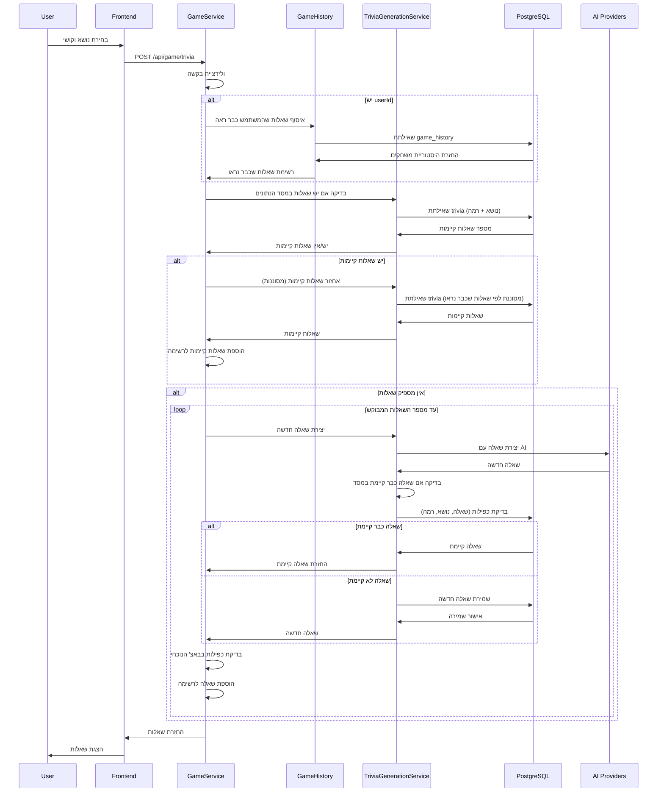

## דיאגרמת זרימת נתונים - תשובה לשאלה

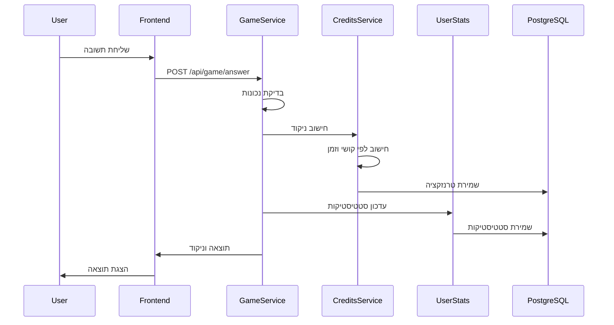

## דיאגרמת מודולי Backend

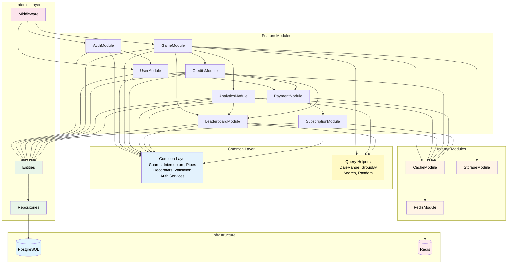

## דיאגרמת היררכיית Common Layer - Backend

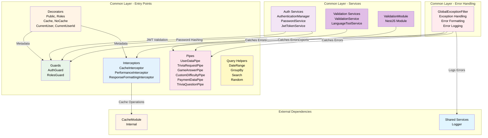

## דיאגרמת היררכיית Internal Layer - Backend

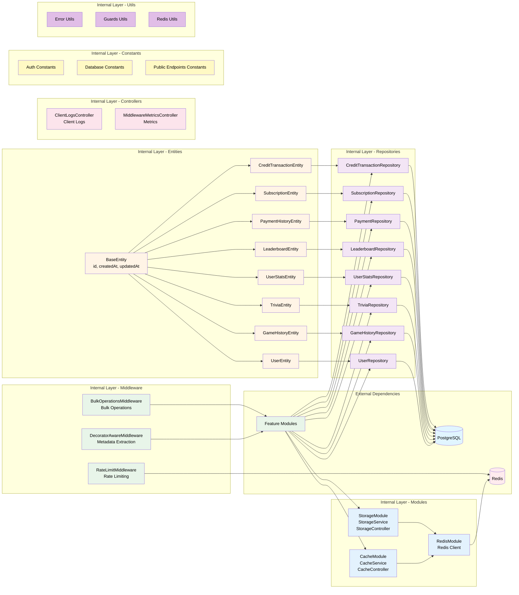

## דיאגרמת מבנה Frontend

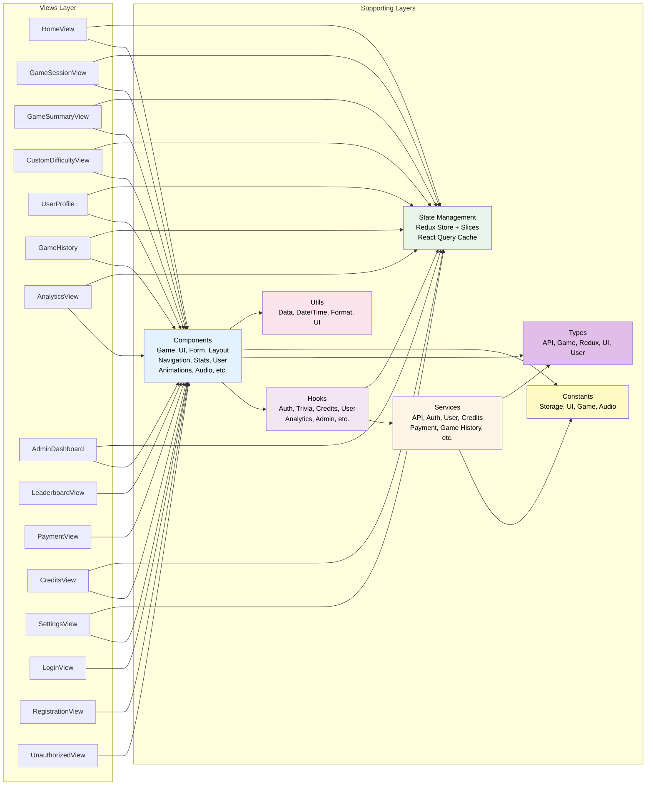

## דיאגרמת מסד נתונים (ERD)

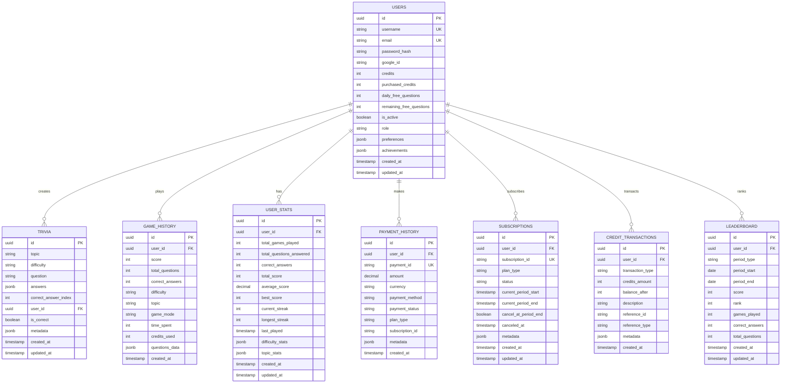

## דיאגרמת זרימת אימות

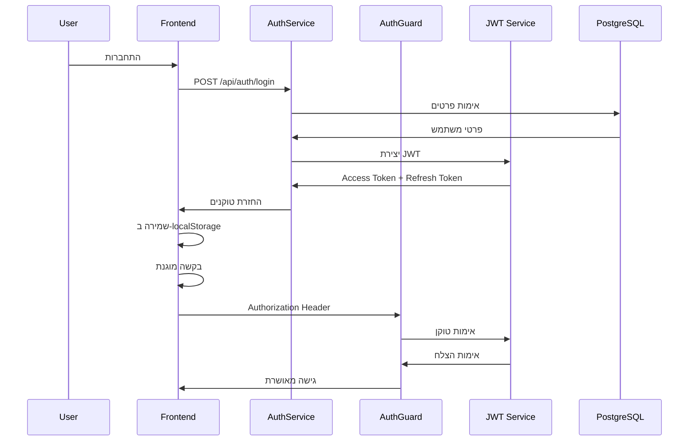

## דיאגרמת זרימת משחק מלא

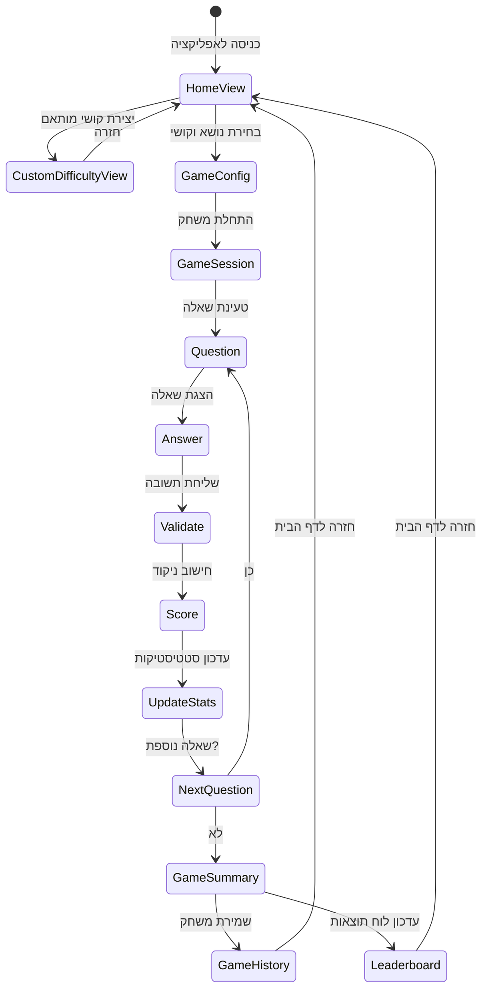

## דיאגרמת חבילה משותפת (Shared)

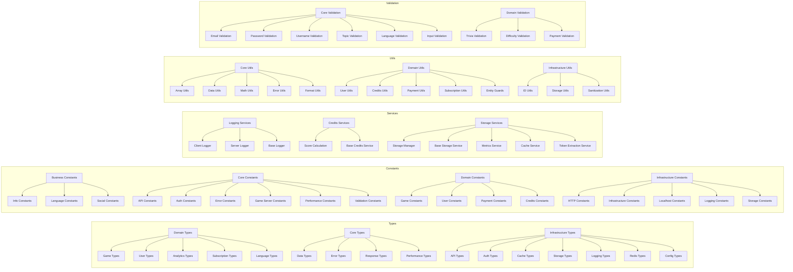

## דיאגרמת AI Providers

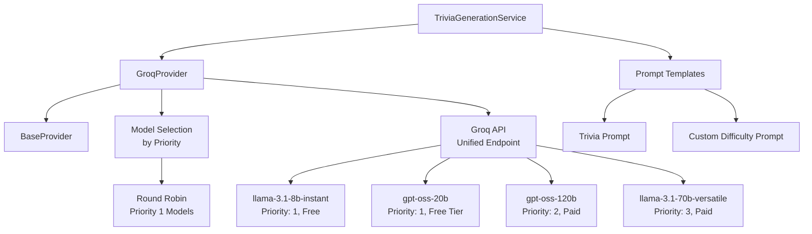

## דיאגרמת Middleware Stack

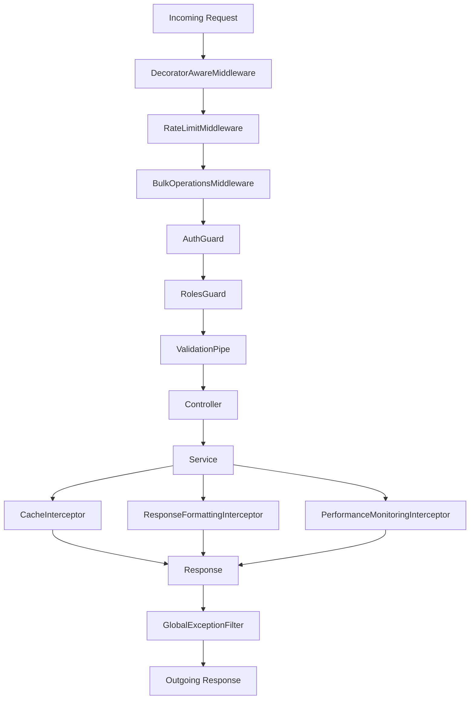

## דיאגרמת Redux State

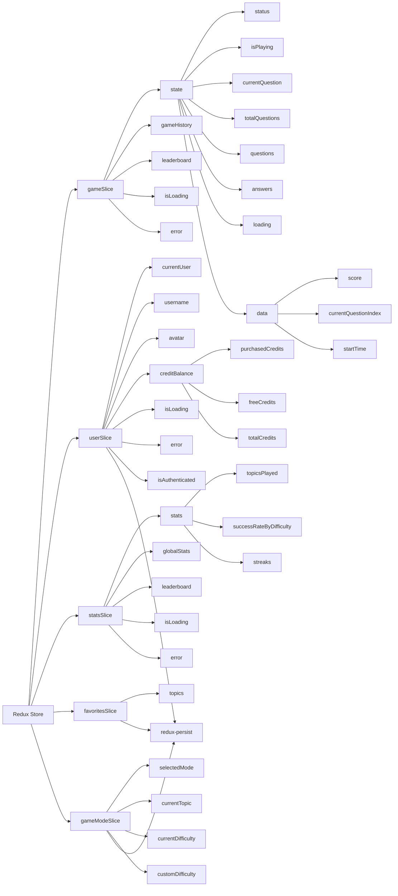

## דיאגרמת React Query Cache

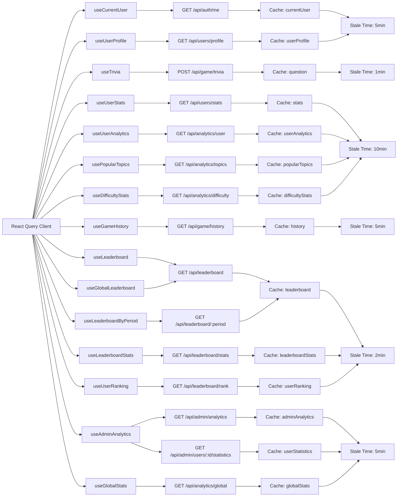

## דיאגרמת זרימת תשלומים

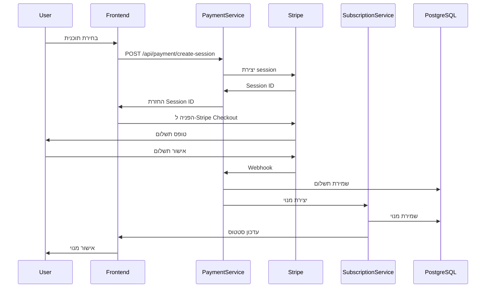

## דיאגרמת Views מלאה

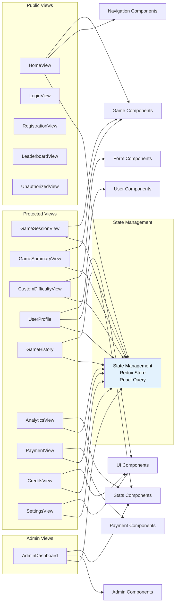

## דיאגרמת Components מלאה

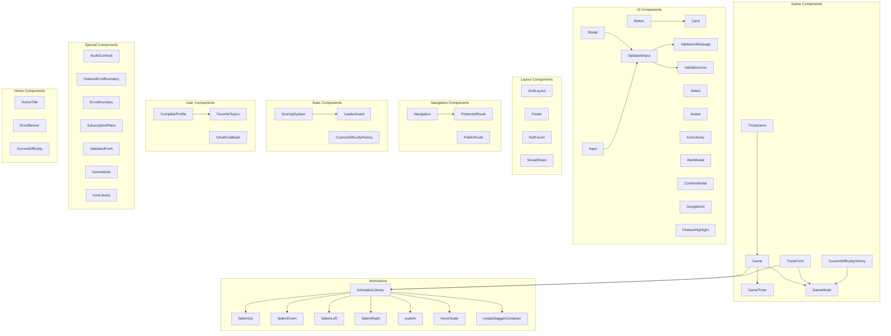

## דיאגרמת Hooks מלאה

```mermaid
graph LR
    subgraph "React Query Hooks"
        RQH[React Query Hooks<br/>useUserProfile, useUserStats<br/>useGameHistory, useLeaderboard<br/>useAnalytics, useAdminAnalytics<br/>usePopularTopics, useDifficultyStats<br/>useGlobalStats, useUserRanking<br/>useGlobalLeaderboard, etc.]
    end

    subgraph "Redux Hooks"
        N[useAppDispatch]
        O[useAppSelector]
    end

    subgraph "Auth Hooks"
        AUTH[Auth Hooks<br/>useAuth, useLogin<br/>useRegister, useCurrentUser]
    end

    subgraph "Game Hooks"
        GAME[Game Hooks<br/>useTrivia, useGameTimer<br/>useSaveHistory, useCanPlay<br/>useDeductCredits]
    end

    subgraph "User Hooks"
        USER[User Hooks<br/>useUser, useUpdateUserProfile<br/>useUserPreferences]
    end

    subgraph "Credits Hooks"
        CREDITS[Credits Hooks<br/>useCredits, useCreditBalance<br/>useCreditHistory]
    end

    subgraph "Subscription Hooks"
        SUB[Subscription Hooks<br/>useSubscriptionManagement<br/>useCreateSubscription<br/>useCancelSubscription]
    end

    subgraph "Account Management Hooks"
        ACCOUNT[Account Management Hooks<br/>useAccountManagement<br/>useUpdateUserCredits<br/>useUpdateUserStatus<br/>useDeleteUser<br/>useGetUserById]
    end

    subgraph "Analytics Hooks"
        ANALYTICS[Analytics Hooks<br/>useAnalyticsDashboard<br/>useUserStatisticsById<br/>useUserPerformanceById<br/>useUserProgressById<br/>useUserActivityById<br/>useUserInsightsById<br/>useUserRecommendationsById<br/>useUserAchievementsById<br/>useUserTrendsById<br/>useCompareUserPerformance<br/>useUserSummaryById, etc.]
    end

    subgraph "Utility Hooks"
        AZ[useAudio]
        BA[useDebounce]
        BB[useDebouncedCallback]
        BC[usePrevious]
        BD[useValueChange]
        BE[useValidation]
        BF[useNavigationController]
        BG[useLeaderboardFeatures]
    end

    subgraph "Services"
        BH[api.service]
        BI[auth.service]
        BJ[user.service]
        BK[credits.service]
        BL[payment.service]
        BM[audio.service]
        BN[Redux Store]
    end

    RQH --> BH
    AUTH --> BI
    USER --> BJ
    CREDITS --> BK
    SUB --> BL
    GAME --> BH
    ACCOUNT --> BH
    ANALYTICS --> BH
    AZ --> BM
    N --> BN

    style BH fill:#e3f2fd,color:#000000
    style BI fill:#fff4e6,color:#000000
    style BJ fill:#e8f5e9,color:#000000
    style BK fill:#fff9c4,color:#000000
    style BL fill:#fce4ec,color:#000000
    style BM fill:#e1bee7,color:#000000
    style BN fill:#e8f5e9,color:#000000
    style RQH fill:#e3f2fd,color:#000000
    style AUTH fill:#fff4e6,color:#000000
    style USER fill:#e8f5e9,color:#000000
    style CREDITS fill:#fff9c4,color:#000000
    style SUB fill:#fce4ec,color:#000000
    style GAME fill:#e1bee7,color:#000000
    style ACCOUNT fill:#f3e5f5,color:#000000
    style ANALYTICS fill:#e1bee7,color:#000000
```

## דיאגרמת Services מלאה (Client)

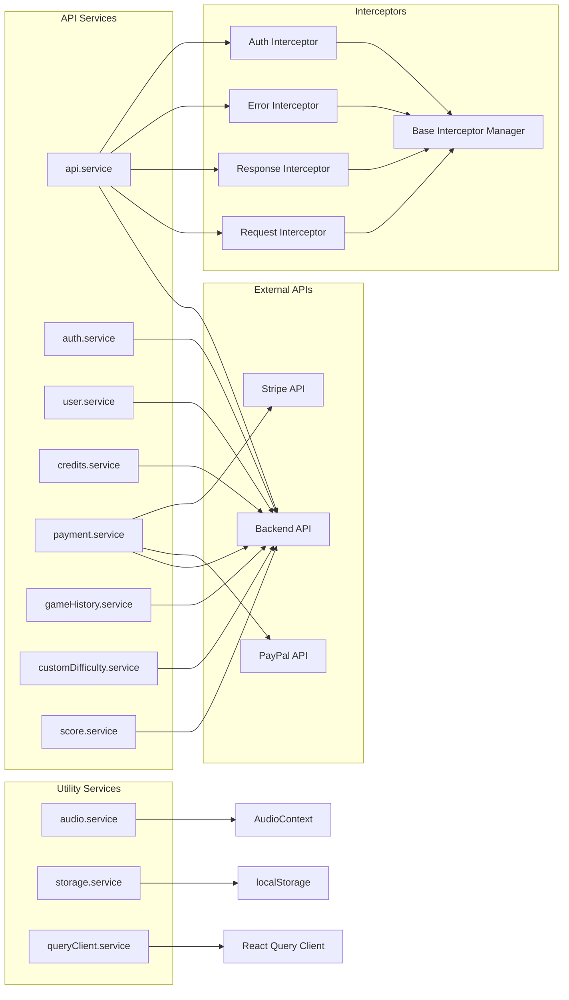

## דיאגרמת Routes/Navigation

```mermaid
graph LR
    subgraph "App Routes"
        A[AppRoutes.tsx]
        A --> B[Public Routes]
        A --> C[Protected Routes]
        A --> D[Admin Routes]
    end

    subgraph "Public Routes"
        E[- HomeView]
        F[leaderboard - LeaderboardView]
        G[login - LoginView]
        H[register - RegistrationView]
        I[unauthorized - UnauthorizedView]
    end

    subgraph "Game Routes"
        J[game/play - GameSessionView]
        K[game/summary - GameSummaryView]
        L[game/custom - CustomDifficultyView]
    end

    subgraph "Protected Routes"
        M[profile - UserProfile]
        N[history - GameHistory]
        O[payment - PaymentView]
        P[credits - CreditsView]
        Q[analytics - AnalyticsView]
        R[settings - SettingsView]
        S[complete-profile - CompleteProfile]
    end

    subgraph "Admin Routes"
        T[admin - AdminDashboard]
    end

    subgraph "Route Protection"
        U[ProtectedRoute]
        V[PublicRoute]
        W[Navigation]
    end

    C --> U
    D --> U
    B --> V
    M --> U
    N --> U
    O --> U
    P --> U
    Q --> U
    R --> U
    S --> U
    T --> U
    G --> V
    H --> V
    W --> X[NavigationBrand]
    W --> Y[NavigationActions]
    W --> Z[NavigationMenu]
```

## דיאגרמת זרימת Custom Difficulty

```mermaid
sequenceDiagram
    participant U as User
    participant CV as CustomDifficultyView
    participant CDS as customDifficulty.service
    participant SS as storage.service
    participant AS as api.service
    participant BE as Backend

    U->>CV: יצירת קושי מותאם
    CV->>CDS: saveCustomDifficulty
    CDS->>SS: שמירה ב-localStorage
    SS->>CDS: אישור שמירה
    CDS->>AS: POST /api/game/custom-difficulty
    AS->>BE: שליחת קושי מותאם
    BE->>AS: אישור שמירה
    AS->>CDS: אישור מהשרת
    CDS->>CV: עדכון רשימת קשיים
    CV->>U: הצגת קשיים שמורים
    U->>CV: בחירת קושי מותאם
    CV->>CDS: loadCustomDifficulty
    CDS->>SS: קריאה מ-localStorage
    SS->>CDS: החזרת קושי
    CDS->>CV: עדכון מצב
    CV->>U: מעבר למשחק
```

## דיאגרמת זרימת Analytics

```mermaid
sequenceDiagram
    participant U as User
    participant AV as AnalyticsView
    participant ADH as useAnalyticsDashboard
    participant AS as api.service
    participant AM as AnalyticsModule
    participant DB as PostgreSQL
    participant C as Redis Cache

    U->>AV: פתיחת Analytics
    AV->>ADH: useUserAnalytics
    ADH->>AS: GET /api/analytics/user
    AS->>AM: בקשה לאנליטיקה
    AM->>C: בדיקת מטמון
    alt יש במטמון
        C->>AM: החזרת נתונים
    else אין במטמון
        AM->>DB: שאילתת נתונים
        DB->>AM: החזרת נתונים
        AM->>C: שמירה במטמון
    end
    AM->>AS: החזרת אנליטיקה
    AS->>ADH: עדכון cache
    ADH->>AV: עדכון UI
    AV->>U: הצגת גרפים ונתונים
    U->>AV: בחירת תקופה/פילטרים
    AV->>ADH: useDifficultyStats / usePopularTopics
    ADH->>AS: GET /api/analytics/difficulty / topics
    AS->>AM: בקשה לנתונים
    AM->>DB: שאילתה
    DB->>AM: נתונים
    AM->>AS: תגובה
    AS->>ADH: עדכון
    ADH->>AV: עדכון UI
```

## דיאגרמת זרימת Admin Dashboard

```mermaid
sequenceDiagram
    participant A as Admin
    participant AD as AdminDashboard
    participant AAH as useAdminAnalytics
    participant AS as api.service
    participant UM as UserModule
    participant AM as AnalyticsModule
    participant DB as PostgreSQL

    A->>AD: פתיחת Dashboard
    AD->>AAH: useUserStatisticsById
    AAH->>AS: GET /api/admin/users/:id/statistics
    AS->>UM: בקשה לנתוני משתמש
    UM->>DB: שאילתת נתונים
    DB->>UM: נתוני משתמש
    UM->>AS: תגובה
    AS->>AAH: עדכון cache
    AAH->>AD: עדכון UI
    AD->>A: הצגת סטטיסטיקות
    A->>AD: פעולת ניהול (עדכון/מחיקה)
    AD->>AAH: useUpdateUserCredits / useDeleteUser
    AAH->>AS: PUT/DELETE /api/admin/users/:id
    AS->>UM: פעולת ניהול
    UM->>DB: עדכון/מחיקה
    DB->>UM: אישור
    UM->>AS: תגובה
    AS->>AAH: עדכון
    AAH->>AD: עדכון UI
    AD->>A: אישור פעולה
    A->>AD: השוואת משתמשים
    AD->>AAH: useCompareUserPerformance
    AAH->>AS: GET /api/admin/users/:id/compare
    AS->>AM: בקשה להשוואה
    AM->>DB: שאילתת השוואה
    DB->>AM: נתוני השוואה
    AM->>AS: תגובה
    AS->>AAH: עדכון
    AAH->>AD: עדכון UI
    AD->>A: הצגת השוואה
```

## דיאגרמת היררכיית Backend - Database עד API

```mermaid
graph TB
    subgraph "Database Layer"
        DB[(PostgreSQL Database)]
    end

    subgraph "TypeORM Entities Layer"
        E1[UserEntity]
        E2[GameHistoryEntity]
        E3[TriviaEntity]
        E4[UserStatsEntity]
        E5[LeaderboardEntity]
        E6[PaymentHistoryEntity]
        E7[SubscriptionEntity]
    end

    subgraph "TypeORM Repositories Layer"
        R1[UserRepository]
        R2[GameHistoryRepository]
        R3[TriviaRepository]
        R4[UserStatsRepository]
        R5[LeaderboardRepository]
        R6[PaymentRepository]
        R7[SubscriptionRepository]
    end

    subgraph "TypeORM QueryBuilder (Complex Queries Only)"
        QB[QueryBuilder<br/>- Aggregations<br/>- GROUP BY<br/>- JOIN<br/>- Date Range<br/>- ILIKE Search]
    end

    subgraph "Common Layer (Query Helpers)"
        QH[Query Helpers<br/>- addDateRangeConditions<br/>- addSearchConditions<br/>- createGroupByQuery]
    end

    subgraph "Services Layer (Business Logic)"
        S1[UserService]
        S2[GameService]
        S3[AnalyticsService]
        S4[LeaderboardService]
        S5[CreditsService]
        S6[PaymentService]
        S7[SubscriptionService]
    end

    subgraph "Controllers Layer (HTTP Handling)"
        C1[UserController]
        C2[GameController]
        C3[AnalyticsController]
        C4[LeaderboardController]
        C5[CreditsController]
        C6[PaymentController]
        C7[SubscriptionController]
    end

    subgraph "HTTP API Layer"
        API[REST API<br/>/auth<br/>/game<br/>/users<br/>/credits<br/>/leaderboard<br/>/analytics<br/>/payment<br/>/subscription]
    end

    DB --> E1
    DB --> E2
    DB --> E3
    DB --> E4
    DB --> E5
    DB --> E6
    DB --> E7

    E1 --> R1
    E2 --> R2
    E3 --> R3
    E4 --> R4
    E5 --> R5
    E6 --> R6
    E7 --> R7

    subgraph "Repositories Group"
        REPOS[Repositories<br/>R1, R2, R3, R4<br/>R5, R6, R7]
    end

    subgraph "Services Group"
        SERVS[Services<br/>S1, S2, S3, S4<br/>S5, S6, S7]
    end

    subgraph "Controllers Group"
        CONTRS[Controllers<br/>C1, C2, C3, C4<br/>C5, C6, C7]
    end

    REPOS --> QB
    QB --> QH
    QH --> SERVS
    REPOS --> SERVS
    SERVS --> CONTRS
    CONTRS --> API

    style REPOS fill:#f3e5f5,color:#000000
    style SERVS fill:#e8f5e9,color:#000000
    style CONTRS fill:#fce4ec,color:#000000

    style DB fill:#e1f5ff,color:#000000
    style E1 fill:#fff4e6,color:#000000
    style E2 fill:#fff4e6,color:#000000
    style E3 fill:#fff4e6,color:#000000
    style E4 fill:#fff4e6,color:#000000
    style E5 fill:#fff4e6,color:#000000
    style E6 fill:#fff4e6,color:#000000
    style E7 fill:#fff4e6,color:#000000
    style R1 fill:#f3e5f5,color:#000000
    style R2 fill:#f3e5f5,color:#000000
    style R3 fill:#f3e5f5,color:#000000
    style R4 fill:#f3e5f5,color:#000000
    style R5 fill:#f3e5f5,color:#000000
    style R6 fill:#f3e5f5,color:#000000
    style R7 fill:#f3e5f5,color:#000000
    style QB fill:#fff9c4,color:#000000
    style QH fill:#e1bee7,color:#000000
    style S1 fill:#e8f5e9,color:#000000
    style S2 fill:#e8f5e9,color:#000000
    style S3 fill:#e8f5e9,color:#000000
    style S4 fill:#e8f5e9,color:#000000
    style S5 fill:#e8f5e9,color:#000000
    style S6 fill:#e8f5e9,color:#000000
    style S7 fill:#e8f5e9,color:#000000
    style C1 fill:#fce4ec,color:#000000
    style C2 fill:#fce4ec,color:#000000
    style C3 fill:#fce4ec,color:#000000
    style C4 fill:#fce4ec,color:#000000
    style C5 fill:#fce4ec,color:#000000
    style C6 fill:#fce4ec,color:#000000
    style C7 fill:#fce4ec,color:#000000
    style API fill:#ffebee,color:#000000
```

## דיאגרמת היררכיית Frontend - API עד Components

```mermaid
graph TB
    subgraph "HTTP API Layer"
        API[REST API<br/>/auth<br/>/game<br/>/users<br/>/credits<br/>/leaderboard<br/>/analytics<br/>/payment<br/>/subscription]
    end

    subgraph "API Service Layer (HTTP Client)"
        AS[api.service<br/>- HTTP Requests<br/>- Request Interceptors<br/>- Response Interceptors<br/>- Error Interceptors<br/>- Transformers]
    end

    subgraph "React Query Client"
        QC[QueryClient<br/>- Cache Management<br/>- Invalidation<br/>- Optimistic Updates<br/>- Background Refetching]
    end

    subgraph "React Query Hooks Group"
        RQ_ALL[React Query Hooks<br/>useAuth, useTrivia<br/>useUser, useCredits<br/>useUserStats, etc.]
    end

    subgraph "Components Group"
        COMPS[Components<br/>GameSessionView, UserProfile<br/>GameHistory, AnalyticsView<br/>LeaderboardView, etc.]
    end

    API --> AS
    AS --> RQ_ALL
    RQ_ALL --> QC
    RQ_ALL --> COMPS

    style API fill:#ffebee,color:#000000
    style AS fill:#e3f2fd,color:#000000
    style QC fill:#fff9c4,color:#000000
    style RQ_ALL fill:#f1f8e9,color:#000000
    style COMPS fill:#fce4ec,color:#000000
```

## דיאגרמת היררכיה מלאה - Database עד Components

```mermaid
graph TB
    subgraph "Database Layer"
        DB[(PostgreSQL<br/>Database)]
    end

    subgraph "Backend - TypeORM Layer"
        E[TypeORM Entities<br/>UserEntity<br/>GameHistoryEntity<br/>TriviaEntity<br/>UserStatsEntity<br/>etc.]
        R[TypeORM Repositories<br/>UserRepository<br/>GameHistoryRepository<br/>TriviaRepository<br/>etc.]
        QB[TypeORM QueryBuilder<br/>Complex Queries Only]
        QH[Query Helpers<br/>common/queries<br/>Date Range, Search<br/>Random, GroupBy]
    end

    subgraph "Backend - Business Logic Layer"
        S[Services<br/>UserService<br/>GameService<br/>AnalyticsService<br/>LeaderboardService<br/>etc.]
    end

    subgraph "Backend - HTTP Layer"
        C[Controllers<br/>UserController<br/>GameController<br/>AnalyticsController<br/>etc.]
        API[HTTP API<br/>REST Endpoints]
    end

    subgraph "Frontend - HTTP Client Layer"
        AS[API Service<br/>api.service<br/>HTTP Client with Interceptors]
    end

    subgraph "Frontend - State Management Layer"
        RS[Redux Store<br/>gameSlice<br/>userSlice<br/>statsSlice<br/>favoritesSlice<br/>gameModeSlice]
        RQ[React Query Hooks<br/>useAuth<br/>useTrivia<br/>useUser<br/>useCredits<br/>etc.]
        QC[React Query Client<br/>Cache Management]
    end

    subgraph "Frontend - UI Layer"
        COM[Components<br/>GameSessionView<br/>UserProfile<br/>AnalyticsView<br/>LeaderboardView<br/>etc.]
    end

    DB -->|Schema| E
    E -->|InjectRepository| R
    R -->|Simple Queries| S
    R -->|Complex Queries| QB
    QB -->|Uses Helpers| QH
    QH -->|Query Results| S
    QB -->|Query Results| S
    S -->|Business Logic| C
    C -->|HTTP Handlers| API
    API -->|REST Requests| AS
    AS -->|HTTP Client| RQ
    RQ -->|Cache/State| QC
    RQ -->|Server State| COM
    RS -->|Local State| COM

    style DB fill:#e1f5ff,color:#000000
    style E fill:#fff4e6,color:#000000
    style R fill:#f3e5f5,color:#000000
    style QB fill:#fff9c4,color:#000000
    style QH fill:#e1bee7,color:#000000
    style S fill:#e8f5e9,color:#000000
    style C fill:#fce4ec,color:#000000
    style API fill:#ffebee,color:#000000
    style AS fill:#e3f2fd,color:#000000
    style RS fill:#ffcdd2,color:#000000
    style RQ fill:#f1f8e9,color:#000000
    style QC fill:#fff9c4,color:#000000
    style COM fill:#fce4ec,color:#000000
```

## דיאגרמת היררכיית Shared Package - שילוב ב-Backend ו-Frontend

```mermaid
graph LR
    subgraph "Shared Package"
        SP_T[Types<br/>Domain, Core, Infrastructure]
        SP_C[Constants<br/>Business, Core, Domain, Infrastructure]
        SP_S[Services<br/>Core: Logging<br/>Domain: Credits<br/>Infrastructure: Storage, Cache, Auth]
        SP_U[Utils<br/>Core, Domain, Infrastructure]
        SP_V[Validation<br/>Core, Domain]
    end

    subgraph "Backend Usage Group"
        BE_ALL[Backend<br/>Services, Controllers<br/>Entities, Modules]
    end

    subgraph "Frontend Usage Group"
        FE_ALL[Frontend<br/>Services, Hooks<br/>Components, Types]
    end

    SP_T -->|Import/Extend Types| BE_ALL
    SP_T -->|Import/Extend Types| FE_ALL

    SP_C -->|Import Constants| BE_ALL
    SP_C -->|Import Constants| FE_ALL

    SP_S -->|Use Services| BE_ALL
    SP_S -->|Use Services| FE_ALL

    SP_U -->|Use Utils| BE_ALL
    SP_U -->|Use Utils| FE_ALL

    SP_V -->|Validation| BE_ALL
    SP_V -->|Validation| FE_ALL

    style BE_ALL fill:#e8f5e9,color:#000000
    style FE_ALL fill:#e3f2fd,color:#000000

    style SP_T fill:#fff4e6,color:#000000
    style SP_C fill:#e3f2fd,color:#000000
    style SP_S fill:#e8f5e9,color:#000000
    style SP_U fill:#fce4ec,color:#000000
    style SP_V fill:#fff9c4,color:#000000
```

## הפניות

לדיאגרמות מפורטות יותר, ראו:
- [ארכיטקטורה כללית](./ARCHITECTURE.md)
- [מבנה Backend](./backend/internal/README.md)
- [מבנה Frontend](./frontend/REDUX.md)
- [מסד נתונים](./database/DATABASE_SETUP.md)
- [Database Queries](./backend/DATABASE_QUERIES.md)
- [Shared Package](./shared/SHARED_PACKAGE.md)
