# EveryTriv - דיאגרמות Mermaid

## ארכיטקטורה כללית

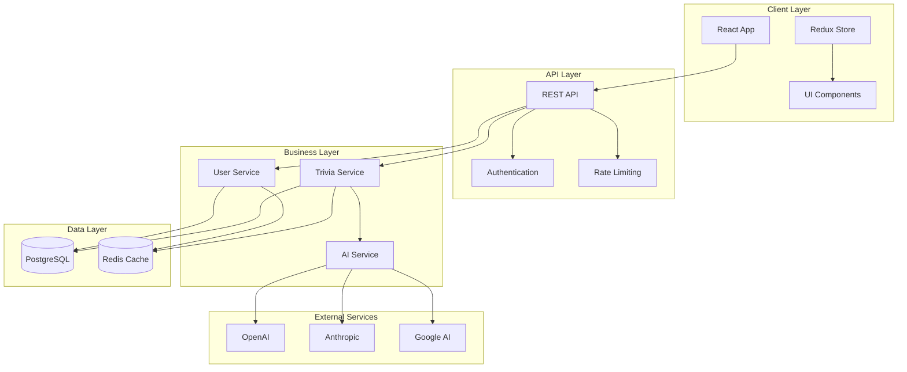

## מבנה בסיס הנתונים

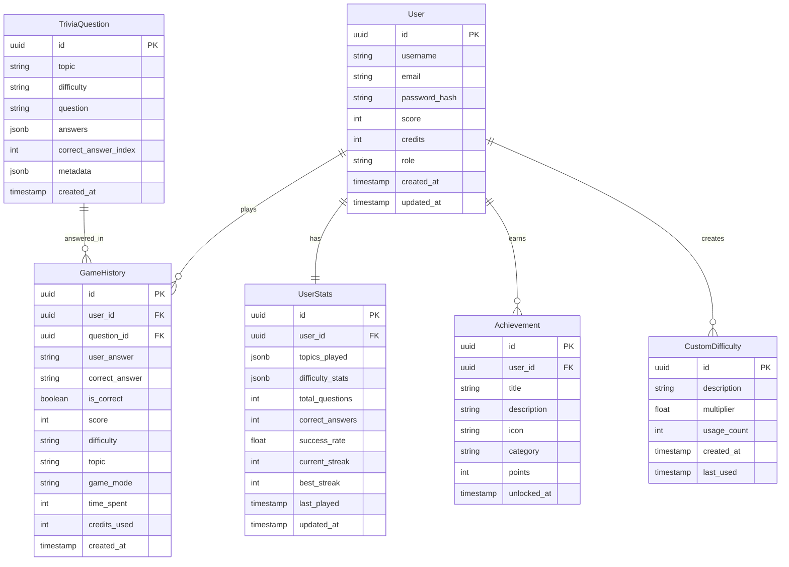

## מבנה Redux Store

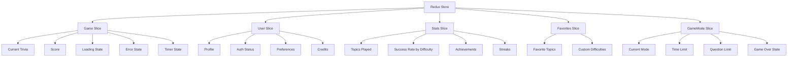

## זרימת נתונים - יצירת שאלה

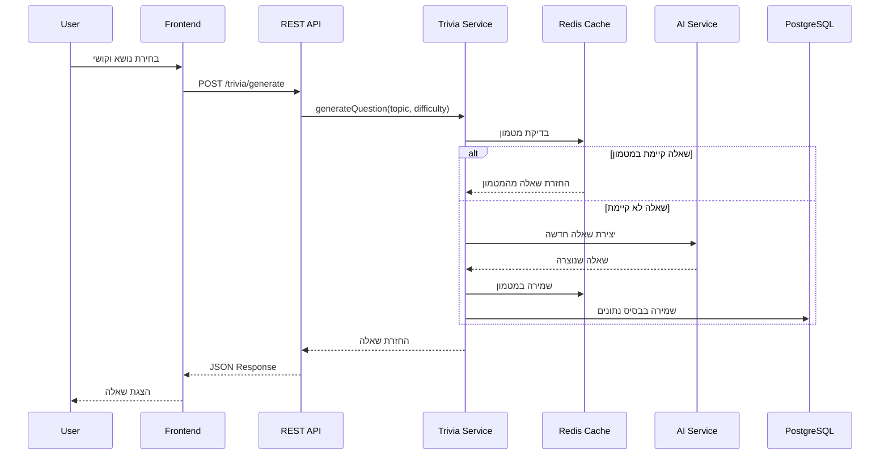

## זרימת נתונים - שמירת תשובה

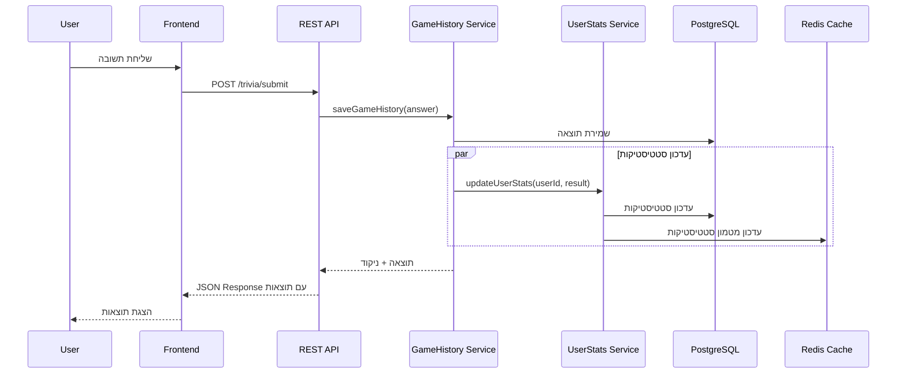

## מבנה רכיבי UI

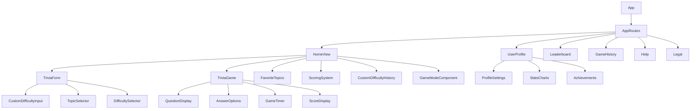

## מבנה מודולי Backend

```mermaid
graph TD
    A[App Module] --> B[Auth Module]
    A --> C[User Module]
    A --> D[Trivia Module]
    A --> E[GameHistory Module]
    A --> F[Shared Module]
    
    B --> B1[Auth Controller]
    B --> B2[Auth Service]
    B --> B3[JWT Strategy]
    B --> B4[Guards]
    
    C --> C1[User Controller]
    C --> C2[User Service]
    C --> C3[User Entity]
    C --> C4[User Repository]
    
    D --> D1[Trivia Controller]
    D --> D2[Trivia Service]
    D --> D3[Question Generator]
    D --> D4[AI Integration]
    
    E --> E1[GameHistory Controller]
    E --> E2[GameHistory Service]
    E --> E3[Stats Calculator]
    
    F --> F1[Logger Service]
    F --> F2[Cache Service]
    F --> F3[Validation Service]
    F --> F4[Config Service]
```

## ארכיטקטורת מטמון

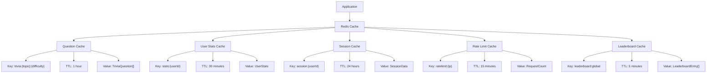

## מבנה אבטחה

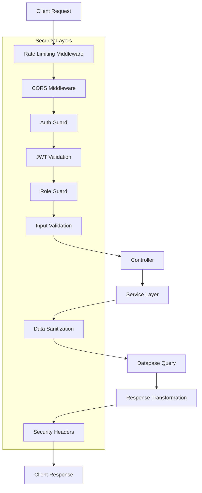

## זרימת Development Build

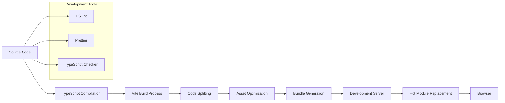

## זרימת Production Deployment

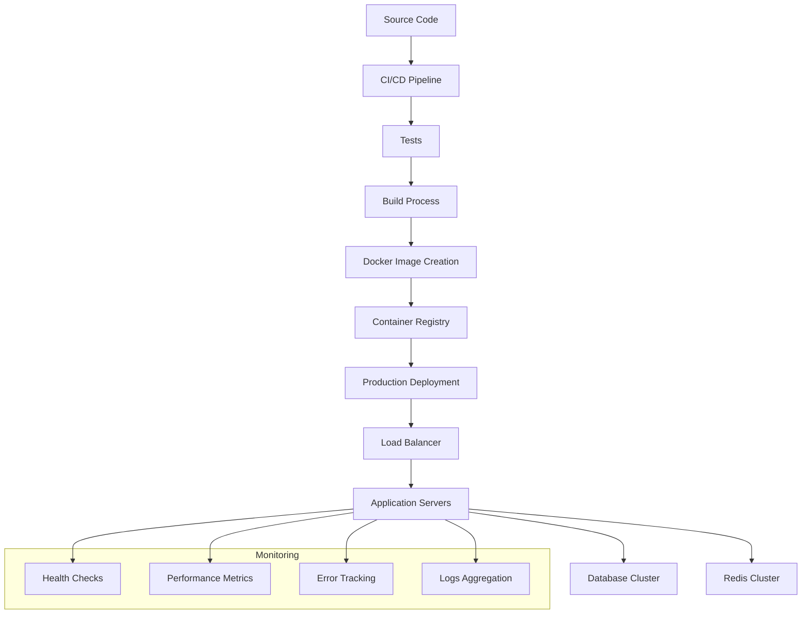

## מבנה Game Modes

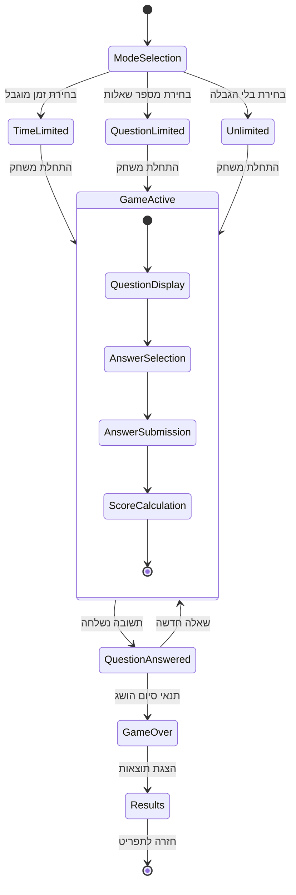

## ארכיטקטורת Audio System

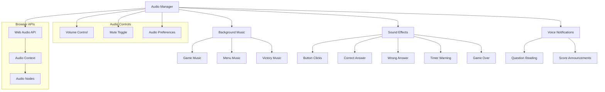
