# דיאגרמות - EveryTriv

קובץ זה מכיל את כל הדיאגרמות המתארות את הארכיטקטורה, הקשרים והיחסים בפרויקט EveryTriv.

## דוח התאמה: תרחישים מול קוד ותרשימים קיימים

(עדכון: מסונכרן עם הקוד, `server/src/migrations/1780000000000-CreateCompleteSchema.ts`, ומודולי `server/src/app.module.ts`.)

### 1. האם תוכן תרשימי הזרימה משקף את הפרויקט?

| תרחיש / רכיב | התאמה לקוד | הערות |
|--------------|-------------|--------|
| **ארכיטקטורה** (Client, Server, PostgreSQL, Redis, Groq, PayPal) | כן | כולל `MultiplayerModule`, `MaintenanceModule`, `AdminModule`. |
| **Authentication** (LoginView, Email/Google, JWT, cache, Redux) | כן | |
| **Single Player** (`GameSetupView`, `canPlay`, `session/start`, deduct, `POST /game/trivia`, PlayArea, `session/answer`, finalize, `SingleSummaryView`) | כן | ראו גם דיאגרמת "זרימת סשן יחיד". |
| **Multiplayer** (Socket.IO namespace `/multiplayer`, אירועי `MultiplayerEvent`) | כן | ראו דיאגרמת "זרימת מולטיפלייר (WebSocket)". |
| **Payment & Credits** (PayPal, webhook, `CreditTransaction`, cache) | כן | אין Stripe/מנוי. |
| **Trivia Generation** | כן | `TriviaRequestPipe`, `CustomDifficultyPipe`, `StartGameSessionPipe` וכו'. |
| **Admin** | כן | |
| **Maintenance – Schedulers** | כן | ראו דיאגרמת "תחזוקה ו-Schedulers". `resetDailyFreeQuestions` אינה מחוברת ל-Cron (אם תרצו איפוס יומי אוטומטי – יש להוסיף קריאה מתוזמנת). |
| **Entities / ERD** | כן | ללא טבלת `leaderboard` (הוסרה במיגרציה); לוחות תוצאות נגזרים מ-`user_stats`. יש `credits_config`. |
| **Redux** | כן | `gameModeSlice`, `gameSessionSlice`, `multiplayerSlice`, `audioSettingsSlice`, `uiPreferencesSlice`. |

### 2. מיפוי תרשימים בקובץ זה

| תרחיש | תרשים ב-DIAGRAMS.md |
|-------|---------------------|
| ארכיטקטורה, מודולי Backend, שכבות | כן |
| Authentication | כן |
| Trivia / Prompt / AI Providers | כן |
| תשובה לשאלה | כן |
| סשן יחיד (מפורט) | כן – "זרימת סשן יחיד" |
| מולטיפלייר WebSocket | כן – "זרימת מולטיפלייר" |
| תחזוקה ו-Cron | כן – "תחזוקה ו-Schedulers" |
| תשלומים | כן |
| ERD | כן – מעודכן למיגרציה ולישויות TypeORM |
| Redux / React Query | כן |
| Middleware | כן – מעודכן (קצה: `RateLimitMiddleware` ב-`AppModule`) |

### 3. הערות שימוש

- **Materialized views** (PostgreSQL): `mv_global_analytics`, `mv_topic_stats` – לא מוצגות כישויות ב-ERD; נוצרות במיגרציה לאנליטיקה.
- נתיבי API בדיאגרמות מניחים קידומת בסיס ה-HTTP כפי שמוגדר בלקוח (לרוב `/api/...`).

---

## דיאגרמת ארכיטקטורה כללית

```mermaid
graph LR
    subgraph "Client - React Frontend"
        A[App.tsx] --> B[AppRoutes.tsx]
        B --> C[Views]
        B --> D[Components]
        C --> E[HomeView]
        C --> F[GameSetupView]
        C --> G[SingleSessionView]
        C --> H[SingleSummaryView]
        C --> I[MultiplayerLobbyView]
        C --> J[MultiplayerGameView]
        C --> K[MultiplayerResultsView]
        C --> L[StatisticsView]
        C --> M[AdminDashboard]
        C --> N[PaymentView]
        C --> O[LoginView]
        C --> P[RegistrationView]
        C --> Q[UnauthorizedView]
        D --> R[Game Components]
        D --> S[UI Components]
        D --> T[Layout / Navigation]
        D --> U[AudioControls]
        D --> V[ProtectedRoute / PublicRoute]
        A --> W[Redux Store]
        W --> X[gameModeSlice, gameSessionSlice, multiplayerSlice, ...]
        A --> Y[React Query]
        A --> Z[Services]
        Z --> ZA[api.service]
        Z --> ZB[auth.service]
        Z --> ZC[user.service]
        Z --> ZD[credits / payment / game / gameHistory / analytics]
        A --> ZE[Hooks]
        ZE --> ZF[useAuth, useTrivia, useCredits, useSingleSession, useMultiplayer, useAnalyticsDashboard, ...]
    end

    subgraph "Shared Package"
        BA[Types] --> BB[Domain Types]
        BA --> BC[Core Types]
        BA --> BD[Infrastructure Types]
        BB --> BE[Game Types]
        BB --> BF[User Types]
        BB --> BG[Analytics Types]
        BB --> BI[Language Types]
        BC --> BJ[Data Types]
        BC --> BK[Error Types]
        BC --> BL[Response Types]
        BD --> BM[API Types]
        BD --> BN[Auth Types]
        BD --> BO[Cache Types]
        BP[Constants] --> BQ[Business Constants]
        BP --> BR[Core Constants]
        BP --> BS[Domain Constants]
        BP --> BT[Infrastructure Constants]
        BQ --> BU[Info Constants]
        BQ --> BV[Language Constants]
        BQ --> BW[Social Constants]
        BR --> BX[API Constants]
        BR --> BY[Auth Constants]
        BR --> BZ[Error Constants]
        BR --> CA[Game Server Constants]
        BR --> CB[Performance Constants]
        BR --> CC[Validation Constants]
        BS --> CD[Game Constants]
        BS --> CE[User Constants]
        BS --> CF[Payment Constants]
        BS --> CG[Credits Constants]
        BT --> CH[HTTP Constants]
        BT --> CI[Infrastructure Constants]
        BT --> CJ[Localhost Constants]
        BT --> CK[Logging Constants]
        BT --> CL[Storage Constants]
        CD[Services] --> CEA[Logging Services]
        CD --> CFA[Credits Services]
        CD --> CGA[Storage Services]
        CEA --> CHA[Client Logger]
        CEA --> CIA[Server Logger]
        CFA --> CJA[Score Calculation]
        CGA --> CKA[Storage Manager]
        BTA[Utils] --> BUA[Core Utils]
        BTA --> BVA[Domain Utils]
        BTA --> BWA[Infrastructure Utils]
        BUA --> BYA[Array Utils]
        BUA --> BZA[Data Utils]
        BUA --> CAA[Math Utils]
        BUA --> CBA[Error Utils]
        BUA --> CCA[Format Utils]
        BVA --> CEB[User Utils]
        BVA --> CFB[Credits Utils]
        BVA --> CGB[Payment Utils]
        BVA --> CIB[Entity Guards]
        BWA --> CJB[ID Utils]
        BWA --> CKB[Storage Utils]
        BWA --> CLB[Sanitization Utils]
        CM[Validation] --> CN[Trivia Validation]
        CM --> CO[Difficulty Validation]
        CM --> CP[Payment Validation]
    end

    subgraph "Server - NestJS Backend"
        DH[main.ts] --> DI[AppModule]
        DI --> DJ[Feature Modules]
        DJ --> DK[AuthModule]
        DJ --> DL[GameModule]
        DJ --> DM[MultiplayerModule]
        DJ --> DN[UserModule]
        DJ --> DO[CreditsModule]
        DJ --> DP[PaymentModule]
        DJ --> DQ[AnalyticsModule]
        DJ --> DR[AdminModule]
        DJ --> DS[MaintenanceModule]
        DI --> DT[Internal Modules]
        DT --> DU[CacheModule]
        DT --> DV[StorageModule]
        DT --> DW[RedisModule]
        DI --> DX[Common]
        DX --> DY[Guards, Interceptors, Pipes, Decorators]
        DI --> DZ[ValidationModule]
        DZ --> EA[LanguageToolService, GameTextLanguageGate, @shared/validation]
    end

    subgraph "Database"
        ED[(PostgreSQL)]
        EE[(Redis)]
    end

    ZA --> DI
    ZB --> DK
    DI --> ED
    DT --> EE
    DJ --> BA
    DJ --> BP
    Z --> BA
    Z --> BP
```

## דיאגרמת זרימת נתונים - יצירת שאלה

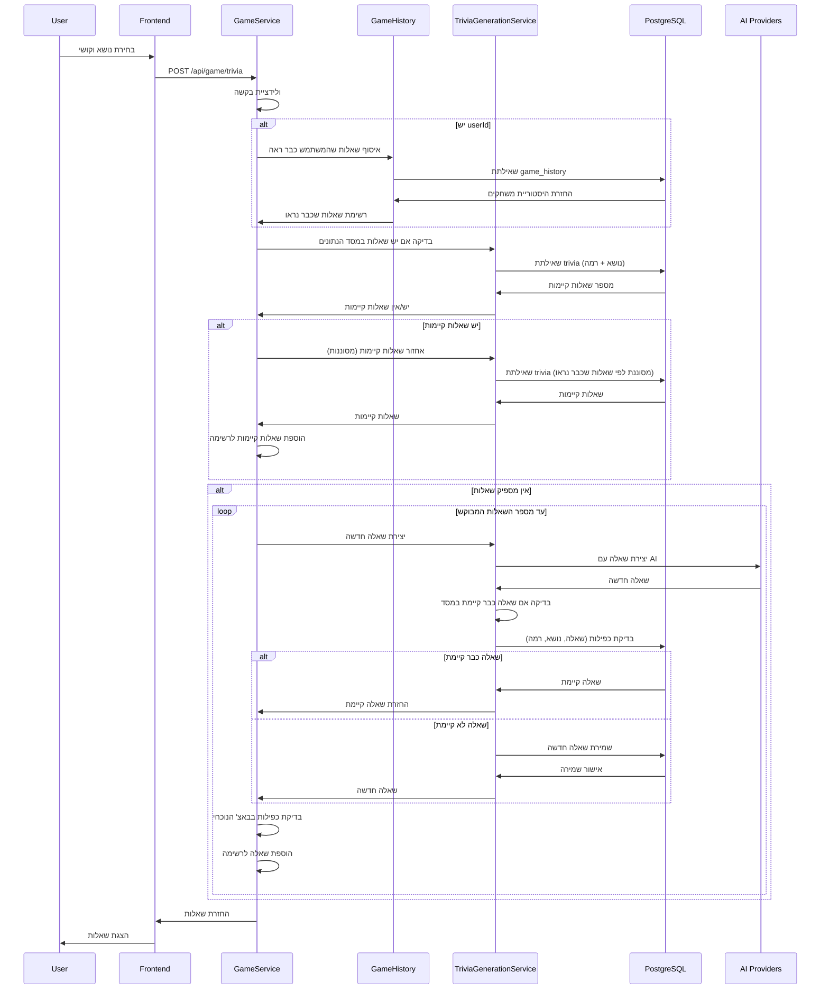
```mermaid
sequenceDiagram
    participant U as User
    participant F as Frontend
    participant G as GameService
    participant GH as GameHistory
    participant TG as TriviaGenerationService
    participant DB as PostgreSQL
    participant AI as AI Providers

    U->>F: בחירת נושא וקושי
    F->>G: POST /api/game/trivia
    G->>G: ולידציית בקשה
    
    alt יש userId
        G->>GH: איסוף שאלות שהמשתמש כבר ראה
        GH->>DB: שאילתת game_history
        DB->>GH: החזרת היסטוריית משחקים
        GH->>G: רשימת שאלות שכבר נראו
    end
    
    G->>TG: בדיקה אם יש שאלות במסד הנתונים
    TG->>DB: שאילתת trivia (נושא + רמה)
    DB->>TG: מספר שאלות קיימות
    TG->>G: יש/אין שאלות קיימות
    
    alt יש שאלות קיימות
        G->>TG: אחזור שאלות קיימות (מסוננות)
        TG->>DB: שאילתת trivia (מסוננת לפי שאלות שכבר נראו)
        DB->>TG: שאלות קיימות
        TG->>G: שאלות קיימות
        G->>G: הוספת שאלות קיימות לרשימה
    end
    
    alt אין מספיק שאלות
        loop עד מספר השאלות המבוקש
            G->>TG: יצירת שאלה חדשה
            TG->>AI: יצירת שאלה עם AI
            AI->>TG: שאלה חדשה
            TG->>TG: בדיקה אם שאלה כבר קיימת במסד
            TG->>DB: בדיקת כפילות (שאלה, נושא, רמה)
            alt שאלה כבר קיימת
                DB->>TG: שאלה קיימת
                TG->>G: החזרת שאלה קיימת
            else שאלה לא קיימת
                TG->>DB: שמירת שאלה חדשה
                DB->>TG: אישור שמירה
                TG->>G: שאלה חדשה
            end
            G->>G: בדיקת כפילות בבאצ' הנוכחי
            G->>G: הוספת שאלה לרשימה
        end
    end
    
    G->>F: החזרת שאלות
    F->>U: הצגת שאלות
```

## דיאגרמת זרימת נתונים - תשובה לשאלה

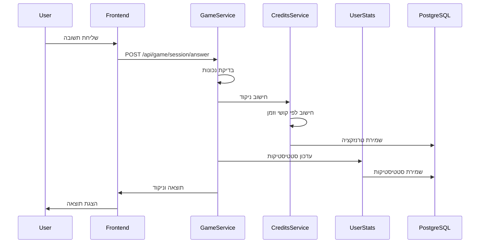
```mermaid
sequenceDiagram
    participant U as User
    participant F as Frontend
    participant G as GameService
    participant P as CreditsService
    participant S as UserStats
    participant DB as PostgreSQL

    U->>F: שליחת תשובה
    F->>G: POST /api/game/session/answer
    G->>G: בדיקת נכונות
    G->>P: חישוב ניקוד
    P->>P: חישוב לפי קושי וזמן
    P->>DB: שמירת טרנזקציה
    G->>S: עדכון סטטיסטיקות
    S->>DB: שמירת סטטיסטיקות
    G->>F: תוצאה וניקוד
    F->>U: הצגת תוצאה
```

## דיאגרמת מודולי Backend

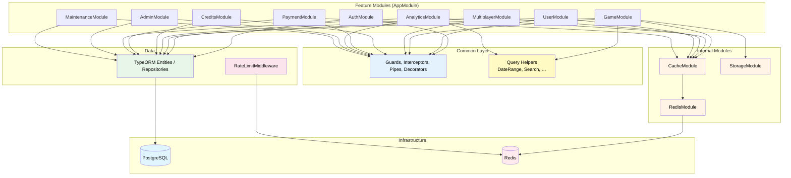
```mermaid
graph TB
    subgraph "Feature Modules (AppModule)"
        A[AuthModule]
        B[UserModule]
        C[GameModule]
        D[MultiplayerModule]
        E[CreditsModule]
        F[PaymentModule]
        G[AnalyticsModule]
        H[AdminModule]
        I[MaintenanceModule]
    end

    subgraph "Common Layer"
        CL[Guards, Interceptors, Pipes, Decorators]
        OA[Query Helpers<br/>DateRange, Search, …]
    end

    subgraph "Internal Modules"
        N[CacheModule]
        O[StorageModule]
        P[RedisModule]
    end

    subgraph "Data"
        Q[TypeORM Entities / Repositories]
        MW[RateLimitMiddleware]
    end

    subgraph "Infrastructure"
        T[(PostgreSQL)]
        U[(Redis)]
    end

    A --> CL
    B --> CL
    C --> CL
    D --> CL
    E --> CL
    F --> CL
    G --> CL
    H --> CL
    I --> CL
    C --> OA
    G --> OA
    A --> Q
    B --> Q
    C --> Q
    D --> Q
    E --> Q
    F --> Q
    G --> Q
    H --> Q
    I --> Q
    Q --> T
    C --> N
    C --> O
    G --> N
    D --> N
    B --> N
    F --> N
    N --> P
    P --> U
    MW --> U

    style CL fill:#e3f2fd,color:#000000
    style OA fill:#fff9c4,color:#000000
    style N fill:#fff4e6,color:#000000
    style O fill:#fff4e6,color:#000000
    style P fill:#fff4e6,color:#000000
    style Q fill:#e8f5e9,color:#000000
    style MW fill:#fce4ec,color:#000000
    style T fill:#e1f5ff,color:#000000
    style U fill:#ffebee,color:#000000
```

## דיאגרמת היררכיית Common Layer - Backend

```mermaid
graph TB
    subgraph "Common Layer - Entry Points"
        A[Decorators<br/>Public, Roles<br/>Cache, NoCache<br/>CurrentUser, CurrentUserId]
        B[Guards<br/>AuthGuard<br/>RolesGuard]
        C[Interceptors<br/>CacheInterceptor<br/>PerformanceInterceptor<br/>ResponseFormattingInterceptor]
        D[Pipes<br/>UserDataPipe, TriviaRequestPipe<br/>StartGameSessionPipe, CustomDifficultyPipe<br/>PaymentDataPipe]
        E[Query Helpers<br/>DateRange<br/>GroupBy<br/>Search<br/>Random]
    end

    subgraph "Common Layer - Services"
        F[Auth Services<br/>AuthenticationManager<br/>PasswordService<br/>JwtTokenService]
        G[Validation<br/>@shared/validation<br/>LanguageToolService]
        H[ValidationModule<br/>NestJS Module]
    end

    subgraph "Common Layer - Error Handling"
        I[GlobalExceptionFilter<br/>Exception Handling<br/>Error Formatting<br/>Error Logging]
    end

    subgraph "External Dependencies"
        J[CacheModule<br/>Internal]
        K[Shared Services<br/>Logger]
    end

    A -->|Metadata| B
    A -->|Metadata| C
    F -->|JWT Validation| B
    F -->|Password Hashing| B
    G -->|Validation Logic| D
    H -->|Module Exports| D
    C -->|Cache Operations| J
    I -->|Catches Errors| B
    I -->|Catches Errors| C
    I -->|Catches Errors| D
    I -->|Logs Errors| K

    style A fill:#fff4e6,color:#000000
    style B fill:#e8f5e9,color:#000000
    style C fill:#e3f2fd,color:#000000
    style D fill:#fce4ec,color:#000000
    style E fill:#fff9c4,color:#000000
    style F fill:#f3e5f5,color:#000000
    style G fill:#e1bee7,color:#000000
    style H fill:#e1bee7,color:#000000
    style I fill:#ffebee,color:#000000
    style J fill:#fff4e6,color:#000000
    style K fill:#e1f5ff,color:#000000
```

## דיאגרמת היררכיית Internal Layer - Backend

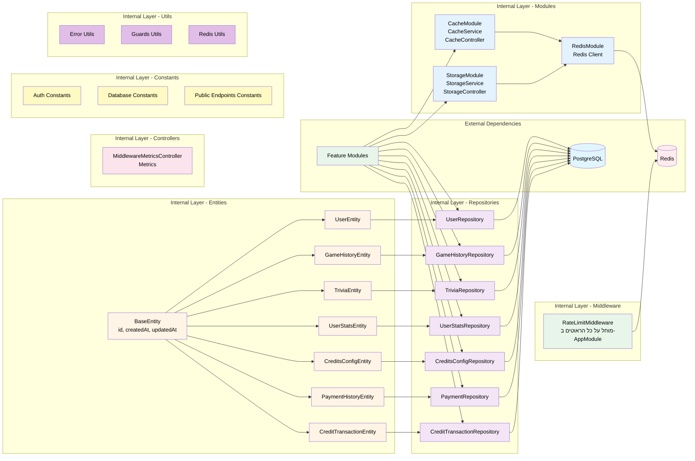
```mermaid
graph LR
    subgraph "Internal Layer - Entities"
        E1[UserEntity]
        E2[GameHistoryEntity]
        E3[TriviaEntity]
        E4[UserStatsEntity]
        E5[CreditsConfigEntity]
        E6[PaymentHistoryEntity]
        E7[CreditTransactionEntity]
        BE[BaseEntity<br/>id, createdAt, updatedAt]
    end

    subgraph "Internal Layer - Repositories"
        R1[UserRepository]
        R2[GameHistoryRepository]
        R3[TriviaRepository]
        R4[UserStatsRepository]
        R5[CreditsConfigRepository]
        R6[PaymentRepository]
        R7[CreditTransactionRepository]
    end

    subgraph "Internal Layer - Modules"
        CM[CacheModule<br/>CacheService<br/>CacheController]
        SM[StorageModule<br/>StorageService<br/>StorageController]
        RM[RedisModule<br/>Redis Client]
    end

    subgraph "Internal Layer - Middleware"
        MW1[RateLimitMiddleware<br/>מוחל על כל הראוטים ב-AppModule]
    end

    subgraph "Internal Layer - Controllers"
        C1[MiddlewareMetricsController<br/>Metrics]
    end

    subgraph "Internal Layer - Constants"
        IC1[Auth Constants]
        IC2[Database Constants]
        IC3[Public Endpoints Constants]
    end

    subgraph "Internal Layer - Utils"
        IU1[Error Utils]
        IU2[Guards Utils]
        IU3[Redis Utils]
    end

    subgraph "External Dependencies"
        DB[(PostgreSQL)]
        REDIS[(Redis)]
        FEATURES[Feature Modules]
    end

    BE --> E1
    BE --> E2
    BE --> E3
    BE --> E4
    BE --> E5
    BE --> E6
    BE --> E7

    E1 --> R1
    E2 --> R2
    E3 --> R3
    E4 --> R4
    E5 --> R5
    E6 --> R6
    E7 --> R7

    R1 --> DB
    R2 --> DB
    R3 --> DB
    R4 --> DB
    R5 --> DB
    R6 --> DB
    R7 --> DB

    CM --> RM
    SM --> RM
    RM --> REDIS

    FEATURES --> R1
    FEATURES --> R2
    FEATURES --> R3
    FEATURES --> R4
    FEATURES --> R5
    FEATURES --> R6
    FEATURES --> R7

    FEATURES --> CM
    FEATURES --> SM

    MW1 --> REDIS

    style BE fill:#fff4e6,color:#000000
    style E1 fill:#fff4e6,color:#000000
    style E2 fill:#fff4e6,color:#000000
    style E3 fill:#fff4e6,color:#000000
    style E4 fill:#fff4e6,color:#000000
    style E5 fill:#fff4e6,color:#000000
    style E6 fill:#fff4e6,color:#000000
    style E7 fill:#fff4e6,color:#000000
    style R1 fill:#f3e5f5,color:#000000
    style R2 fill:#f3e5f5,color:#000000
    style R3 fill:#f3e5f5,color:#000000
    style R4 fill:#f3e5f5,color:#000000
    style R5 fill:#f3e5f5,color:#000000
    style R6 fill:#f3e5f5,color:#000000
    style R7 fill:#f3e5f5,color:#000000
    style CM fill:#e3f2fd,color:#000000
    style SM fill:#e3f2fd,color:#000000
    style RM fill:#e3f2fd,color:#000000
    style MW1 fill:#e8f5e9,color:#000000
    style C1 fill:#fce4ec,color:#000000
    style IC1 fill:#fff9c4,color:#000000
    style IC2 fill:#fff9c4,color:#000000
    style IC3 fill:#fff9c4,color:#000000
    style IU1 fill:#e1bee7,color:#000000
    style IU2 fill:#e1bee7,color:#000000
    style IU3 fill:#e1bee7,color:#000000
    style DB fill:#e1f5ff,color:#000000
    style REDIS fill:#ffebee,color:#000000
    style FEATURES fill:#e8f5e9,color:#000000
```

## דיאגרמת מבנה Frontend

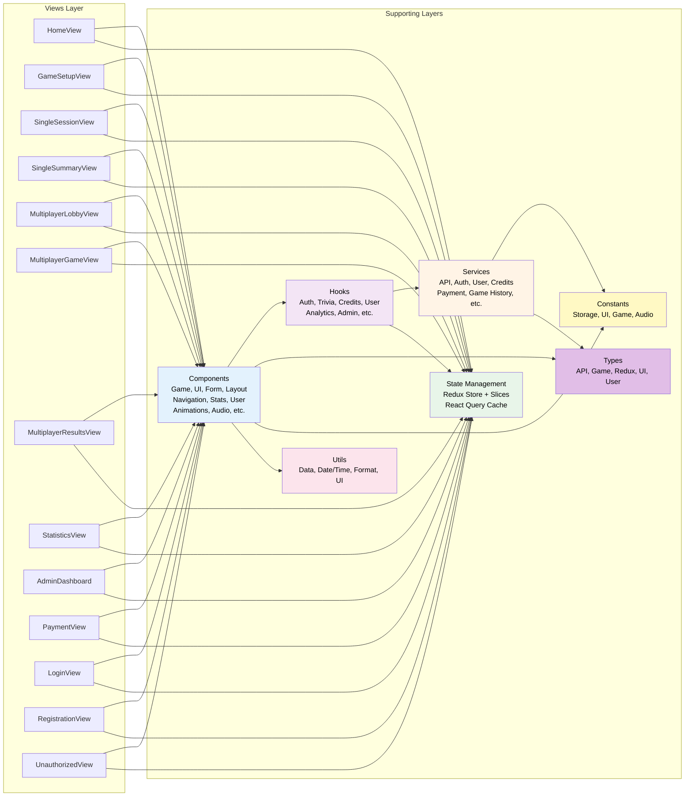
```mermaid
graph LR
    subgraph "Views Layer"
        A[HomeView]
        B[GameSetupView]
        C[SingleSessionView]
        D[SingleSummaryView]
        E[MultiplayerLobbyView]
        F[MultiplayerGameView]
        G[MultiplayerResultsView]
        H[StatisticsView]
        I[AdminDashboard]
        J[PaymentView]
        K[LoginView]
        L[RegistrationView]
        M[UnauthorizedView]
    end

    subgraph "Supporting Layers"
        COMP[Components<br/>Game, UI, Form, Layout<br/>Navigation, Stats, User<br/>Animations, Audio, etc.]
        STATE[State Management<br/>Redux Store + Slices<br/>React Query Cache]
        SERV[Services<br/>API, Auth, User, Credits<br/>Payment, Game History, etc.]
        HOOKS[Hooks<br/>Auth, Trivia, Credits, User<br/>Analytics, Admin, etc.]
        CONST[Constants<br/>Storage, UI, Game, Audio]
        TYPES[Types<br/>API, Game, Redux, UI, User]
        UTILS[Utils<br/>Data, Date/Time, Format, UI]
    end

    A --> COMP
    B --> COMP
    C --> COMP
    D --> COMP
    E --> COMP
    F --> COMP
    G --> COMP
    H --> COMP
    I --> COMP
    J --> COMP
    K --> COMP
    L --> COMP
    M --> COMP

    A --> STATE
    B --> STATE
    C --> STATE
    D --> STATE
    E --> STATE
    F --> STATE
    G --> STATE
    H --> STATE
    I --> STATE
    J --> STATE
    K --> STATE
    L --> STATE
    M --> STATE

    COMP --> HOOKS
    HOOKS --> SERV
    HOOKS --> STATE
    SERV --> CONST
    SERV --> TYPES
    COMP --> TYPES
    COMP --> CONST
    COMP --> UTILS

    style COMP fill:#e3f2fd,color:#000000
    style STATE fill:#e8f5e9,color:#000000
    style SERV fill:#fff4e6,color:#000000
    style HOOKS fill:#f3e5f5,color:#000000
    style CONST fill:#fff9c4,color:#000000
    style TYPES fill:#e1bee7,color:#000000
    style UTILS fill:#fce4ec,color:#000000
```

## דיאגרמת מסד נתונים (ERD)

מבוסס על `CreateCompleteSchema1780000000000` וישויות TypeORM ב-`server/src/internal/entities/`. **אין טבלת `leaderboard`** – דירוגים מחושבים מ-`user_stats` (למשל ב-`LeaderboardAnalyticsService`). יש גם **views** ממומשות: `mv_global_analytics`, `mv_topic_stats`.

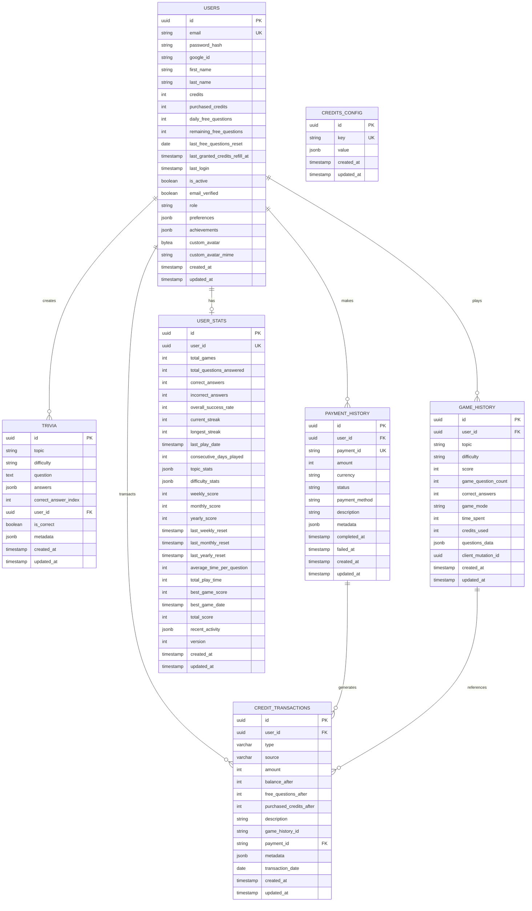
```mermaid
erDiagram
    USERS ||--o{ TRIVIA : "creates"
    USERS ||--o{ GAME_HISTORY : "plays"
    USERS ||--o| USER_STATS : "has"
    USERS ||--o{ PAYMENT_HISTORY : "makes"
    USERS ||--o{ CREDIT_TRANSACTIONS : "transacts"
    PAYMENT_HISTORY ||--o{ CREDIT_TRANSACTIONS : "generates"
    GAME_HISTORY ||--o{ CREDIT_TRANSACTIONS : "references"

    USERS {
        uuid id PK
        string email UK
        string password_hash
        string google_id
        string first_name
        string last_name
        int credits
        int purchased_credits
        int daily_free_questions
        int remaining_free_questions
        date last_free_questions_reset
        timestamp last_granted_credits_refill_at
        timestamp last_login
        boolean is_active
        boolean email_verified
        string role
        jsonb preferences
        jsonb achievements
        bytea custom_avatar
        string custom_avatar_mime
        timestamp created_at
        timestamp updated_at
    }

    TRIVIA {
        uuid id PK
        string topic
        string difficulty
        text question
        jsonb answers
        int correct_answer_index
        uuid user_id FK
        boolean is_correct
        jsonb metadata
        timestamp created_at
        timestamp updated_at
    }

    GAME_HISTORY {
        uuid id PK
        uuid user_id FK
        string topic
        string difficulty
        int score
        int game_question_count
        int correct_answers
        string game_mode
        int time_spent
        int credits_used
        jsonb questions_data
        uuid client_mutation_id
        timestamp created_at
        timestamp updated_at
    }

    USER_STATS {
        uuid id PK
        uuid user_id UK
        int total_games
        int total_questions_answered
        int correct_answers
        int incorrect_answers
        int overall_success_rate
        int current_streak
        int longest_streak
        timestamp last_play_date
        int consecutive_days_played
        jsonb topic_stats
        jsonb difficulty_stats
        int weekly_score
        int monthly_score
        int yearly_score
        timestamp last_weekly_reset
        timestamp last_monthly_reset
        timestamp last_yearly_reset
        int average_time_per_question
        int total_play_time
        int best_game_score
        timestamp best_game_date
        int total_score
        jsonb recent_activity
        int version
        timestamp created_at
        timestamp updated_at
    }

    PAYMENT_HISTORY {
        uuid id PK
        uuid user_id FK
        string payment_id UK
        int amount
        string currency
        string status
        string payment_method
        string description
        jsonb metadata
        timestamp completed_at
        timestamp failed_at
        timestamp created_at
        timestamp updated_at
    }

    CREDIT_TRANSACTIONS {
        uuid id PK
        uuid user_id FK
        varchar type
        varchar source
        int amount
        int balance_after
        int free_questions_after
        int purchased_credits_after
        string description
        string game_history_id
        string payment_id FK
        jsonb metadata
        date transaction_date
        timestamp created_at
        timestamp updated_at
    }

    CREDITS_CONFIG {
        uuid id PK
        string key UK
        jsonb value
        timestamp created_at
        timestamp updated_at
    }
```

## זרימת סשן יחיד (Single Player)

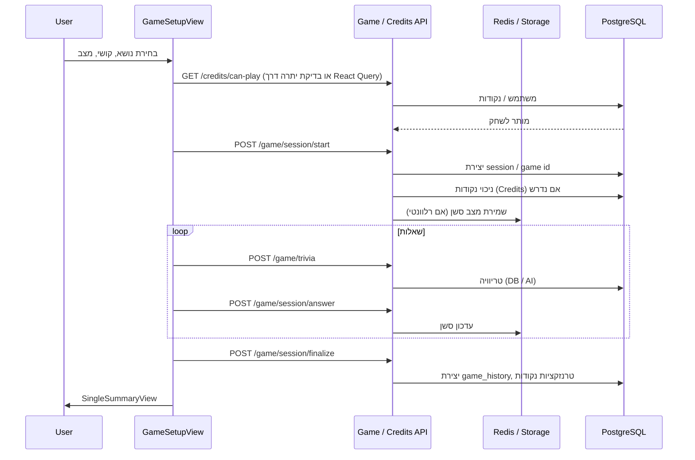
```mermaid
sequenceDiagram
    participant U as User
    participant V as GameSetupView
    participant API as Game / Credits API
    participant R as Redis / Storage
    participant DB as PostgreSQL

    U->>V: בחירת נושא, קושי, מצב
    V->>API: GET /credits/can-play (או בדיקת יתרה דרך React Query)
    API->>DB: משתמש / נקודות
    DB-->>API: מותר לשחק
    V->>API: POST /game/session/start
    API->>DB: יצירת session / game id
    API->>DB: ניכוי נקודות (Credits) אם נדרש
    API->>R: שמירת מצב סשן (אם רלוונטי)
    loop שאלות
        V->>API: POST /game/trivia
        API->>DB: טריוויה (DB / AI)
        V->>API: POST /game/session/answer
        API->>R: עדכון סשן
    end
    V->>API: POST /game/session/finalize
    API->>DB: יצירת game_history, טרנזקציות נקודות
    V->>U: SingleSummaryView
```

## זרימת מולטיפלייר (WebSocket)

Namespace Socket.IO: `/multiplayer`. אירועי לקוח (לרוב `subscribe`): `create-room`, `join-room`, `leave-room`, `start-game`, `submit-answer`. אירועי שרת (למשל ב-`MultiplayerEvent`): `room-created`, `room-joined`, `player-joined`, `game-started`, `question-started`, `answer-received`, `question-ended`, `game-ended`, `room-updated`.

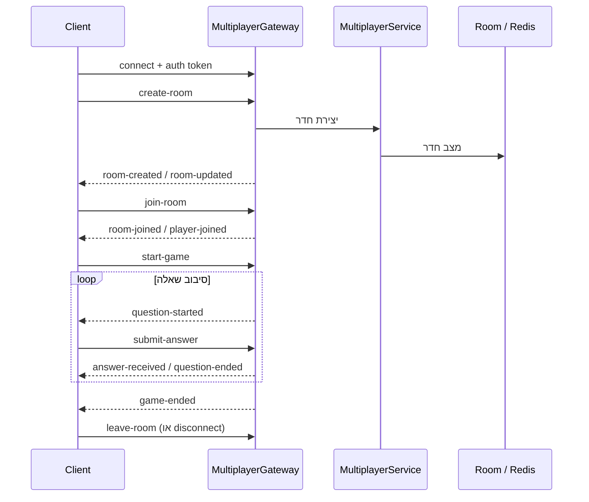
```mermaid
sequenceDiagram
    participant C as Client
    participant G as MultiplayerGateway
    participant S as MultiplayerService
    participant R as Room / Redis

    C->>G: connect + auth token
    C->>G: create-room
    G->>S: יצירת חדר
    S->>R: מצב חדר
    G-->>C: room-created / room-updated
    C->>G: join-room
    G-->>C: room-joined / player-joined
    C->>G: start-game
    loop סיבוב שאלה
        G-->>C: question-started
        C->>G: submit-answer
        G-->>C: answer-received / question-ended
    end
    G-->>C: game-ended
    C->>G: leave-room (או disconnect)
```

## תחזוקה ו-Schedulers

| קומפוננטה | תזמון | תפקיד |
|-----------|--------|--------|
| `GameSessionScheduler.finalizeStaleSessions` | כל 5 דקות | סיום סשנים ישנים ב-Redis (מעל ~שעה) דרך `GameService.finalizeGameSession` |
| `ScoreResetScheduler.resetWeeklyScores` | שבועי | איפוס `weekly_score` ב-`user_stats` |
| `ScoreResetScheduler.resetMonthlyScores` | בתחילת חודש | איפוס `monthly_score` |
| `ScoreResetScheduler.resetYearlyScores` | 1 בינואר | איפוס `yearly_score` |
| `ScoreResetScheduler.retryFailedStatsUpdates` | כל 6 שעות | `UserStatsUpdateService.retryFailedUpdates` |
| `ScoreResetScheduler.checkAllUsersConsistency` | יומי 02:00 | `UserStatsMaintenanceService.checkAllUsersConsistency` + תיקון אוטומטי |

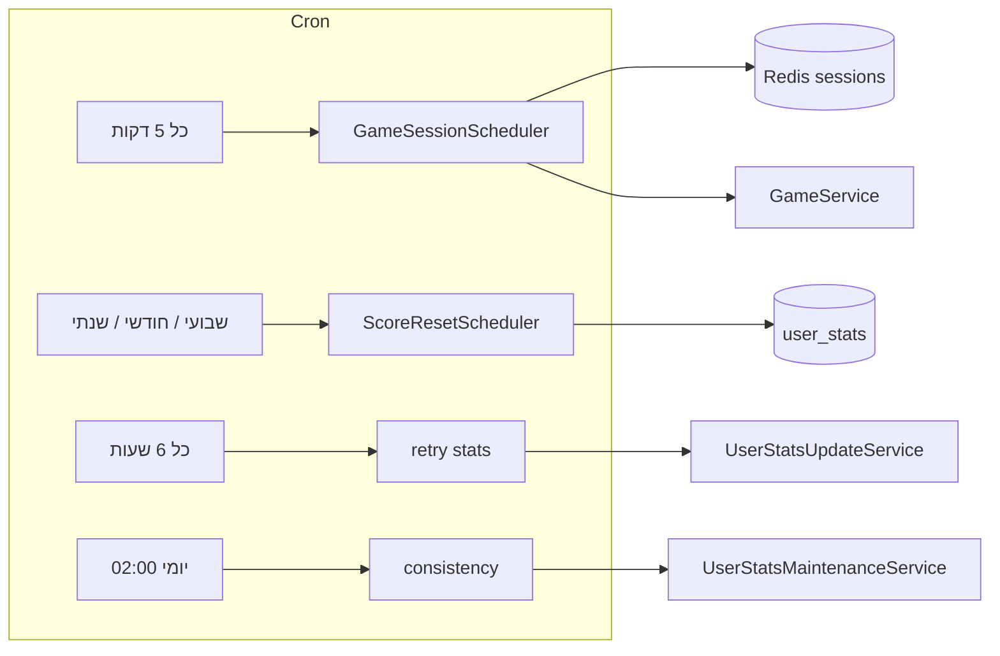
```mermaid
graph LR
    subgraph Cron
        A[כל 5 דקות] --> B[GameSessionScheduler]
        C[שבועי / חודשי / שנתי] --> D[ScoreResetScheduler]
        E[כל 6 שעות] --> F[retry stats]
        G[יומי 02:00] --> H[consistency]
    end
    B --> I[(Redis sessions)]
    B --> J[GameService]
    D --> K[(user_stats)]
    F --> L[UserStatsUpdateService]
    H --> M[UserStatsMaintenanceService]
```

## דיאגרמת זרימת אימות

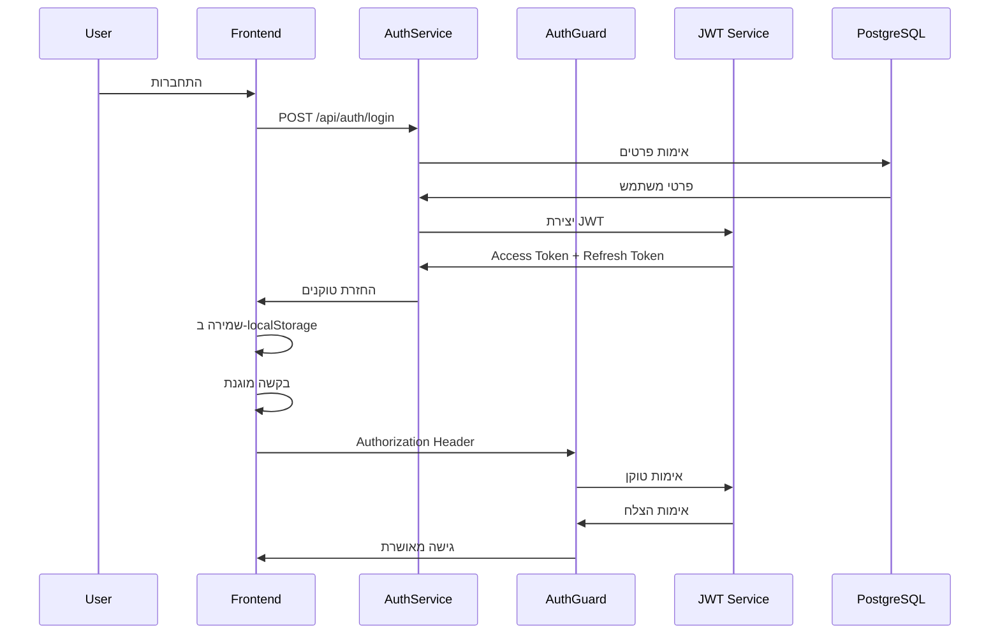
```mermaid
sequenceDiagram
    participant U as User
    participant F as Frontend
    participant A as AuthService
    participant G as AuthGuard
    participant J as JWT Service
    participant DB as PostgreSQL

    U->>F: התחברות
    F->>A: POST /api/auth/login
    A->>DB: אימות פרטים
    DB->>A: פרטי משתמש
    A->>J: יצירת JWT
    J->>A: Access Token + Refresh Token
    A->>F: החזרת טוקנים
    F->>F: שמירה ב-localStorage
    F->>F: בקשה מוגנת
    F->>G: Authorization Header
    G->>J: אימות טוקן
    J->>G: אימות הצלח
    G->>F: גישה מאושרת
```

## דיאגרמת זרימת משחק מלא

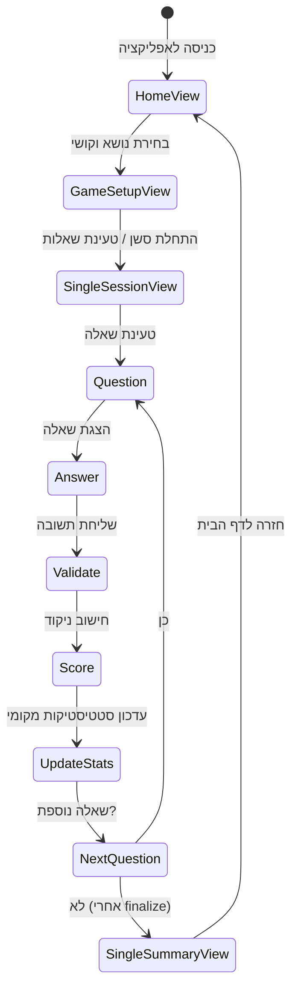
```mermaid
stateDiagram-v2
    [*] --> HomeView: כניסה לאפליקציה
    HomeView --> GameSetupView: בחירת נושא וקושי
    GameSetupView --> SingleSessionView: התחלת סשן / טעינת שאלות
    SingleSessionView --> Question: טעינת שאלה
    Question --> Answer: הצגת שאלה
    Answer --> Validate: שליחת תשובה
    Validate --> Score: חישוב ניקוד
    Score --> UpdateStats: עדכון סטטיסטיקות מקומי
    UpdateStats --> NextQuestion: שאלה נוספת?
    NextQuestion --> Question: כן
    NextQuestion --> SingleSummaryView: לא (אחרי finalize)
    SingleSummaryView --> HomeView: חזרה לדף הבית
```

## דיאגרמת חבילה משותפת (Shared)

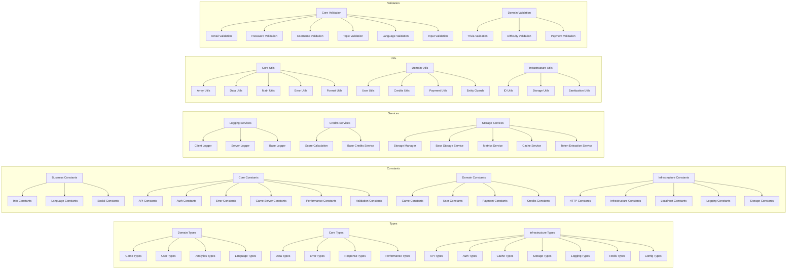
```mermaid
graph LR
    subgraph "Types"
        A[Domain Types]
        B[Core Types]
        C[Infrastructure Types]
        A --> D[Game Types]
        A --> E[User Types]
        A --> F[Analytics Types]
        A --> H[Language Types]
        B --> I[Data Types]
        B --> J[Error Types]
        B --> K[Response Types]
        B --> L[Performance Types]
        C --> M[API Types]
        C --> N[Auth Types]
        C --> O[Cache Types]
        C --> P[Storage Types]
        C --> Q[Logging Types]
        C --> R[Redis Types]
        C --> S[Config Types]
    end

    subgraph "Constants"
        T[Business Constants]
        U[Core Constants]
        V[Infrastructure Constants]
        W[Domain Constants]
        T --> X[Info Constants]
        T --> Y[Language Constants]
        T --> Z[Social Constants]
        U --> AA[API Constants]
        U --> AB[Auth Constants]
        U --> AC[Error Constants]
        U --> AD[Game Server Constants]
        U --> AE[Performance Constants]
        U --> AF[Validation Constants]
        W --> AG[Game Constants]
        W --> AH[User Constants]
        W --> AI[Payment Constants]
        W --> AJ[Credits Constants]
        V --> AK[HTTP Constants]
        V --> AL[Infrastructure Constants]
        V --> AM[Localhost Constants]
        V --> AN[Logging Constants]
        V --> AO[Storage Constants]
    end

    subgraph "Services"
        AP[Logging Services]
        AQ[Credits Services]
        AR[Storage Services]
        AP --> AS[Client Logger]
        AP --> AT[Server Logger]
        AP --> AU[Base Logger]
        AQ --> AV[Score Calculation]
        AQ --> AW[Base Credits Service]
        AR --> AX[Storage Manager]
        AR --> AY[Base Storage Service]
        AR --> AZ[Metrics Service]
        AR --> BA[Cache Service]
        AR --> BB[Token Extraction Service]
    end

    subgraph "Utils"
        BC[Core Utils]
        BD[Domain Utils]
        BE[Infrastructure Utils]
        BC --> BG[Array Utils]
        BC --> BH[Data Utils]
        BC --> BI[Math Utils]
        BC --> BJ[Error Utils]
        BC --> BK[Format Utils]
        BD --> BM[User Utils]
        BD --> BN[Credits Utils]
        BD --> BO[Payment Utils]
        BD --> BQ[Entity Guards]
        BE --> BR[ID Utils]
        BE --> BS[Storage Utils]
        BE --> BT[Sanitization Utils]
    end

    subgraph "Validation"
        BU[Core Validation]
        BV[Domain Validation]
        BU --> BW[Email Validation]
        BU --> BX[Password Validation]
        BU --> BY[Username Validation]
        BU --> BZ[Topic Validation]
        BU --> CA[Language Validation]
        BU --> CB[Input Validation]
        BV --> CC[Trivia Validation]
        BV --> CD[Difficulty Validation]
        BV --> CE[Payment Validation]
    end
```

## דיאגרמת AI Providers

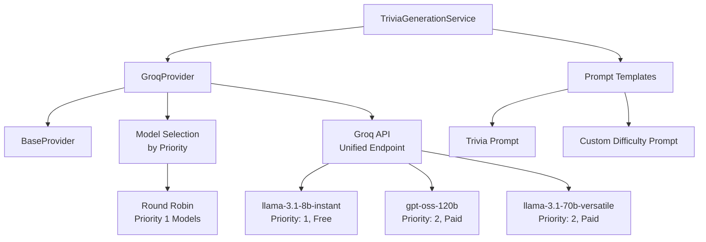
```mermaid
graph TB
    A[TriviaGenerationService] --> B[GroqProvider]
    B --> C[BaseProvider]
    
    B --> D[Model Selection<br/>by Priority]
    D --> E[Round Robin<br/>Priority 1 Models]
    
    B --> F[Groq API<br/>Unified Endpoint]
    F --> G[llama-3.1-8b-instant<br/>Priority: 1, Free]
    F --> I[gpt-oss-120b<br/>Priority: 2, Paid]
    F --> J[llama-3.1-70b-versatile<br/>Priority: 2, Paid]
    
    A --> K[Prompt Templates]
    K --> L[Trivia Prompt]
    K --> M[Custom Difficulty Prompt]
```

## דיאגרמת זרימת Prompt - יצירת שאלת טריוויה

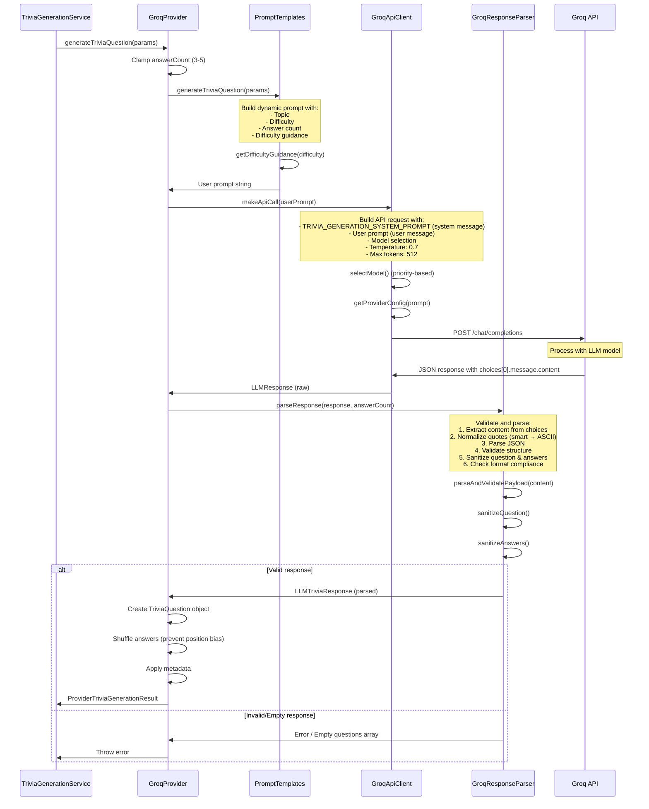
```mermaid
sequenceDiagram
    participant TG as TriviaGenerationService
    participant GP as GroqProvider
    participant PT as PromptTemplates
    participant AC as GroqApiClient
    participant RP as GroqResponseParser
    participant AI as Groq API

    TG->>GP: generateTriviaQuestion(params)
    
    GP->>GP: Clamp answerCount (3-5)
    GP->>PT: generateTriviaQuestion(params)
    
    Note over PT: Build dynamic prompt with:<br/>- Topic<br/>- Difficulty<br/>- Answer count<br/>- Difficulty guidance
    PT->>PT: getDifficultyGuidance(difficulty)
    PT->>GP: User prompt string
    
    GP->>AC: makeApiCall(userPrompt)
    
    Note over AC: Build API request with:<br/>- TRIVIA_GENERATION_SYSTEM_PROMPT (system message)<br/>- User prompt (user message)<br/>- Model selection<br/>- Temperature: 0.7<br/>- Max tokens: 512
    AC->>AC: selectModel() (priority-based)
    AC->>AC: getProviderConfig(prompt)
    AC->>AI: POST /chat/completions
    
    Note over AI: Process with LLM model
    AI->>AC: JSON response with choices[0].message.content
    
    AC->>GP: LLMResponse (raw)
    
    GP->>RP: parseResponse(response, answerCount)
    
    Note over RP: Validate and parse:<br/>1. Extract content from choices<br/>2. Normalize quotes (smart → ASCII)<br/>3. Parse JSON<br/>4. Validate structure<br/>5. Sanitize question & answers<br/>6. Check format compliance
    RP->>RP: parseAndValidatePayload(content)
    RP->>RP: sanitizeQuestion()
    RP->>RP: sanitizeAnswers()
    
    alt Valid response
        RP->>GP: LLMTriviaResponse (parsed)
        GP->>GP: Create TriviaQuestion object
        GP->>GP: Shuffle answers (prevent position bias)
        GP->>GP: Apply metadata
        GP->>TG: ProviderTriviaGenerationResult
    else Invalid/Empty response
        RP->>GP: Error / Empty questions array
        GP->>TG: Throw error
    end
```

**רכיבים:**
- **PromptTemplates**: יוצר prompts דינמיים עם הנחיות איכות וקושי
- **TRIVIA_GENERATION_SYSTEM_PROMPT**: קבוע - הנחיות כלליות ל-AI ליצירת שאלות
- **GroqApiClient**: מנהל את הקריאה ל-API עם retry logic ו-error handling
- **GroqResponseParser**: מנתח ומאמת את התשובה מה-AI

## דיאגרמת Middleware Stack

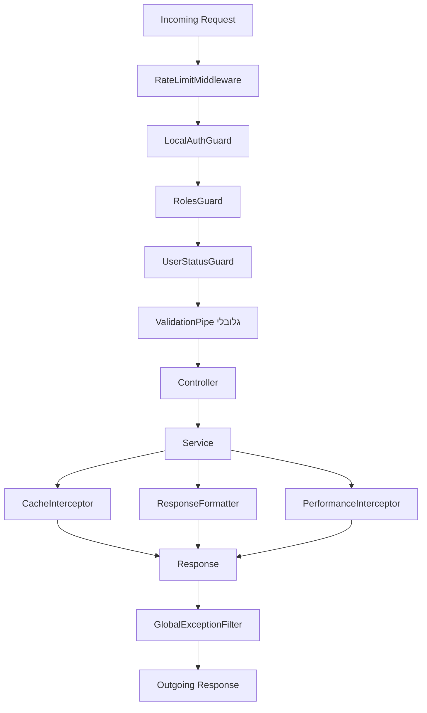
```mermaid
graph TB
    A[Incoming Request] --> B[RateLimitMiddleware]
    B --> C[LocalAuthGuard]
    C --> D[RolesGuard]
    D --> E[UserStatusGuard]
    E --> F[ValidationPipe גלובלי]
    F --> G[Controller]
    G --> H[Service]
    H --> I[CacheInterceptor]
    H --> J[ResponseFormatter]
    H --> K[PerformanceInterceptor]
    I --> L[Response]
    J --> L
    K --> L
    L --> M[GlobalExceptionFilter]
    M --> N[Outgoing Response]
```

## דיאגרמת Redux State

```mermaid
graph TB
    A[Redux Store] --> B[gameModeSlice]
    A --> C[gameSessionSlice]
    A --> D[multiplayerSlice]
    A --> E[audioSettingsSlice]
    A --> F[uiPreferencesSlice]
    
    B --> B1[currentMode]
    B --> B2[currentTopic]
    B --> B3[currentDifficulty]
    B --> B4[currentSettings]
    B --> B5[isLoading]
    B --> B6[error]
    
    C --> C1[gameId]
    C --> C2[currentQuestionIndex]
    C --> C3[score]
    C --> C4[questions]
    C --> C5[loading]
    C --> C6[timeSpent]
    
    D --> D1[isConnected]
    D --> D2[room]
    D --> D3[gameState]
    D --> D4[leaderboard]
    D --> D5[error]
    D --> D6[isLoading]
    
    E --> E1[volume]
    E --> E2[isMuted]
    E --> E3[soundEnabled]
    E --> E4[musicEnabled]
    E --> E5[isInitialized]
    
    F --> F1[leaderboardPeriod]
    
    B -.->|persisted| G[localStorage]
    E -.->|persisted| G
    F -.->|persisted| H[sessionStorage]
    
    style B fill:#e1f5ff
    style C fill:#ffe1e1
    style D fill:#e1ffe1
    style E fill:#fff4e1
    style F fill:#f4e1ff
    style G fill:#e1e1e1
    style H fill:#e1e1e1
```

## דיאגרמת React Query Cache

דוגמאות נתיבים (הקידומת בסיסית כמו בלקוח, לרוב `/api`). לוחות תוצאות: תחת **`/analytics/leaderboard`** (לא `/leaderboard`).

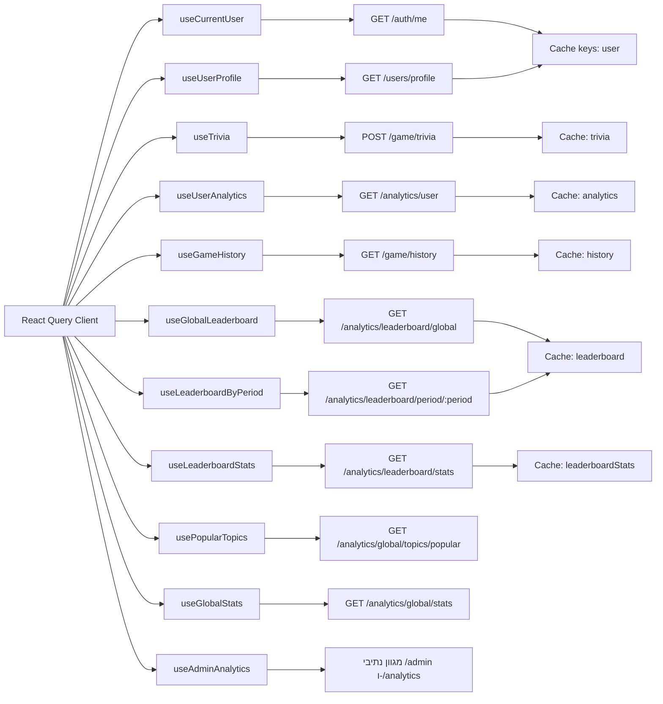
```mermaid
graph LR
    A[React Query Client] --> B[useCurrentUser]
    A --> C[useUserProfile]
    A --> D[useTrivia]
    A --> E[useUserAnalytics]
    A --> F[useGameHistory]
    A --> G[useGlobalLeaderboard]
    A --> H[useLeaderboardByPeriod]
    A --> I[useLeaderboardStats]
    A --> J[usePopularTopics]
    A --> K[useGlobalStats]
    A --> L[useAdminAnalytics]

    B --> M[GET /auth/me]
    C --> N[GET /users/profile]
    D --> O[POST /game/trivia]
    E --> P[GET /analytics/user]
    F --> Q[GET /game/history]
    G --> R[GET /analytics/leaderboard/global]
    H --> S[GET /analytics/leaderboard/period/:period]
    I --> T[GET /analytics/leaderboard/stats]
    J --> U[GET /analytics/global/topics/popular]
    K --> V[GET /analytics/global/stats]
    L --> W[מגוון נתיבי /admin ו-/analytics]

    M --> X[Cache keys: user]
    N --> X
    O --> Y[Cache: trivia]
    P --> Z[Cache: analytics]
    Q --> AA[Cache: history]
    R --> AB[Cache: leaderboard]
    S --> AB
    T --> AC[Cache: leaderboardStats]
```

## דיאגרמת זרימת תשלומים

(המערכת משתמשת ב-**PayPal** ו-**נקודות (Credits)**; אין מנוי/Stripe.)

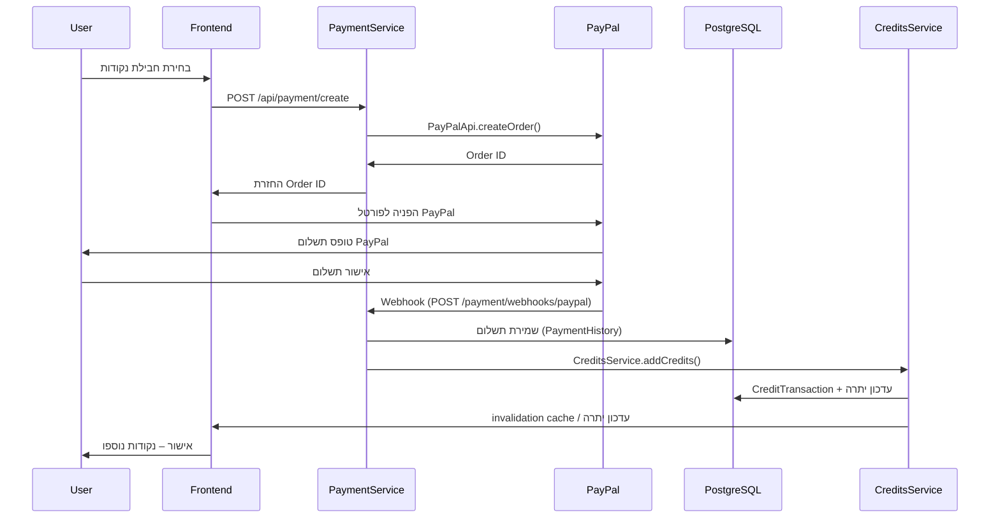
```mermaid
sequenceDiagram
    participant U as User
    participant F as Frontend
    participant P as PaymentService
    participant S as PayPal
    participant DB as PostgreSQL
    participant C as CreditsService

    U->>F: בחירת חבילת נקודות
    F->>P: POST /api/payment/create
    P->>S: PayPalApi.createOrder()
    S->>P: Order ID
    P->>F: החזרת Order ID
    F->>S: הפניה לפורטל PayPal
    S->>U: טופס תשלום PayPal
    U->>S: אישור תשלום
    S->>P: Webhook (POST /payment/webhooks/paypal)
    P->>DB: שמירת תשלום (PaymentHistory)
    P->>C: CreditsService.addCredits()
    C->>DB: CreditTransaction + עדכון יתרה
    C->>F: invalidation cache / עדכון יתרה
    F->>U: אישור – נקודות נוספו
```

## דיאגרמת Views מלאה

```mermaid
graph LR
    subgraph "Public Views"
        A[HomeView]
        B[LoginView]
        C[RegistrationView]
        D[StatisticsView]
        E[UnauthorizedView]
        F[PrivacyPolicyView / Terms / Contact]
    end

    subgraph "Game Views"
        G[GameSetupView]
        H[SingleSessionView]
        I[SingleSummaryView]
        J[MultiplayerLobbyView]
        K[MultiplayerGameView]
        L[MultiplayerResultsView]
    end

    subgraph "Account / Payment"
        M[PaymentView]
        N[CompleteProfile]
    end

    subgraph "Admin"
        O[AdminDashboard]
    end

    A --> P[Components]
    G --> P
    H --> P
    D --> Q[Statistics / Leaderboard tabs]
    M --> R[Payment UI]
    O --> S[Admin Components]

    subgraph "State Management"
        SM[Redux + React Query]
    end
    A --> SM
    D --> SM
    G --> SM
    H --> SM
    M --> SM
    O --> SM

    style SM fill:#e3f2fd,color:#000000
```

## דיאגרמת Components מלאה

```mermaid
graph TB
    subgraph "Game Components"
        A[Game]
        B[GameTimer]
        C[TriviaForm]
        D[TriviaGame]
        E[GameMode]
        F[CustomDifficultyHistory]
    end

    subgraph "UI Components"
        G[Button]
        H[Card]
        I[Modal]
        J[Input]
        K[Select]
        L[Avatar]
        M[IconLibrary]
        N[ValidatedInput]
        O[ValidationMessage]
        P[ValidationIcon]
        Q[AlertModal]
        R[ConfirmModal]
        S[GoogleIcon]
        T[FeatureHighlight]
    end

    subgraph "Layout Components"
        U[GridLayout]
        V[Footer]
        W[NotFound]
        X[SocialShare]
    end

    subgraph "Navigation Components"
        Y[Navigation]
        Z[ProtectedRoute]
        BA[PublicRoute]
    end

    subgraph "Stats Components"
        BB[ScoringSystem]
        BC[LeaderboardTable / LeaderboardTabContent]
        BD[CustomDifficultyHistory]
    end

    subgraph "User Components"
        BE[CompleteProfile]
        BF[FavoriteTopics]
        BG[OAuthCallback]
    end

    subgraph "Animations"
        BH[AnimationLibrary]
        BI[fadeInUp]
        BJ[fadeInDown]
        BK[fadeInLeft]
        BL[fadeInRight]
        BM[scaleIn]
        BN[hoverScale]
        BO[createStaggerContainer]
    end

    subgraph "Special Components"
        BP[AudioControls]
        BQ[FeatureErrorBoundary]
        BR[ErrorBoundary]
        BT[ValidatedForm]
        BU[GameMode]
        BV[IconLibrary]
    end

    subgraph "Home Components"
        BW[HomeTitle]
        BX[ErrorBanner]
        BY[CurrentDifficulty]
    end

    A --> E
    A --> B
    C --> E
    D --> A
    F --> E
    G --> H
    I --> N
    J --> N
    N --> O
    N --> P
    Y --> Z
    BB --> BC
    BE --> BF
    A --> BH
    C --> BH
    BH --> BI
    BH --> BJ
    BH --> BK
    BH --> BL
    BH --> BM
    BH --> BN
    BH --> BO
```

## דיאגרמת Hooks מלאה

```mermaid
graph LR
    subgraph "React Query Hooks"
        RQH[React Query Hooks<br/>useUserProfile, useGameHistory<br/>useGlobalLeaderboard, useLeaderboardByPeriod<br/>useUserAnalytics, useAdminAnalytics<br/>usePopularTopics, useGlobalStats, etc.]
    end

    subgraph "Redux Hooks"
        N[useAppDispatch]
        O[useAppSelector]
    end

    subgraph "Auth Hooks"
        AUTH[Auth Hooks<br/>useAuth, useLogin<br/>useRegister, useCurrentUser]
    end

    subgraph "Game Hooks"
        GAME[Game Hooks<br/>useTrivia, useGameTimer<br/>useFinalizeGameSession, useCanPlay<br/>useDeductCredits]
    end

    subgraph "User Hooks"
        USER[User Hooks<br/>useUser, useUpdateUserProfile<br/>useUserPreferences]
    end

    subgraph "Credits Hooks"
        CREDITS[Credits Hooks<br/>useCredits, useCreditBalance<br/>useCreditHistory]
    end

    subgraph "Account Management Hooks"
        ACCOUNT[Account Management Hooks<br/>useAccountManagement<br/>useUpdateUserCredits<br/>useUpdateUserStatus<br/>useDeleteUser<br/>useGetUserById]
    end

    subgraph "Analytics Hooks"
        ANALYTICS[Analytics Hooks<br/>useAnalyticsDashboard<br/>useUserStatisticsById<br/>useUserPerformanceById<br/>useUserProgressById<br/>useUserActivityById<br/>useUserInsightsById<br/>useUserRecommendationsById<br/>useUserTrendsById<br/>useCompareUserPerformance<br/>useUserSummaryById, etc.]
    end

    subgraph "Utility Hooks"
        AZ[useAudio]
        BA[useDebounce]
        BB[useDebouncedCallback]
        BC[usePrevious]
        BD[useValueChange]
        BE[useValidation]
        BF[useNavigationController]
        BG[useGlobalLeaderboard / useLeaderboardByPeriod]
    end

    subgraph "Services"
        BH[api.service]
        BI[auth.service]
        BJ[user.service]
        BK[credits.service]
        BL[payment.service]
        BM[audio.service]
        BN[Redux Store]
    end

    RQH --> BH
    AUTH --> BI
    USER --> BJ
    CREDITS --> BK
    SUB --> BL
    GAME --> BH
    ACCOUNT --> BH
    ANALYTICS --> BH
    AZ --> BM
    N --> BN

    style BH fill:#e3f2fd,color:#000000
    style BI fill:#fff4e6,color:#000000
    style BJ fill:#e8f5e9,color:#000000
    style BK fill:#fff9c4,color:#000000
    style BL fill:#fce4ec,color:#000000
    style BM fill:#e1bee7,color:#000000
    style BN fill:#e8f5e9,color:#000000
    style RQH fill:#e3f2fd,color:#000000
    style AUTH fill:#fff4e6,color:#000000
    style USER fill:#e8f5e9,color:#000000
    style CREDITS fill:#fff9c4,color:#000000
    style SUB fill:#fce4ec,color:#000000
    style GAME fill:#e1bee7,color:#000000
    style ACCOUNT fill:#f3e5f5,color:#000000
    style ANALYTICS fill:#e1bee7,color:#000000
```

## דיאגרמת Services מלאה (Client)

```mermaid
graph LR
    subgraph "API Services"
        A[api.service]
        B[auth.service]
        C[user.service]
        D[credits.service]
        E[payment.service]
        F[gameHistory.service]
        G[game.service<br/>trivia, validate-text, validate-custom]
        H[score.service]
    end

    subgraph "Utility Services"
        I[audio.service]
        J[storage.service]
        K[queryClient.service]
    end

    subgraph "Interceptors"
        L[Request Interceptor]
        M[Response Interceptor]
        N[Error Interceptor]
        O[Auth Interceptor]
        P[Base Interceptor Manager]
    end

    subgraph "External APIs"
        Q[Backend API]
        R[PayPal API]
    end

    A --> Q
    B --> Q
    C --> Q
    D --> Q
    E --> Q
    F --> Q
    G --> Q
    H --> Q
    E --> R
    A --> L
    A --> M
    A --> N
    A --> O
    L --> P
    M --> P
    N --> P
    O --> P
    I --> T[AudioContext]
    J --> U[localStorage]
    K --> V[React Query Client]
```

## דיאגרמת Routes/Navigation

מסלולים עיקריים מ-`ROUTES` ב-`navigation.constants.ts` (משחק יחיד/מרובה תחת `/game/...`).

```mermaid
graph LR
    subgraph "App Routes"
        A[AppRoutes.tsx]
        A --> B[Public]
        A --> C[Protected]
        A --> D[Admin]
    end

    subgraph "Public"
        E[/ - HomeView]
        F[/statistics - StatisticsView]
        G[/login, /register]
        H[/privacy, /terms, /contact]
    end

    subgraph "Game"
        I[/game - GameSetupView]
        J[/game/single/play/:gameId]
        K[/game/single/summary/:gameId]
        L[/game/multiplayer/...]
    end

    subgraph "Protected"
        M[/payment - PaymentView]
        N[/complete-profile]
    end

    subgraph "Admin"
        O[/admin - AdminDashboard]
    end

    subgraph "Guards"
        P[ProtectedRoute]
        Q[PublicRoute]
    end

    C --> P
    D --> P
    B --> Q
    G --> Q
```

## דיאגרמת זרימת Analytics

```mermaid
sequenceDiagram
    participant U as User
    participant AV as StatisticsView
    participant ADH as useAnalyticsDashboard
    participant AS as api.service
    participant AM as AnalyticsModule
    participant DB as PostgreSQL
    participant C as Redis Cache

    U->>AV: פתיחת Statistics / אנליטיקה
    AV->>ADH: useUserAnalytics
    ADH->>AS: GET /api/analytics/user
    AS->>AM: בקשה לאנליטיקה
    AM->>C: בדיקת מטמון
    alt יש במטמון
        C->>AM: החזרת נתונים
    else אין במטמון
        AM->>DB: שאילתת נתונים
        DB->>AM: החזרת נתונים
        AM->>C: שמירה במטמון
    end
    AM->>AS: החזרת אנליטיקה
    AS->>ADH: עדכון cache
    ADH->>AV: עדכון UI
    AV->>U: הצגת גרפים ונתונים
    U->>AV: בחירת תקופה/פילטרים
    AV->>ADH: useDifficultyStats / usePopularTopics
    ADH->>AS: GET /api/analytics/difficulty / topics
    AS->>AM: בקשה לנתונים
    AM->>DB: שאילתה
    DB->>AM: נתונים
    AM->>AS: תגובה
    AS->>ADH: עדכון
    ADH->>AV: עדכון UI
```

## דיאגרמת זרימת Admin Dashboard

```mermaid
sequenceDiagram
    participant A as Admin
    participant AD as AdminDashboard
    participant AAH as useAdminAnalytics
    participant AS as api.service
    participant UM as UserModule
    participant AM as AnalyticsModule
    participant DB as PostgreSQL

    A->>AD: פתיחת Dashboard
    AD->>AAH: useUserStatisticsById
    AAH->>AS: GET /api/admin/users/:id/statistics
    AS->>UM: בקשה לנתוני משתמש
    UM->>DB: שאילתת נתונים
    DB->>UM: נתוני משתמש
    UM->>AS: תגובה
    AS->>AAH: עדכון cache
    AAH->>AD: עדכון UI
    AD->>A: הצגת סטטיסטיקות
    A->>AD: פעולת ניהול (עדכון/מחיקה)
    AD->>AAH: useUpdateUserCredits / useDeleteUser
    AAH->>AS: PUT/DELETE /api/admin/users/:id
    AS->>UM: פעולת ניהול
    UM->>DB: עדכון/מחיקה
    DB->>UM: אישור
    UM->>AS: תגובה
    AS->>AAH: עדכון
    AAH->>AD: עדכון UI
    AD->>A: אישור פעולה
    A->>AD: השוואת משתמשים
    AD->>AAH: useCompareUserPerformance
    AAH->>AS: GET /api/admin/users/:id/compare
    AS->>AM: בקשה להשוואה
    AM->>DB: שאילתת השוואה
    DB->>AM: נתוני השוואה
    AM->>AS: תגובה
    AS->>AAH: עדכון
    AAH->>AD: עדכון UI
    AD->>A: הצגת השוואה
```

## דיאגרמת היררכיית Backend - Database עד API

```mermaid
graph TB
    subgraph "Database Layer"
        DB[(PostgreSQL Database)]
    end

    subgraph "TypeORM Entities Layer"
        E1[UserEntity]
        E2[GameHistoryEntity]
        E3[TriviaEntity]
        E4[UserStatsEntity]
        E5[CreditsConfigEntity]
        E6[PaymentHistoryEntity]
        E7[CreditTransactionEntity]
    end

    subgraph "TypeORM Repositories Layer"
        R1[UserRepository]
        R2[GameHistoryRepository]
        R3[TriviaRepository]
        R4[UserStatsRepository]
        R5[CreditsConfigRepository]
        R6[PaymentRepository]
        R7[CreditTransactionRepository]
    end

    subgraph "TypeORM QueryBuilder (Complex Queries Only)"
        QB[QueryBuilder<br/>Aggregations, JOIN, טווחי תאריכים]
    end

    subgraph "Common Layer (Query Helpers)"
        QH[Query Helpers]
    end

    subgraph "Services Layer (Business Logic)"
        S1[UserService]
        S2[GameService]
        S3[Analytics services<br/>כולל LeaderboardAnalyticsService]
        S4[CreditsService]
        S5[PaymentService]
    end

    subgraph "Controllers Layer (HTTP Handling)"
        C1[UserController]
        C2[GameController]
        C3[AnalyticsController<br/>כולל /analytics/leaderboard]
        C4[CreditsController]
        C5[PaymentController]
    end

    subgraph "HTTP API Layer"
        API[REST + WebSocket<br/>/auth, /game, /multiplayer<br/>/users, /credits, /analytics<br/>/payment, /admin, /ai-providers]
    end

    DB --> E1
    DB --> E2
    DB --> E3
    DB --> E4
    DB --> E5
    DB --> E6
    DB --> E7

    E1 --> R1
    E2 --> R2
    E3 --> R3
    E4 --> R4
    E5 --> R5
    E6 --> R6
    E7 --> R7

    subgraph "Repositories Group"
        REPOS[Repositories R1–R7]
    end

    subgraph "Services Group"
        SERVS[Services S1–S5]
    end

    subgraph "Controllers Group"
        CONTRS[Controllers C1–C5 + נוספים]
    end

    REPOS --> QB
    QB --> QH
    QH --> SERVS
    REPOS --> SERVS
    SERVS --> CONTRS
    CONTRS --> API

    style REPOS fill:#f3e5f5,color:#000000
    style SERVS fill:#e8f5e9,color:#000000
    style CONTRS fill:#fce4ec,color:#000000

    style DB fill:#e1f5ff,color:#000000
    style E1 fill:#fff4e6,color:#000000
    style E2 fill:#fff4e6,color:#000000
    style E3 fill:#fff4e6,color:#000000
    style E4 fill:#fff4e6,color:#000000
    style E5 fill:#fff4e6,color:#000000
    style E6 fill:#fff4e6,color:#000000
    style E7 fill:#fff4e6,color:#000000
    style R1 fill:#f3e5f5,color:#000000
    style R2 fill:#f3e5f5,color:#000000
    style R3 fill:#f3e5f5,color:#000000
    style R4 fill:#f3e5f5,color:#000000
    style R5 fill:#f3e5f5,color:#000000
    style R6 fill:#f3e5f5,color:#000000
    style R7 fill:#f3e5f5,color:#000000
    style QB fill:#fff9c4,color:#000000
    style QH fill:#e1bee7,color:#000000
    style S1 fill:#e8f5e9,color:#000000
    style S2 fill:#e8f5e9,color:#000000
    style S3 fill:#e8f5e9,color:#000000
    style S4 fill:#e8f5e9,color:#000000
    style S5 fill:#e8f5e9,color:#000000
    style C1 fill:#fce4ec,color:#000000
    style C2 fill:#fce4ec,color:#000000
    style C3 fill:#fce4ec,color:#000000
    style C4 fill:#fce4ec,color:#000000
    style C5 fill:#fce4ec,color:#000000
    style API fill:#ffebee,color:#000000
```

## דיאגרמת היררכיית Frontend - API עד Components

```mermaid
graph TB
    subgraph "HTTP API Layer"
        API[REST + WS<br/>לוחות תוצאות: /analytics/leaderboard]
    end

    subgraph "API Service Layer (HTTP Client)"
        AS[api.service<br/>- HTTP Requests<br/>- Request Interceptors<br/>- Response Interceptors<br/>- Error Interceptors<br/>- Transformers]
    end

    subgraph "React Query Client"
        QC[QueryClient<br/>- Cache Management<br/>- Invalidation<br/>- Optimistic Updates<br/>- Background Refetching]
    end

    subgraph "React Query Hooks Group"
        RQ_ALL[React Query Hooks<br/>useAuth, useTrivia, useSingleSession<br/>useUser, useCredits, useMultiplayer, etc.]
    end

    subgraph "Components Group"
        COMPS[Views + Components<br/>SingleSessionView, StatisticsView<br/>MultiplayerGameView, PaymentView, etc.]
    end

    API --> AS
    AS --> RQ_ALL
    RQ_ALL --> QC
    RQ_ALL --> COMPS

    style API fill:#ffebee,color:#000000
    style AS fill:#e3f2fd,color:#000000
    style QC fill:#fff9c4,color:#000000
    style RQ_ALL fill:#f1f8e9,color:#000000
    style COMPS fill:#fce4ec,color:#000000
```

## דיאגרמת היררכיה מלאה - Database עד Components

```mermaid
graph TB
    subgraph "Database Layer"
        DB[(PostgreSQL<br/>Database)]
    end

    subgraph "Backend - TypeORM Layer"
        E[TypeORM Entities<br/>כולל CreditsConfigEntity]
        R[Repositories]
        QB[QueryBuilder]
        QH[Query Helpers]
    end

    subgraph "Backend - Business Logic Layer"
        S[Services<br/>כולל LeaderboardAnalyticsService]
    end

    subgraph "Backend - HTTP Layer"
        C[Controllers]
        API[REST + WebSocket]
    end

    subgraph "Frontend - HTTP Client Layer"
        AS[api.service]
    end

    subgraph "Frontend - State Management Layer"
        RS[Redux]
        RQ[React Query Hooks]
        QC[QueryClient]
    end

    subgraph "Frontend - UI Layer"
        COM[Views: SingleSessionView, StatisticsView, Multiplayer…]
    end

    DB -->|Schema| E
    E -->|InjectRepository| R
    R -->|Simple Queries| S
    R -->|Complex Queries| QB
    QB -->|Uses Helpers| QH
    QH -->|Query Results| S
    QB -->|Query Results| S
    S -->|Business Logic| C
    C -->|HTTP Handlers| API
    API -->|REST Requests| AS
    AS -->|HTTP Client| RQ
    RQ -->|Cache/State| QC
    RQ -->|Server State| COM
    RS -->|Local State| COM

    style DB fill:#e1f5ff,color:#000000
    style E fill:#fff4e6,color:#000000
    style R fill:#f3e5f5,color:#000000
    style QB fill:#fff9c4,color:#000000
    style QH fill:#e1bee7,color:#000000
    style S fill:#e8f5e9,color:#000000
    style C fill:#fce4ec,color:#000000
    style API fill:#ffebee,color:#000000
    style AS fill:#e3f2fd,color:#000000
    style RS fill:#ffcdd2,color:#000000
    style RQ fill:#f1f8e9,color:#000000
    style QC fill:#fff9c4,color:#000000
    style COM fill:#fce4ec,color:#000000
```

## דיאגרמת היררכיית Shared Package - שילוב ב-Backend ו-Frontend

```mermaid
graph LR
    subgraph "Shared Package"
        SP_T[Types<br/>Domain, Core, Infrastructure]
        SP_C[Constants<br/>Business, Core, Domain, Infrastructure]
        SP_S[Services<br/>Core: Logging<br/>Domain: Credits<br/>Infrastructure: Storage, Cache, Auth]
        SP_U[Utils<br/>Core, Domain, Infrastructure]
        SP_V[Validation<br/>Core, Domain]
    end

    subgraph "Backend Usage Group"
        BE_ALL[Backend<br/>Services, Controllers<br/>Entities, Modules]
    end

    subgraph "Frontend Usage Group"
        FE_ALL[Frontend<br/>Services, Hooks<br/>Components, Types]
    end

    SP_T -->|Import/Extend Types| BE_ALL
    SP_T -->|Import/Extend Types| FE_ALL

    SP_C -->|Import Constants| BE_ALL
    SP_C -->|Import Constants| FE_ALL

    SP_S -->|Use Services| BE_ALL
    SP_S -->|Use Services| FE_ALL

    SP_U -->|Use Utils| BE_ALL
    SP_U -->|Use Utils| FE_ALL

    SP_V -->|Validation| BE_ALL
    SP_V -->|Validation| FE_ALL

    style BE_ALL fill:#e8f5e9,color:#000000
    style FE_ALL fill:#e3f2fd,color:#000000

    style SP_T fill:#fff4e6,color:#000000
    style SP_C fill:#e3f2fd,color:#000000
    style SP_S fill:#e8f5e9,color:#000000
    style SP_U fill:#fce4ec,color:#000000
    style SP_V fill:#fff9c4,color:#000000
```

## הפניות

לדיאגרמות מפורטות יותר, ראו:
- [ארכיטקטורה כללית](./ARCHITECTURE.md)
- [מבנה Backend](./backend/internal/README.md)
- [מבנה Frontend](./frontend/REDUX.md)
- [מסד נתונים](./database/DATABASE_SETUP.md)
- [Database Queries](./backend/DATABASE_QUERIES.md)
- [Shared Package](./shared/SHARED_PACKAGE.md)
