# תרשימים מפורטים - EveryTriv

> **הערת יישום (סנכרון קוד ↔ תרשימים)**:
> התרשימים מציגים באופן מושגי מודולים נפרדים לצרכי הבהרה. במימוש בפועל:
> - **Game Module** כולל trivia, game history, AI providers
> - **Logger** ממומש כשירות משותף מ-Shared
> - **Analytics** ו-**Leaderboard** הם מודולים נפרדים
> לפרטים מלאים ראו: [סנכרון תרשימים ↔ מימוש קוד](#diagram-sync-status)

<a id="diagram-sync-status"></a>
## סנכרון תרשימים ↔ מימוש קוד

סעיף זה מרכז את הפערים (אם קיימים) בין תרשימי הארכיטקטורה לבין המימוש בפועל בקוד.

### מטרות
- שקיפות: מה מושגי בלבד ומה קיים כקוד.
- מניעת הנחות שגויות בעת חונכות/הצטרפות.
- בסיס להחלטה: לעדכן תרשים או להוסיף מודול.

### טבלת סטטוס מודולים
| תרשים | מצב בקוד בפועל | קובץ / מודול קיים | הערות | החלטה עתידית |
|-------|----------------|--------------------|--------|---------------|
| **Game Module** | ממומש במלואו | `server/src/features/game/` | כולל trivia, AI providers, game logic | ✅ תואם |
| **Analytics Module** | ממומש במלואו | `server/src/features/analytics/` | מודול נפרד לאנליטיקה | ✅ תואם |
| **Leaderboard Module** | ממומש במלואו | `server/src/features/leaderboard/` | מודול נפרד ללוח תוצאות | ✅ תואם |
| **User Module** | ממומש במלואו | `server/src/features/user/` | כולל userStats.service.ts | ✅ תואם |
| **Points Module** | ממומש במלואו | `server/src/features/points/` | מודול נפרד לנקודות | ✅ תואם |
| **Payment Module** | ממומש במלואו | `server/src/features/payment/` | מודול נפרד לתשלומים | ✅ תואם |
| **Subscription Module** | ממומש במלואו | `server/src/features/subscription/` | מודול נפרד למנויים | ✅ תואם |
| **Auth Module** | ממומש במלואו | `server/src/features/auth/` | כולל Google OAuth | ✅ תואם |
| **Logger Service** | שירות משותף | `shared/services/logging/` | משמש בכל שכבות | ✅ תואם |
| **Validation Module** | ממומש במלואו | `server/src/common/validation/` | תואם תרשים | ✅ תואם |
| **Client Logs Controller** | ממומש במלואו | `server/src/internal/controllers/client-logs.controller.ts` | ✅ תואם |
| **Cache Module** | ממומש במלואו | `server/src/internal/modules/cache/` | מודול פנימי למטמון | ✅ תואם |
| **Storage Module** | ממומש במלואו | `server/src/internal/modules/storage/` | מודול פנימי לאחסון | ✅ תואם |

### קריטריונים לפיצול עתידי
- קו שירות > 800 שורות קוד נטו
- קצב שינוי עצמאי > 30% מהקומיטים שבועית
- תלות חוצה > 5 מודולים צורכים ישירות
- חציית גבולות Domain ברורים

### תהליך עדכון תרשים
1. שינוי מבני -> לפתוח Issue "diagram-sync".
2. לעדכן קוד / תרשים -> להריץ `pnpm run docs:check`.
3. לאשר PR עם תיוג `docs`.

### פסאודו תרשים מושגי (Modules מקווקווים = איחוד בקוד)


### קישורים רלוונטיים
- `shared/LOGGING_MONITORING.md`
- `server/src/features/game/`
- `shared/`


## סקירה כללית

תיעוד כל התרשימים של פרויקט EveryTriv, כולל ארכיטקטורה, זרימת נתונים, ומבנה המערכת.

## ארכיטקטורה כללית

### מבנה המערכת המעודכן עם Shared Package


**הערה:** כל המודולים ממומשים במלואם בקוד. לפרטים על מיפוי מדויק ראו: [סנכרון תרשימים ↔ מימוש קוד](#diagram-sync-status).

<a id="nestjs-core-flow"></a>
## אבני יסוד NestJS ושרשרת בקשה

סעיף זה מרכז בצורה מרוכזת את רכיבי הליבה של NestJS וכיצד בקשה עוברת ביניהם.

### תרשים רצף – Request Lifecycle


### תרשים קשרים – רכיבי ליבה
```mermaid
graph TD
    Req[Request] --> MW[Middleware]
    MW --> G[Guard]
    G -->|Authorized| INT[Interceptor (pre)]
    INT --> P[Pipe]
    P --> CTR[Controller]
    CTR --> S[Service]
    S --> R[(Repository)]
    S --> C[(Cache)]
    S --> EXT[External API]
    R --> S
    C --> S
    EXT --> S
    S --> CTR
    CTR --> INT2[Interceptor (post)]
    INT2 --> RES[Response]
    CTR -->|Error| F[Exception Filter]
    INT -->|Error| F
    P -->|Validation Error| F
    F --> RES

    classDef layer fill:#f5f5f5,stroke:#555;
    class Req,RES layer;
```

### טבלת אחריות
| רכיב | רץ מתי | אחריות עיקרית | דוגמאות שימוש | לא בשביל |
|------|--------|----------------|----------------|-----------|
| Middleware | לפני Guards | עיבוד טכני גלובלי (Context, Trace Id) | בקשת מזהה, לוג בסיסי | ולידציה דומיין |
| Guard | לפני Controller | הרשאות / בקרת גישה | AuthGuard JWT | טרנספורמציית DTO |
| Pipe | לפני Handler | ולידציה + טרנספורמציה | ValidationPipe | הרשאות |
| Interceptor | סביב Handler | מדידה, שינוי תשובה, Cache | LoggingInterceptor | ולידציה ראשית |
| Controller | נקודת כניסה | מיפוי HTTP → שירות | GET /points | לוגיקה עסקית ארוכה |
| Service | לוגיקה עסקית | חוקים, אגרגציות, אינטגרציות | חישוב נקודות | ניהול חיבור DB ישיר מרובים |
| Repository | גישת נתונים | CRUD / שאילתות | findById | לוגיקה עסקית |
| Exception Filter | בעת חריגה | מיפוי חריגות למבנה תשובה | GlobalExceptionFilter | לוגיקה דומיין |

### עקרונות שימוש מהיר
- אחריות אחת לכל שכבה – אין ולידציה עסקית ב-Middleware.
- Interceptor לפני/אחרי מאפשר הוספת מדדים ללא זיהום הלוגיקה.
- Pipe מבטיח ש-Service מקבל אובייקט כבר תקין טיפוסית.
- Guard לא דולף לוגיקה עסקית – רק החלטת Allow/Deny.

---

### מבנה תיקיות מפורט ומעודכן
```mermaid
graph TB
    subgraph "EveryTriv Project"
        subgraph "Client (React)"
            A1[src/]
            A2[public/]
            A3[package.json]
        end
        
        subgraph "Server (NestJS)"
            B1[src/]
            B2[package.json]
            B3[docker-compose.yaml]
        end
        
        subgraph "Shared Package"
            C1[types/]
            C2[constants/]
            C3[validation/]
            C4[utils/]
            C5[services/]
            C6[package.json]
        end
        
        subgraph "Documentation"
            D1[docs/]
            D2[README.md]
        end
    end
    
    %% Client structure
    A1 --> A11[components/]
    A1 --> A12[hooks/]
    A1 --> A13[redux/]
    A1 --> A14[services/]
    A1 --> A15[views/]
    A1 --> A16[types/]
    A1 --> A17[utils/]
    A1 --> A18[constants/]
    A1 --> A19[styles/]
    
    %% Client services breakdown
    A14 --> A141[api/]
    A14 --> A142[auth/]
    A14 --> A143[game/]
    A14 --> A144[media/]
    A14 --> A145[storage/]
    A14 --> A146[utils/]
    
    %% Components breakdown
    A11 --> A111[animations/]
    A11 --> A112[audio/]
    A11 --> A113[auth/]
    A11 --> A114[forms/]
    A11 --> A115[game/]
    A11 --> A116[gameMode/]
    A11 --> A117[home/]
    A11 --> A118[icons/]
    A11 --> A119[layout/]
    A11 --> A120[leaderboard/]
    A11 --> A121[navigation/]
    A11 --> A122[points/]
    A11 --> A123[stats/]
    A11 --> A124[subscription/]
    A11 --> A125[ui/]
    A11 --> A126[user/]
    
    %% UI components breakdown
    A125 --> A1251[Avatar.tsx]
    A125 --> A1252[Button.tsx]
    A125 --> A1253[Card.tsx]
    A125 --> A1254[ErrorBoundary.tsx]
    A125 --> A1255[Input.tsx]
    A125 --> A1256[Modal.tsx]
    A125 --> A1257[Select.tsx]
    A125 --> A1258[ValidatedInput.tsx]
    A125 --> A1259[ValidationIcon.tsx]
    A125 --> A1260[ValidationMessage.tsx]
    
    %% Game components breakdown
    A115 --> A1151[Game.tsx]
    A115 --> A1152[GameTimer.tsx]
    A115 --> A1153[TriviaForm.tsx]
    A115 --> A1154[TriviaGame.tsx]
    
    %% Stats components breakdown
    A123 --> A1231[CustomDifficultyHistory.tsx]
    A123 --> A1232[GameSessionStats.tsx]
    A123 --> A1233[ScoringSystem.tsx]
    A123 --> A1234[UserStatsCard.tsx]
    
    %% Animation components breakdown
    A111 --> A1111[AnimatedBackground.tsx]
    A111 --> A1112[AnimationEffects.tsx]
    A111 --> A1113[AnimationLibrary.tsx]
    
    %% Audio components breakdown
    A112 --> A1121[AudioControls.tsx]
    
    %% Auth components breakdown
    A113 --> A1131[ProtectedRoute.tsx]
    
    %% Forms components breakdown
    A114 --> A1141[ValidatedForm.tsx]
    
    %% GameMode components breakdown
    A116 --> A1161[GameMode.tsx]
    
    %% Home components breakdown
    A117 --> A1171[CurrentDifficulty.tsx]
    A117 --> A1172[ErrorBanner.tsx]
    A117 --> A1173[HomeTitle.tsx]
    
    %% Icons components breakdown
    A118 --> A1181[IconLibrary.tsx]
    
    %% Layout components breakdown
    A119 --> A1191[Footer.tsx]
    A119 --> A1192[GridLayout.tsx]
    A119 --> A1193[NotFound.tsx]
    A119 --> A1194[SocialShare.tsx]
    
    %% Leaderboard components breakdown
    A120 --> A1201[Leaderboard.tsx]
    
    %% Navigation components breakdown
    A121 --> A1211[Navigation.tsx]
    
    %% Points components breakdown
    A122 --> A1221[PointsManager.tsx]
    
    %% Subscription components breakdown
    A124 --> A1241[SubscriptionPlans.tsx]
    
    %% User components breakdown
    A126 --> A1261[CompleteProfile.tsx]
    A126 --> A1262[FavoriteTopics.tsx]
    A126 --> A1263[OAuthCallback.tsx]
    
    %% Hooks breakdown
    A12 --> A121[api/]
    A12 --> A122[layers/]
    
    %% API hooks breakdown
    A121 --> A1211[useAccountManagement.ts]
    A121 --> A1212[useAnalyticsDashboard.ts]
    A121 --> A1213[useAuth.ts]
    A121 --> A1214[useLanguageValidation.ts]
    A121 --> A1215[useLeaderboardFeatures.ts]
    A121 --> A1216[usePoints.ts]
    A121 --> A1217[useSubscriptionManagement.ts]
    A121 --> A1218[useTrivia.ts]
    A121 --> A1219[useUser.ts]
    A121 --> A1220[useUserPreferences.ts]
    
    %% Layers breakdown
    A122 --> A1221[ui/]
    A122 --> A1222[utils/]
    
    %% UI hooks breakdown
    A1221 --> A12211[useCustomAnimations.ts]
    
    %% Utils hooks breakdown
    A1222 --> A12221[useDebounce.ts]
    A1222 --> A12222[usePrevious.ts]
    A1222 --> A12223[useRedux.ts]
    
    %% Redux breakdown
    A13 --> A131[slices/]
    
    %% Redux slices breakdown
    A131 --> A1311[favoritesSlice.ts]
    A131 --> A1312[gameModeSlice.ts]
    A131 --> A1313[gameSlice.ts]
    A131 --> A1314[statsSlice.ts]
    A131 --> A1315[userSlice.ts]
    
    %% Client types breakdown
    A16 --> A161[auth/]
    A16 --> A162[game/]
    A16 --> A163[redux/]
    A16 --> A164[ui/]
    A16 --> A165[api.types.ts]
    A16 --> A166[points.types.ts]
    A16 --> A167[user.types.ts]
    
    %% Game types breakdown
    A162 --> A1621[achievements.types.ts]
    A162 --> A1622[components.types.ts]
    A162 --> A1623[config.types.ts]
    
    %% UI types breakdown
    A164 --> A1641[animations.types.ts]
    A164 --> A1642[audio.types.ts]
    A164 --> A1643[forms.types.ts]
    A164 --> A1644[validation.types.ts]
    A164 --> A1645[components/]
    
    %% UI components types breakdown
    A1645 --> A16451[components.analytics.types.ts]
    A1645 --> A16452[components.base.types.ts]
    A1645 --> A16453[components.leaderboard.types.ts]
    A1645 --> A16454[components.stats.types.ts]
    
    %% Client constants breakdown
    A18 --> A181[app/]
    A18 --> A182[audio/]
    A18 --> A183[game/]
    A18 --> A184[storage/]
    A18 --> A185[ui/]
    A18 --> A186[user/]
    A18 --> A187[gameModeDefaults.ts]
    
    %% Game constants breakdown
    A183 --> A1831[game-client.constants.ts]
    A183 --> A1832[game-state.constants.ts]
    
    %% UI constants breakdown
    A185 --> A1851[animation.constants.ts]
    A185 --> A1852[avatar.constants.ts]
    A185 --> A1853[form.constants.ts]
    A185 --> A1854[ui.constants.ts]
    
    %% Views breakdown
    A15 --> A151[analytics/]
    A15 --> A152[gameHistory/]
    A15 --> A153[home/]
    A15 --> A154[leaderboard/]
    A15 --> A155[login/]
    A15 --> A156[payment/]
    A15 --> A157[registration/]
    A15 --> A158[unauthorized/]
    A15 --> A159[user/]
    
    %% Views files breakdown
    A151 --> A1511[AnalyticsView.tsx]
    A152 --> A1521[GameHistory.tsx]
    A153 --> A1531[HomeView.tsx]
    A154 --> A1541[LeaderboardView.tsx]
    A155 --> A1551[LoginView.tsx]
    A156 --> A1561[PaymentView.tsx]
    A157 --> A1571[RegistrationView.tsx]
    A158 --> A1581[UnauthorizedView.tsx]
    A159 --> A1591[UserProfile.tsx]
    
    %% Server structure
    B1 --> B11[features/]
    B1 --> B12[common/]
    B1 --> B13[internal/]
    B1 --> B14[config/]
    B1 --> B15[migrations/]
    
    %% Features breakdown
    B11 --> B111[auth/]
    B11 --> B112[user/]
    B11 --> B113[game/]
    B11 --> B114[points/]
    B11 --> B115[payment/]
    B11 --> B116[analytics/]
    B11 --> B117[leaderboard/]
    B11 --> B118[subscription/]
    
    %% Game module breakdown
    B113 --> B1131[logic/]
    B1131 --> B1132[providers/]
    B1132 --> B1133[implementations/]
    B1132 --> B1134[management/]
    B1132 --> B1135[prompts/]
    
    %% Game providers breakdown
    B1133 --> B11331[anthropic.provider.ts]
    B1133 --> B11332[base.provider.ts]
    B1133 --> B11333[google.provider.ts]
    B1133 --> B11334[mistral.provider.ts]
    B1133 --> B11335[openai.provider.ts]
    
    %% Game management breakdown
    B1134 --> B11341[providers.controller.ts]
    B1134 --> B11342[providers.module.ts]
    B1134 --> B11343[providers.service.ts]
    
    %% Game prompts breakdown
    B1135 --> B11351[prompts.ts]
    
    %% Game logic breakdown
    B1131 --> B11311[triviaGeneration.service.ts]
    
    %% Server features breakdown
    B111 --> B1111[auth.controller.ts]
    B111 --> B1112[auth.module.ts]
    B111 --> B1113[auth.service.ts]
    B111 --> B1114[google.strategy.ts]
    B111 --> B1115[dtos/]
    
    B112 --> B1121[user.controller.ts]
    B112 --> B1122[user.module.ts]
    B112 --> B1123[user.service.ts]
    B112 --> B1124[userStats.service.ts]
    B112 --> B1125[dtos/]
    
    B113 --> B1131[logic/]
    B113 --> B1132[providers/]
    B113 --> B1133[implementations/]
    B113 --> B1134[management/]
    B113 --> B1135[prompts/]
    B113 --> B1136[game.controller.ts]
    B113 --> B1137[game.module.ts]
    B113 --> B1138[game.service.ts]
    B113 --> B1139[dtos/]
    
    B114 --> B1141[points.controller.ts]
    B114 --> B1142[points.module.ts]
    B114 --> B1143[points.service.ts]
    B114 --> B1144[dtos/]
    
    B115 --> B1151[payment.controller.ts]
    B115 --> B1152[payment.module.ts]
    B115 --> B1153[payment.service.ts]
    B115 --> B1154[dtos/]
    
    B116 --> B1161[analytics.controller.ts]
    B116 --> B1162[analytics.module.ts]
    B116 --> B1163[analytics.service.ts]
    B116 --> B1164[dtos/]
    
    B117 --> B1171[leaderboard.controller.ts]
    B117 --> B1172[leaderboard.module.ts]
    B117 --> B1173[leaderboard.service.ts]
    B117 --> B1174[dtos/]
    
    B118 --> B1181[subscription.controller.ts]
    B118 --> B1182[subscription.module.ts]
    B118 --> B1183[subscription.service.ts]
    B118 --> B1184[dtos/]
    
    %% Server features DTOs breakdown
    B1115 --> B11151[auth.dto.ts]
    B1125 --> B11251[user.dto.ts]
    B1139 --> B11391[triviaRequest.dto.ts]
    B1144 --> B11441[points.dto.ts]
    B1154 --> B11541[payment.dto.ts]
    B1164 --> B11641[analytics.dto.ts]
    B1174 --> B11741[leaderboard.dto.ts]
    B1184 --> B11841[subscription.dto.ts]
    
    %% Internal breakdown
    B13 --> B131[constants/]
    B13 --> B132[controllers/]
    B13 --> B133[entities/]
    B13 --> B134[middleware/]
    B13 --> B135[modules/]
    B13 --> B136[repositories/]
    B13 --> B137[services/]
    B13 --> B138[types/]
    B13 --> B139[utils/]
    
    %% Internal modules breakdown
    B135 --> B1351[cache/]
    B135 --> B1352[storage/]
    B135 --> B1353[redis.module.ts]
    
    %% Cache module breakdown
    B1351 --> B13511[cache.controller.ts]
    B1351 --> B13512[cache.module.ts]
    B1351 --> B13513[cache.service.ts]
    B1351 --> B13514[dtos/]
    
    %% Cache DTOs breakdown
    B13514 --> B135141[cacheInvalidation.dto.ts]
    B13514 --> B135142[cacheQuestions.dto.ts]
    B13514 --> B135143[cacheStats.dto.ts]
    
    %% Storage module breakdown
    B1352 --> B13521[storage.controller.ts]
    B1352 --> B13522[storage.module.ts]
    B1352 --> B13523[storage.service.ts]
    
    %% Internal constants breakdown
    B131 --> B1311[app/]
    B131 --> B1312[auth/]
    B131 --> B1313[database/]
    B131 --> B1314[game/]
    B131 --> B1315[points/]
    
    %% Internal constants files breakdown
    B1311 --> B13111[app.constants.ts]
    B1312 --> B13121[auth.constants.ts]
    B1313 --> B13131[database.constants.ts]
    B1314 --> B13141[game-server.constants.ts]
    B1315 --> B13151[points.constants.ts]
    
    %% Internal types breakdown
    B138 --> B1381[exports/]
    
    %% Internal types files breakdown
    B138 --> B1382[metadata.types.ts]
    B138 --> B1383[nest.types.ts]
    B138 --> B1384[payment.types.ts]
    B138 --> B1385[trivia.types.ts]
    B138 --> B1386[typeorm-compatibility.types.ts]
    B138 --> B1387[user.types.ts]
    
    %% Internal types exports breakdown
    B1381 --> B13811[config.types.ts]
    
    %% Server entities breakdown
    B133 --> B1331[gameHistory.entity.ts]
    B133 --> B1332[leaderboard.entity.ts]
    B133 --> B1333[paymentHistory.entity.ts]
    B133 --> B1334[pointTransaction.entity.ts]
    B133 --> B1335[subscription.entity.ts]
    B133 --> B1336[trivia.entity.ts]
    B133 --> B1337[user.entity.ts]
    B133 --> B1338[userStats.entity.ts]
    
    %% Server repositories breakdown
    B136 --> B1361[base.repository.ts]
    B136 --> B1362[game-history.repository.ts]
    B136 --> B1363[trivia.repository.ts]
    B136 --> B1364[user.repository.ts]
    
    %% Server middleware breakdown
    B134 --> B1341[auth.middleware.ts]
    B134 --> B1342[bulkOperations.middleware.ts]
    B134 --> B1343[country-check.middleware.ts]
    B134 --> B1344[decorator-aware.middleware.ts]
    B134 --> B1345[rateLimit.middleware.ts]
    
    %% Server controllers breakdown
    B132 --> B1321[client-logs.controller.ts]
    B132 --> B1322[middleware-metrics.controller.ts]
    
    %% Server utils breakdown
    B139 --> B1391[interceptors.utils.ts]
    B139 --> B1392[retry.utils.ts]
    
    %% Common breakdown
    B12 --> B121[auth/]
    B12 --> B122[decorators/]
    B12 --> B123[guards/]
    B12 --> B124[interceptors/]
    B12 --> B125[pipes/]
    B12 --> B126[validation/]
    B12 --> B127[globalException.filter.ts]
    
    %% Server common auth breakdown
    B121 --> B1211[authentication.manager.ts]
    B121 --> B1212[jwt-token.service.ts]
    B121 --> B1213[password.service.ts]
    
    %% Server common decorators breakdown
    B122 --> B1221[auth.decorator.ts]
    B122 --> B1222[cache.decorator.ts]
    B122 --> B1223[game.decorator.ts]
    B122 --> B1224[logging.decorator.ts]
    B122 --> B1225[param.decorator.ts]
    B122 --> B1226[performance.decorator.ts]
    B122 --> B1227[repository.decorator.ts]
    B122 --> B1228[validation.decorator.ts]
    
    %% Server common guards breakdown
    B123 --> B1231[auth.guard.ts]
    B123 --> B1232[roles.guard.ts]
    
    %% Server common interceptors breakdown
    B124 --> B1241[cache.interceptor.ts]
    B124 --> B1242[performance-monitoring.interceptor.ts]
    B124 --> B1243[repository.interceptor.ts]
    B124 --> B1244[response-formatting.interceptor.ts]
    
    %% Server common pipes breakdown
    B125 --> B1251[customDifficulty.pipe.ts]
    B125 --> B1252[gameAnswer.pipe.ts]
    B125 --> B1253[languageValidation.pipe.ts]
    B125 --> B1254[paymentData.pipe.ts]
    B125 --> B1255[triviaQuestion.pipe.ts]
    B125 --> B1256[triviaRequest.pipe.ts]
    B125 --> B1257[userData.pipe.ts]
    
    %% Server common validation breakdown
    B126 --> B1261[languageTool.service.ts]
    B126 --> B1262[validation.module.ts]
    B126 --> B1263[validation.service.ts]
    
    %% Config breakdown
    B14 --> B141[app.config.ts]
    B14 --> B142[database.config.ts]
    B14 --> B143[dataSource.ts]
    B14 --> B144[redis.config.ts]
    
    %% Migrations breakdown
    B15 --> B151[CreateInitialTables.ts]
    B15 --> B152[AddPaymentAndSubscriptionTables.ts]
    B15 --> B153[AddPointTransactionSystem.ts]
    B15 --> B154[AddFullTextSearch.ts]
    B15 --> B155[AddUserStatsAndRefactorLeaderboard.ts]
    B15 --> B156[AddScoreToLeaderboard.ts]
    B15 --> B157[AddPointsToUsers.ts]
    
    %% Shared structure
    C1 --> C11[core/]
    C1 --> C12[domain/]
    C1 --> C13[infrastructure/]
    C1 --> C14[ui.types.ts]
    C1 --> C15[payment.types.ts]
    C1 --> C16[points.types.ts]
    C1 --> C17[subscription.types.ts]
    C1 --> C18[language.types.ts]
    
    %% Domain breakdown
    C12 --> C121[ai/]
    C12 --> C122[analytics/]
    C12 --> C123[game/]
    C12 --> C124[user/]
    C12 --> C125[validation/]
    
    %% Core types breakdown
    C11 --> C111[data.types.ts]
    C11 --> C112[error.types.ts]
    C11 --> C113[response.types.ts]
    C11 --> C114[utility.types.ts]
    
    %% AI types breakdown
    C121 --> C1211[ai.types.ts]
    C121 --> C1212[models.types.ts]
    C121 --> C1213[providers.types.ts]
    
    %% Analytics types breakdown
    C122 --> C1221[analytics.types.ts]
    C122 --> C1222[insights.types.ts]
    C122 --> C1223[metrics.types.ts]
    
    %% Game types breakdown
    C123 --> C1231[game.types.ts]
    C123 --> C1232[trivia.types.ts]
    
    %% User types breakdown
    C124 --> C1241[preferences.types.ts]
    C124 --> C1242[profile.types.ts]
    C124 --> C1243[user.types.ts]
    
    %% Validation types breakdown
    C125 --> C1251[forms.types.ts]
    C125 --> C1252[rules.types.ts]
    C125 --> C1253[validation.types.ts]
    
    %% Infrastructure types breakdown
    C13 --> C131[api.types.ts]
    C13 --> C132[auth.types.ts]
    C13 --> C133[cache.types.ts]
    C13 --> C134[config.types.ts]
    C13 --> C135[http.types.ts]
    C13 --> C136[logging.types.ts]
    C13 --> C137[redis.types.ts]
    C13 --> C138[storage.types.ts]
    
    C3 --> C31[schemas.ts]
    C3 --> C32[validation.utils.ts]
    C3 --> C33[difficulty.validation.ts]
    C3 --> C34[payment.validation.ts]
    C3 --> C35[points.validation.ts]
    C3 --> C36[trivia.validation.ts]
    
    C4 --> C41[data.utils.ts]
    C4 --> C42[date.utils.ts]
    C4 --> C43[format.utils.ts]
    C4 --> C44[id.utils.ts]
    C4 --> C45[payment.utils.ts]
    C4 --> C46[preferences.utils.ts]
    C4 --> C47[sanitization.utils.ts]
    C4 --> C48[storage.utils.ts]
    C4 --> C49[time.utils.ts]
    
    C5 --> C51[logging/]
    C5 --> C52[points/]
    C5 --> C53[storage/]
    
    %% Services breakdown
    C53 --> C531[base/]
    C53 --> C532[services/]
    
    %% Logging services breakdown
    C51 --> C511[baseLogger.service.ts]
    C51 --> C512[logger.service.ts]
    C51 --> C513[logger.service.ts]
    
    %% Points services breakdown
    C52 --> C521[basePoints.service.ts]
    C52 --> C522[pointCalculation.service.ts]
    
    %% Storage base breakdown
    C531 --> C5311[metrics-tracker.ts]
    C531 --> C5312[storage-config.ts]
    C531 --> C5313[storage-utils.ts]
    
    %% Storage services breakdown
    C532 --> C5321[baseStorage.service.ts]
    C532 --> C5322[metrics.service.ts]
    C532 --> C5323[storageManager.service.ts]
    
    %% Shared constants breakdown
    C2 --> C21[business/]
    C2 --> C22[core/]
    C2 --> C23[infrastructure/]
    C2 --> C24[navigation/]
    
    %% Shared utils breakdown
    C4 --> C41[data.utils.ts]
    C4 --> C42[date.utils.ts]
    C4 --> C43[format.utils.ts]
    C4 --> C44[id.utils.ts]
    C4 --> C45[payment.utils.ts]
    C4 --> C46[preferences.utils.ts]
    C4 --> C47[sanitization.utils.ts]
    C4 --> C48[storage.utils.ts]
    C4 --> C49[time.utils.ts]
    
    %% Shared validation breakdown
    C3 --> C31[schemas.ts]
    C3 --> C32[validation.utils.ts]
    C3 --> C33[difficulty.validation.ts]
    C3 --> C34[payment.validation.ts]
    C3 --> C35[points.validation.ts]
    C3 --> C36[trivia.validation.ts]
    
    %% Dependencies
    A1 -.-> C1
    A1 -.-> C2
    A1 -.-> C3
    A1 -.-> C4
    A1 -.-> C5
    
    B1 -.-> C1
    B1 -.-> C2
    B1 -.-> C3
    B1 -.-> C4
    B1 -.-> C5
    
    %% Package dependencies
    A3 -.-> C6
    B2 -.-> C6
    
    %% Styling
    classDef client fill:#e3f2fd,stroke:#1976d2,stroke-width:2px
    classDef server fill:#e8f5e8,stroke:#388e3c,stroke-width:2px
    classDef shared fill:#f3e5f5,stroke:#7b1fa2,stroke-width:2px
    classDef docs fill:#fff3e0,stroke:#f57c00,stroke-width:2px
    
    class A1,A2,A3,A11,A12,A13,A14,A15,A16,A17,A18 client
    class B1,B2,B3,B11,B12,B13,B14,B111,B112,B113,B114,B115,B116,B117,B118,B131,B132,B133,B134,B135,B136 server
    class C1,C2,C3,C4,C5,C6,C11,C12,C13,C14,C15,C16,C17,C18,C21,C22,C23,C24,C31,C32,C33,C34,C35,C36,C41,C42,C43,C44,C45,C46,C47,C48,C49,C51,C52,C53 shared
    class D1,D2 docs
```


## ארכיטקטורת Shared Package

### מבנה מפורט של Shared Package

```mermaid
graph TB
    subgraph "📦 Shared Package"
        subgraph "🔧 Types"
            T1[api.types.ts]
            T2[game.types.ts]
            T3[user.types.ts]
            T4[validation.types.ts]
            T5[analytics.types.ts]
            T6[auth.types.ts]
            T7[payment.types.ts]
            T8[points.types.ts]
            T9[ai.types.ts]
            T10[logging.types.ts]
            T11[storage.types.ts]
            T12[error.types.ts]
            T13[http.types.ts]
            T14[response.types.ts]
            T15[data.types.ts]
            T16[metadata.types.ts]
            T17[subscription.types.ts]
            T18[cache.types.ts]
            T19[ui.types.ts]
            T20[typeorm.types.ts]
            T21[component.types.ts]
            T22[language.types.ts]
        end
        
        subgraph "📋 Constants"
            C1[api.constants.ts]
            C2[game.constants.ts]
            C3[validation.constants.ts]
            C4[info.constants.ts]
            C5[error.constants.ts]
            C6[payment.constants.ts]
            C7[storage.constants.ts]
            C8[navigation.constants.ts]
            C9[logging.constants.ts]
            C10[language.constants.ts]
            C12[social.constants.ts]
            C13[infrastructure.constants.ts]
            C14[http.constants.ts]
        end
        
        subgraph "✅ Validation"
            V1[schemas.ts]
            V2[validation.utils.ts]
            V3[decorators.ts]
        end
        
        subgraph "🛠️ Utils"
            U1[format.utils.ts]
            U2[date.utils.ts]
            U3[time.utils.ts]
            U4[data.utils.ts]
            U5[sanitization.utils.ts]
        end
        
        subgraph "🔗 Interfaces"
            I1[api.interfaces.ts]
            I2[game.interfaces.ts]
            I3[user.interfaces.ts]
        end
        
        subgraph "📤 DTOs"
            D1[request.dto.ts]
            D2[response.dto.ts]
            D3[game.dto.ts]
            D4[user.dto.ts]
        end
    end
    
    subgraph "🎯 Usage"
        subgraph "📱 Client Usage"
            CL1[import types]
            CL2[import constants]
            CL3[import utils]
            CL4[import validation]
        end
        
        subgraph "⚙️ Server Usage"
            SV1[import types]
            SV2[import constants]
            SV3[import validation]
            SV4[import decorators]
        end
    end
    
    %% Type dependencies
    T1 --> T2
    T1 --> T3
    T2 --> T4
    T3 --> T4
    
    %% Constant dependencies
    C1 --> C2
    C2 --> C3
    C3 --> C4
    
    %% Validation dependencies
    V1 --> V2
    V2 --> V3
    V1 --> T4
    
    %% Utils dependencies
    U1 --> U2
    U2 --> U3
    U4 --> U5
    
    %% Interface dependencies
    I1 --> T1
    I2 --> T2
    I3 --> T3
    
    %% DTO dependencies
    D1 --> T1
    D2 --> T1
    D3 --> T2
    D4 --> T3
    
    %% Client usage
    CL1 -.-> T1
    CL1 -.-> T2
    CL1 -.-> T3
    CL2 -.-> C1
    CL2 -.-> C2
    CL3 -.-> U1
    CL3 -.-> U2
    CL4 -.-> V1
    CL4 -.-> V2
    
    %% Server usage
    SV1 -.-> T1
    SV1 -.-> T2
    SV1 -.-> T3
    SV2 -.-> C1
    SV2 -.-> C2
    SV3 -.-> V1
    SV3 -.-> V2
    SV4 -.-> V3
```


<a id="shared-deps-map"></a>
## מפת תלות Shared

התרשים הבא ממפה סוגי סימבולים מתוך החבילה המשותפת (Shared) לצרכנים בצד השרת והלקוח, עם הבחנה בין שימוש Compile-Time בלבד (חצים מקווקווים) לבין שימוש Runtime (חצים מלאים).

### תרשים תלות
```mermaid
graph LR
    subgraph Shared
        T[Types]
        DTO[DTOs]
        VAL[Validation Schemas]
        CONST[Constants]
        U[Utils]
        IF[Interfaces]
    end

    subgraph Server(NestJS)
        MOD[Feature Modules]
        CTR[Controllers]
        SVC[Services]
        REP[Repositories]
        FLT[Exception Filters]
    end

    subgraph Client(React)
        ST[State / Slices]
        CMP[Components]
        HK[Hooks]
        API[API Layer]
    end

    %% Compile-time consumption (dashed)
    ST -.-> T
    CMP -.-> T
    HK -.-> T

    %% API Contract
    API --> DTO
    CTR --> DTO
    MOD --> DTO
    SVC --> DTO

    %% Validation (Runtime Server)
    CTR --> VAL
    SVC --> VAL

    %% Business logic consumption
    SVC --> CONST
    SVC --> U
    REP --> IF

    %% Return Path
    SVC --> DTO --> API --> CMP

    classDef contract stroke:#1e88e5,stroke-width:2,fill:#e3f2fd;
    class DTO,VAL contract;
```

### סיווג סימבולים
| קבוצה | מקור אמת | Runtime Client | Runtime Server | הערות |
|-------|----------|----------------|----------------|--------|
| DTOs | Shared | ❌ (Tiping only) | ✅ (Serialize/Validate) | Base API contract |
| Validation Schemas | Shared | ❌ | ✅ | רץ בשרת בלבד |
| Types | Shared | ✅ (Compile-time) | ✅ | חלקם פנימיים – להגביל ייצוא עודף |
| Constants | Shared | ✅ | ✅ | להבחין בין Public/Private במידת הצורך |
| Utils | Shared | ✅ (Pure) | ✅ | להימנע מתלויות Node ב-Client |
| Interfaces | Shared | ✅ | ✅ | משמשות ארכיטקטורה / Injection |

### עקרונות
- שינוי ב-DTO → מחייב Build לשני הצדדים (שבירת חוזה מזוהה מהר).
- ולידציה מתבצעת פעמיים לוגית (Client אופציונלי, Server מחייב) – מקור אמת בסכמות Shared.
- Utils צריכים להיות Pure כדי לאפשר tree-shaking בצד הלקוח.
- לוגיקת דומיין נשארת בשירותי השרת; הלקוח משתמש ב-Types בלבד לצורך מצבים ותצוגה.

---

## זרימת נתונים

### זרימת נתונים עם Shared Package

```mermaid
sequenceDiagram
    participant C as Client
    participant S as Shared
    participant B as Backend
    participant DB as Database
    
    Note over C,S: שימוש בטיפוסים משותפים
    C->>S: import { GameMode, DifficultyLevel }
    S->>C: Types & Constants
    
    Note over C,B: שליחת בקשה עם ולידציה
    C->>S: validateRequest(data)
    S->>C: ValidationResult
    
    C->>B: POST /api/game (with validated data)
    
    Note over B,S: ולידציה בשרת
    B->>S: validateGameData(data)
    S->>B: ValidationResult
    
    alt נתונים תקינים
        B->>DB: Query with shared types
        DB->>B: Response
        B->>S: formatResponse(data)
        S->>B: FormattedResponse
        B->>C: Response with shared types
    else נתונים לא תקינים
        B->>C: Error with shared error types
    end
```


### יצירת שאלה חדשה

```mermaid
sequenceDiagram
    participant U as משתמש
    participant F as Frontend
    participant B as Backend
    participant V as Validation
    participant C as Cache
    participant AI as AI Service
    participant Q as Priority Queue
    participant DB as Database

    U->>F: בחירת נושא וקושי
    F->>B: POST /v1/trivia
    B->>V: ולידציה של הקלט
    V->>B: תוצאות ולידציה
    
    alt קלט תקין
        B->>C: בדיקת מטמון
        alt יש במטמון
            C->>B: החזרת שאלה
        else אין במטמון
            B->>Q: הוספה לתור
            Q->>AI: יצירת שאלה
            AI->>B: שאלה חדשה
            B->>DB: שמירת שאלה
            B->>C: שמירה במטמון
        end
        B->>F: החזרת שאלה
        F->>U: הצגת שאלה
    else קלט לא תקין
        B->>F: שגיאת ולידציה
        F->>U: הצגת שגיאה
    end
```


### שמירת תוצאות משחק

```mermaid
sequenceDiagram
    participant U as משתמש
    participant F as Frontend
    participant B as Backend
    participant GH as Game History
    participant P as Points Service
    participant DB as Database
    participant C as Cache

    U->>F: סיום משחק
    F->>B: POST /game-history
    B->>GH: יצירת רשומת משחק
    GH->>DB: שמירת היסטוריית משחק
    
    B->>P: עדכון נקודות
    P->>DB: עדכון מאזן נקודות
    P->>DB: יצירת עסקת נקודות
    
    B->>DB: עדכון סטטיסטיקות משתמש
    B->>C: עדכון מטמון
    B->>F: תוצאות משחק
    F->>U: הצגת תוצאות
```


### זרימת טיפול בשגיאות

```mermaid
sequenceDiagram
    participant C as Client
    participant F as Frontend
    participant B as Backend
    participant E as Error Handler
    participant L as Logger
    participant DB as Database
    
    Note over C,F: שגיאה בצד הלקוח
    C->>F: שגיאת JavaScript
    F->>F: Error Boundary
    F->>C: הצגת שגיאה ידידותית
    
    Note over F,B: שגיאה בשרת
    F->>B: API Request
    B->>B: Validation Error
    B->>E: Global Exception Filter
    E->>L: Log Error
    E->>B: Format Error Response
    B->>F: Error Response
    F->>C: הצגת שגיאה
    
    Note over B,DB: שגיאת מסד נתונים
    B->>DB: Database Query
    DB->>B: Database Error
    B->>E: Handle Database Error
    E->>L: Log Database Error
    E->>B: Fallback Response
    B->>F: Error Response
    F->>C: הצגת שגיאה
    
    Note over B,L: שגיאה חיצונית
    B->>External: External API Call
    External->>B: API Error
    B->>E: Handle External Error
    E->>L: Log External Error
    E->>B: Retry/Fallback
    B->>F: Response
    F->>C: תוצאה
```


### אימות משתמש (Google OAuth)

```mermaid
sequenceDiagram
    participant U as משתמש
    participant F as Frontend
    participant B as Backend
    participant G as Google OAuth
    participant DB as Database

    U->>F: לחיצה על "התחבר עם Google"
    F->>B: GET /api/auth/google
    B->>G: הפניה ל-Google OAuth
    G->>U: דף התחברות Google
    U->>G: הזנת פרטי Google
    G->>B: קוד אימות + פרטי משתמש
    B->>DB: בדיקה/יצירת משתמש
    DB->>B: פרטי משתמש
    B->>B: יצירת JWT Token
    B->>F: החזרת Token
    F->>U: כניסה למערכת
```


## מבנה מסד הנתונים

### סכמת מסד הנתונים


<a id="frontend-architecture"></a>
## ארכיטקטורת Frontend

### מבנה Redux Store מפורט


### מבנה רכיבי UI מפורט


### React Hooks Architecture


## ארכיטקטורת Backend

### מבנה מודולי NestJS מפורט


### מבנה מודול Game מפורט


### שירותי AI


## זרימת משחק

### תהליך משחק מלא


### מצבי משחק


## מערכת מטמון

### אסטרטגיות מטמון
```mermaid
graph TD
    A[Request] --> B{Cache Hit?}
    B -->|Yes| C[Return Cached Data]
    B -->|No| D[Fetch from Database]
    D --> E[Store in Cache]
    E --> F[Return Data]
    C --> G[Response]
    F --> G

    subgraph "Cache Types"
        H[User Stats Cache]
        I[Question Cache]
        J[Session Cache]
        K[Rate Limit Cache]
        L[Point Balance Cache]
        M[Leaderboard Cache]
    end

    H --> N[TTL: 30 minutes]
    I --> O[TTL: 60 minutes]
    J --> P[TTL: 24 hours]
    K --> Q[TTL: 15 minutes]
    L --> R[TTL: 5 minutes]
    M --> S[TTL: 10 minutes]
```

## מערכת אבטחה

### אימות API Requests
```mermaid
sequenceDiagram
    participant C as Client
    participant M as Auth Middleware
    participant A as Auth Service
    participant D as Database
    participant J as JWT Service
    participant H as Route Handler

    C->>M: API Request with JWT
    M->>J: Verify JWT Token
    J->>M: Token Valid/Invalid
    alt Token Valid
        M->>A: Get User Data
        A->>D: Fetch User
        D->>A: User Data
        A->>M: User Object
        M->>H: Request with User
        H->>C: API Response
    else Token Invalid
        M->>C: 401 Unauthorized
    end
```

### בקרת גישה
```mermaid
graph TD
    A[Request] --> B[Logging Middleware]
    B --> C[Rate Limit Middleware]
    C --> D[Country Check Middleware]
    D --> E[Auth Middleware]
    E --> F{Valid Token?}
    F -->|No| G[401 Unauthorized]
    F -->|Yes| H[Role Check Middleware]
    H --> I{Has Permission?}
    I -->|No| J[403 Forbidden]
    I -->|Yes| K[Body Validation Middleware]
    K --> L{Valid Body?}
    L -->|No| M[400 Bad Request]
    L -->|Yes| N[Route Handler]
    N --> O[Response]
```

## ביצועים

### אופטימיזציות מערכת
```mermaid
graph TB
    subgraph "🎨 Frontend Optimizations"
        A1[Code Splitting]
        A2[Lazy Loading]
        A3[Bundle Optimization]
        A4[Tree Shaking]
        A5[Minification]
        A6[Gzip Compression]
        
        B1[Memoization]
        B2[React.memo]
        B3[useMemo]
        B4[useCallback]
        
        C1[Virtual Scrolling]
        C2[Large Lists]
        C3[Performance]
        
        D1[Audio Optimization]
        D2[Audio Preloading]
        D3[Audio Compression]
        D4[Audio Caching]
        
        E1[Animation Optimization]
        E2[CSS Transitions]
        E3[Hardware Acceleration]
        E4[Smooth Animations]
        
        F1[State Management]
        F2[Redux Optimization]
        F3[Selective Re-renders]
        F4[State Persistence]
        
        G1[Network Optimization]
        G2[Request Caching]
        G3[Background Sync]
        G4[Offline Support]
    end
    
    subgraph "⚙️ Backend Optimizations"
        H1[Database Indexing]
        H2[Query Optimization]
        H3[Connection Pooling]
        H4[Response Caching]
        H5[Load Balancing]
        
        I1[Rate Limiting]
        I2[API Protection]
        I3[Resource Management]
        
        J1[Background Jobs]
        J2[Queue Processing]
        J3[Async Operations]
        
        K1[AI Optimization]
        K2[Provider Fallback]
        K3[Question Caching]
        K4[Priority Queue]
        
        L1[Validation Optimization]
        L2[Input Sanitization]
        L3[Custom Difficulty Validation]
        L4[Rate Limiting per User]
        
        M1[Security Optimization]
        M2[JWT Optimization]
        M3[Session Management]
        M4[Encryption]
        
        N1[Monitoring Optimization]
        N2[Performance Tracking]
        N3[Error Tracking]
        N4[Log Aggregation]
    end
    
    subgraph "🔄 Shared Optimizations"
        O1[Type Safety]
        O2[Code Reusability]
        O3[Consistent Validation]
        O4[Shared Constants]
        O5[Utility Functions]
    end
    
    %% Frontend connections
    A1 --> A2 --> A3 --> A4 --> A5 --> A6
    B1 --> B2 --> B3 --> B4
    C1 --> C2 --> C3
    D1 --> D2 --> D3 --> D4
    E1 --> E2 --> E3 --> E4
    F1 --> F2 --> F3 --> F4
    G1 --> G2 --> G3 --> G4
    
    %% Backend connections
    H1 --> H2 --> H3 --> H4 --> H5
    I1 --> I2 --> I3
    J1 --> J2 --> J3
    K1 --> K2 --> K3 --> K4
    L1 --> L2 --> L3 --> L4
    M1 --> M2 --> M3 --> M4
    N1 --> N2 --> N3 --> N4
    
    %% Shared connections
    O1 --> O2 --> O3 --> O4 --> O5
    
    %% Cross-layer connections
    A6 -.-> H4
    F4 -.-> M3
    G2 -.-> H4
    L3 -.-> O3
```

## פריסה

### Docker Architecture
```mermaid
graph TB
    subgraph "Docker Compose"
        A[Nginx Reverse Proxy]
        B[React Frontend]
        C[NestJS Backend]
        D[PostgreSQL Database]
        E[Redis Cache]
        F[Shared Package]
        G[Client Logs]
    end

    A --> B
    A --> C
    C --> D
    C --> E
    B --> F
    C --> F
    B --> G

    subgraph "External Services"
        H[AI Providers]
        I[Stripe]
        J[Google OAuth]
        K[Monitoring]
    end

    C --> H
    C --> I
    C --> J
    C --> K
```

### Production Deployment
```mermaid
graph LR
    A[Load Balancer] --> B[Web Server 1]
    A --> C[Web Server 2]
    A --> D[Web Server 3]
    
    B --> E[Database Cluster]
    C --> E
    D --> E
    
    B --> F[Redis Cluster]
    C --> F
    D --> F
    
    G[CDN] --> A
    H[SSL Certificate] --> A
    I[Monitoring] --> A
    J[Logging] --> A
    K[Backup System] --> E
    L[Auto Scaling] --> A
    M[Health Checks] --> A
```

## Monitoring

### מערכת ניטור מאוחדת
```mermaid
graph TB
    subgraph "🏥 Health Checks"
        A1[Health Check Service]
        A2[Database Check]
        A3[Redis Check]
        A4[AI Providers Check]
        A5[Stripe API Check]
        A6[Google OAuth Check]
        A7[Memory Usage Check]
        A8[Disk Space Check]
        
        A1 --> A2
        A1 --> A3
        A1 --> A4
        A1 --> A5
        A1 --> A6
        A1 --> A7
        A1 --> A8
        
        A2 --> B1{DB Healthy?}
        A3 --> B2{Redis Healthy?}
        A4 --> B3{AI APIs Healthy?}
        A5 --> B4{Stripe Healthy?}
        A6 --> B5{Google OAuth Healthy?}
        A7 --> B6{Memory OK?}
        A8 --> B7{Disk OK?}
        
        B1 -->|Yes| C1[Status: Healthy]
        B1 -->|No| C2[Status: Unhealthy]
        B2 -->|Yes| C1
        B2 -->|No| C2
        B3 -->|Yes| C1
        B3 -->|No| C2
        B4 -->|Yes| C1
        B4 -->|No| C2
        B5 -->|Yes| C1
        B5 -->|No| C2
        B6 -->|Yes| C1
        B6 -->|No| C2
        B7 -->|Yes| C1
        B7 -->|No| C2
    end
    
    subgraph "📊 Metrics Collection"
        D1[Application Metrics]
        D2[Performance Metrics]
        D3[Business Metrics]
        D4[Error Metrics]
        D5[AI Analytics]
        D6[Security Metrics]
        
        D1 --> D2
        D1 --> D3
        D1 --> D4
        D1 --> D5
        D1 --> D6
        
        D2 --> E1[Response Times]
        D2 --> E2[Throughput]
        D2 --> E3[Resource Usage]
        D2 --> E4[Cache Hit Rates]
        D2 --> E5[Database Performance]
        
        D3 --> F1[User Engagement]
        D3 --> F2[Game Statistics]
        D3 --> F3[Revenue Metrics]
        D3 --> F4[Point Transactions]
        D3 --> F5[Subscription Metrics]
        
        D4 --> G1[Error Rates]
        D4 --> G2[Exception Tracking]
        D4 --> G3[Log Analysis]
        D4 --> G4[Client Logs]
        D4 --> G5[API Errors]
        
        D5 --> H1[Question Generation Stats]
        D5 --> H2[AI Provider Performance]
        D5 --> H3[Custom Difficulty Usage]
        D5 --> H4[Question Quality Metrics]
        
        D6 --> I1[Authentication Attempts]
        D6 --> I2[Rate Limit Violations]
        D6 --> I3[Security Incidents]
    end
    
    subgraph "📈 Monitoring Dashboard"
        J1[Real-time Dashboard]
        J2[Alert System]
        J3[Performance Reports]
        J4[Error Reports]
        J5[Business Reports]
        
        C1 --> J1
        C2 --> J2
        E1 --> J3
        G1 --> J4
        F1 --> J5
    end
    
    %% Connections
    C1 -.-> D1
    C2 -.-> D1
```

## תרשים מערכת מאוחד - EveryTriv

### סקירה כללית של המערכת
```mermaid
graph TB
    %% User Layer
    subgraph "👤 User Layer"
        U[משתמש]
        U1[משתמש חדש]
        U2[משתמש רשום]
    end

    %% Frontend Layer
    subgraph "🎨 Frontend Layer (React)"
        subgraph "📱 Client Application"
            FA[React App]
            FB[Redux Store]
            FC[React Hooks]
            FD[Audio System]
            FE[Performance Context]
            FF[Error Boundary]
        end
        
        subgraph "🎮 Game Components"
            FG[Game Interface]
            FH[Question Display]
            FI[Score Tracking]
            FJ[Leaderboard]
            FK[User Profile]
        end
    end

    %% Backend Layer
    subgraph "⚙️ Backend Layer (NestJS)"
        subgraph "🔐 Authentication"
            BA[Auth Module]
            BA1[JWT Strategy]
            BA2[Google OAuth]
            BA3[Auth Controller]
            BA4[Auth Service]
        end
        
        subgraph "🧠 AI & Questions"
            BB[Trivia Module]
            BB1[Trivia Controller]
            BB2[AI Service]
            BB3[Question Cache]
            BB4[Priority Queue]
            BB5[OpenAI Provider]
            BB6[Anthropic Provider]
            BB7[Google AI Provider]
            BB8[Mistral Provider]
        end
        
        subgraph "👤 User Management"
            BC[User Module]
            BC1[User Controller]
            BC2[User Service]
            BC3[Profile Management]
        end
        
        subgraph "💰 Payments & Points"
            BD[Payment Module]
            BD1[Payment Controller]
            BD2[Stripe Service]
            BD3[Subscription Service]
            BE[Points Module]
            BE1[Points Controller]
            BE2[Points Service]
        end
        
        subgraph "📊 Game History"
            BF[Game History Module]
            BF1[Game History Controller]
            BF2[Game History Service]
        end
        
        subgraph "🛠️ Infrastructure"
            BG[Logger Module]
            BG1[Logger Service]
            BH[Validation Module]
            BH1[Input Validation]
            BI[Client Logs Controller]
            BI1[Client Logs Service]
            BJ[Global Exception Filter]
        end
    end

    %% Data Layer
    subgraph "🗄️ Data Layer"
        subgraph "📊 PostgreSQL Database"
            DA[USERS Table]
            DB[TRIVIA Table]
            DC[GAME_HISTORY Table]
            DD[USER_STATS Table]
            DE[POINT_TRANSACTIONS Table]
            DF[PAYMENT_HISTORY Table]
            DG[SUBSCRIPTIONS Table]
            DH[LEADERBOARD Table]
        end
        
        subgraph "⚡ Redis Cache"
            DI[User Stats Cache]
            DJ[Question Cache]
            DK[Session Cache]
            DL[Rate Limit Cache]
            DM[Point Balance Cache]
            DN[Leaderboard Cache]
        end
    end

    %% External Services
    subgraph "🌐 External Services"
        subgraph "🤖 AI Providers"
            EA[OpenAI API]
            EB[Anthropic API]
            EC[Google AI API]
            ED[Mistral API]
        end
        
        subgraph "💳 Payment Services"
            EE[Stripe API]
            EF[Google OAuth]
        end
        
        subgraph "📈 Monitoring"
            EG[Health Checks]
            EH[Metrics Collection]
            EI[Error Tracking]
        end
    end

    %% Infrastructure
    subgraph "🏗️ Infrastructure"
        subgraph "🐳 Docker Environment"
            FA[Nginx Reverse Proxy]
            FB[React Frontend Container]
            FC[NestJS Backend Container]
            FD[PostgreSQL Container]
            FE[Redis Container]
        end
        
        subgraph "🚀 Production"
            FF[Load Balancer]
            FG[Web Servers Cluster]
            FH[Database Cluster]
            FI[Redis Cluster]
            FJ[CDN]
            FK[SSL Certificate]
            FL[Auto Scaling]
        end
    end

    %% Connections - User to Frontend
    U --> FA
    U1 --> BA2
    U2 --> BA1

    %% Frontend to Backend
    FA --> BA
    FA --> BB
    FA --> BC
    FA --> BD
    FA --> BE
    FA --> BF
    
    FG --> BB1
    FH --> BB1
    FI --> BE2
    FJ --> BF1
    FK --> BC1

    %% Backend to Data
    BA4 --> DA
    BB2 --> DB
    BC2 --> DA
    BD2 --> DE
    BE2 --> DD
    BF2 --> DC
    BE2 --> DF

    %% Backend to Cache
    BB2 --> DH
    BC2 --> DG
    BE2 --> DK
    BF2 --> DL
    BA4 --> DI
    BB1 --> DJ

    %% Backend to External
    BB2 --> EA
    BB2 --> EB
    BB2 --> EC
    BB2 --> ED
    BD2 --> EE
    BA2 --> EF

    %% Infrastructure Connections
    FA --> FB
    FA --> FC
    FC --> FD
    FC --> FE
    
    FF --> FG
    FG --> FH
    FG --> FI
    FJ --> FF
    FK --> FF
    FL --> FF

    %% Monitoring
    EG --> EA
    EG --> EB
    EG --> EC
    EG --> ED
    EG --> EE
    EG --> EF
    
    EH --> FC
    EI --> FC

    %% Styling
    classDef userLayer fill:#e1f5fe,stroke:#01579b,stroke-width:2px
    classDef frontendLayer fill:#f3e5f5,stroke:#4a148c,stroke-width:2px
    classDef backendLayer fill:#e8f5e8,stroke:#1b5e20,stroke-width:2px
    classDef dataLayer fill:#fff3e0,stroke:#e65100,stroke-width:2px
    classDef externalLayer fill:#fce4ec,stroke:#880e4f,stroke-width:2px
    classDef infraLayer fill:#f1f8e9,stroke:#33691e,stroke-width:2px

    class U,U1,U2 userLayer
    class FA,FB,FC,FD,FE,FF,FG,FH,FI,FJ,FK frontendLayer
    class BA,BA1,BA2,BA3,BA4,BB,BB1,BB2,BB3,BB4,BB5,BB6,BB7,BB8,BC,BC1,BC2,BC3,BD,BD1,BD2,BD3,BE,BE1,BE2,BF,BF1,BF2,BG,BG1,BH,BH1,BI,BI1,BJ backendLayer
    class DA,DB,DC,DD,DE,DF,DG,DH,DI,DJ,DK,DL dataLayer
    class EA,EB,EC,ED,EE,EF,EG,EH,EI externalLayer
    class FA,FB,FC,FD,FE,FF,FG,FH,FI,FJ,FK,FL infraLayer
```

### זרימת נתונים מאוחדת - מקצה לקצה
```mermaid
sequenceDiagram
    participant U as 👤 משתמש
    participant F as 🎨 Frontend
    participant A as 🔐 Auth
    participant T as 🧠 Trivia
    participant P as 💰 Points
    participant G as 📊 Game History
    participant C as ⚡ Cache
    participant D as 🗄️ Database
    participant AI as 🤖 AI Providers
    participant S as 💳 Stripe

    %% User Registration/Login
    U->>F: התחברות/הרשמה
    F->>A: POST /auth/google
    A->>AI: Google OAuth
    AI->>A: User Data
    A->>D: Create/Update User
    A->>F: JWT Token
    F->>U: כניסה למערכת

    %% Game Flow
    U->>F: בחירת נושא וקושי
    F->>T: POST /trivia
    T->>C: בדיקת מטמון
    alt יש במטמון
        C->>T: החזרת שאלה
    else אין במטמון
        T->>AI: יצירת שאלה
        AI->>T: שאלה חדשה
        T->>D: שמירת שאלה
        T->>C: שמירה במטמון
    end
    T->>F: החזרת שאלה
    F->>U: הצגת שאלה

    %% Answer Submission
    U->>F: בחירת תשובה
    F->>T: POST /trivia/answer
    T->>D: שמירת תשובה
    T->>F: תוצאה + נקודות
    F->>U: הצגת תוצאה

    %% Game Completion
    U->>F: סיום משחק
    F->>G: POST /game-history
    G->>D: שמירת היסטוריית משחק
    
    F->>P: עדכון נקודות
    P->>D: עדכון מאזן נקודות
    P->>D: יצירת עסקת נקודות
    
    G->>C: עדכון מטמון
    P->>C: עדכון מטמון נקודות
    F->>U: הצגת תוצאות סופיות

    %% Payment Flow
    U->>F: רכישת נקודות
    F->>S: יצירת תשלום
    S->>F: Payment Intent
    F->>U: דף תשלום
    U->>S: אישור תשלום
    S->>F: אישור תשלום
    F->>P: הוספת נקודות
    P->>D: עדכון מאזן
    P->>C: עדכון מטמון
    F->>U: אישור רכישה
```

### מפת תלויות מערכת
```mermaid
graph TD
    %% Core Dependencies
    subgraph "🎯 Core System"
        A[Frontend React App]
        B[Backend NestJS]
        C[PostgreSQL Database]
        D[Redis Cache]
    end

    %% Frontend Dependencies
    subgraph "📱 Frontend Dependencies"
        A1[Redux Store]
        A2[React Hooks]
        A3[Audio System]
        A4[Performance Context]
        A5[Error Boundary]
    end

    %% Backend Dependencies
    subgraph "⚙️ Backend Dependencies"
        B1[Auth Module]
        B2[Trivia Module]
        B3[User Module]
        B4[Points Module]
        B5[Payment Module]
        B6[Game History Module]
        B7[Logger Module]
        B8[Validation Module]
    end

    %% External Dependencies
    subgraph "🌐 External Dependencies"
        E1[OpenAI API]
        E2[Anthropic API]
        E3[Google AI API]
        E4[Mistral API]
        E5[Stripe API]
        E6[Google OAuth]
    end

    %% Infrastructure Dependencies
    subgraph "🏗️ Infrastructure"
        F1[Nginx Reverse Proxy]
        F2[Docker Containers]
        F3[Load Balancer]
        F4[CDN]
        F5[SSL Certificate]
        F6[Monitoring]
    end

    %% Dependency Connections
    A --> A1
    A --> A2
    A --> A3
    A --> A4
    A --> A5
    
    A --> B
    B --> B1
    B --> B2
    B --> B3
    B --> B4
    B --> B5
    B --> B6
    B --> B7
    B --> B8
    
    B --> C
    B --> D
    
    B2 --> E1
    B2 --> E2
    B2 --> E3
    B2 --> E4
    B5 --> E5
    B1 --> E6
    
    F1 --> A
    F1 --> B
    F2 --> A
    F2 --> B
    F2 --> C
    F2 --> D
    F3 --> F1
    F4 --> F3
    F5 --> F3
    F6 --> B

    %% Critical Path Highlighting
    A -.->|Critical Path| B
    B -.->|Critical Path| C
    B2 -.->|Critical Path| E1
    B5 -.->|Critical Path| E5

    %% Styling
    classDef core fill:#ffebee,stroke:#c62828,stroke-width:3px
    classDef frontend fill:#e3f2fd,stroke:#1565c0,stroke-width:2px
    classDef backend fill:#e8f5e8,stroke:#2e7d32,stroke-width:2px
    classDef external fill:#fff3e0,stroke:#ef6c00,stroke-width:2px
    classDef infra fill:#f3e5f5,stroke:#6a1b9a,stroke-width:2px

    class A,B,C,D core
    class A1,A2,A3,A4,A5 frontend
    class B1,B2,B3,B4,B5,B6,B7,B8 backend
    class E1,E2,E3,E4,E5,E6 external
    class F1,F2,F3,F4,F5,F6 infra
```

---

**הערות על התרשים המאוחד:**
- **צבעים**: כל שכבה צבועה בצבע שונה לזיהוי קל
- **חצים**: מראים את כיוון הזרימה והתלויות
- **חצים מקווקווים**: מראים נתיבים קריטיים במערכת
- **קבוצות**: מאורגנות לפי שכבות לוגיות
- **פרטים**: כולל את כל הרכיבים החשובים במערכת

**שימוש בתרשים:**
1. **הבנה כללית**: תצוגה מהירה של כל המערכת
2. **זיהוי תלויות**: מי תלוי במי ואיפה נקודות החולשה
3. **תכנון שינויים**: איך שינוי באזור אחד משפיע על אחרים
4. **ארכיטקטורה**: הבנת המבנה הכללי של המערכת
