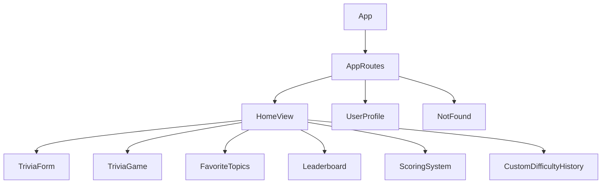
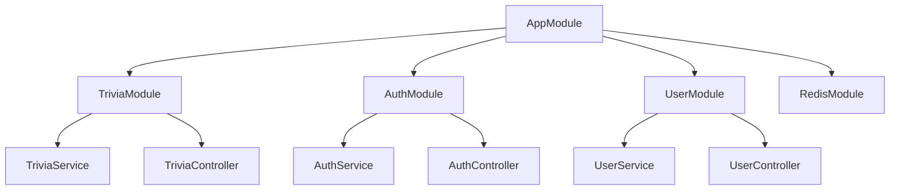

# EveryTriv Architecture Overview

## System Architecture

EveryTriv is built using a modern, scalable architecture with the following key components:

### Frontend (React + TypeScript)

- **Framework**: React with TypeScript
- **State Management**: Redux Toolkit
- **Routing**: React Router v6
- **Styling**: Tailwind CSS + Custom CSS
- **Animation**: Framer Motion
- **Icons**: Lucide React

### Backend (NestJS)

- **Framework**: NestJS
- **Database**: PostgreSQL with TypeORM
- **Caching**: Redis
- **Authentication**: JWT-based
- **API Documentation**: OpenAPI/Swagger

### Infrastructure

- **Containerization**: Docker
- **Database**: PostgreSQL
- **Caching Layer**: Redis
- **API Gateway**: NestJS built-in

## Component Architecture

### Frontend Components

### Backend Modules

## Data Flow

1. **User Input**
   - User enters topic and difficulty
   - Frontend validates input
   - Request sent to backend

2. **Backend Processing**
   - Input validation
   - Cache check (Redis)
   - LLM provider selection
   - Question generation
   - Response caching

3. **Data Storage**
   - Questions stored in PostgreSQL
   - User data in PostgreSQL
   - Session data in Redis
   - Local storage for preferences

## Security Architecture

- JWT-based authentication
- Rate limiting
- Input validation
- CORS configuration
- Helmet security headers
- Environment variable protection

## Caching Strategy

### Redis Cache
- Question cache (TTL: 1 hour)
- Session data
- Rate limiting data

### Local Storage
- User preferences
- Favorite topics
- Custom difficulty history

## Error Handling

- Global error handling
- Custom error boundaries
- Retry mechanisms
- Fallback states
- Error logging

## Performance Optimizations

- React.memo for heavy components
- Redis caching
- Database indexing
- Code splitting
- Image optimization
- Lazy loading

## Monitoring and Logging

- Winston logger
- Performance metrics
- Error tracking
- User analytics
- System health checks