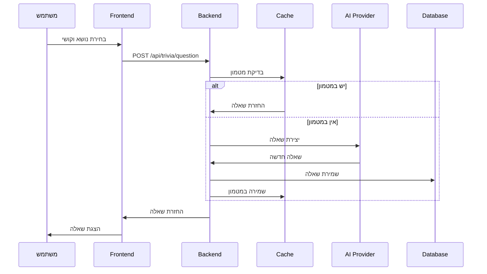
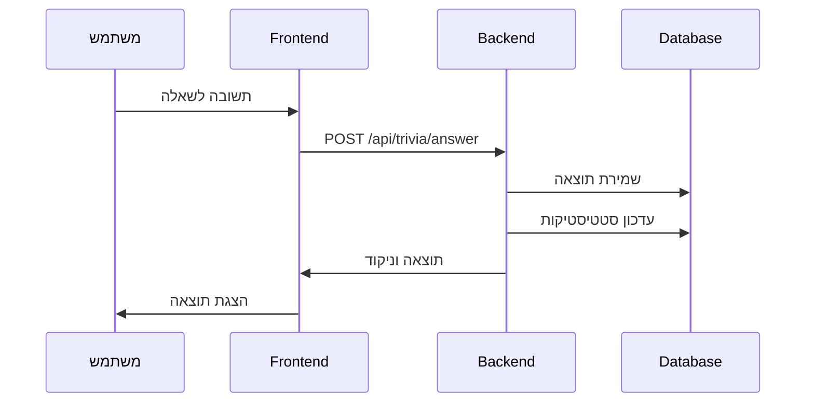

# EveryTriv - ארכיטקטורה כללית

## סקירה כללית

EveryTriv הוא פלטפורמת טריוויה חכמה המבוססת על AI עם ארכיטקטורה מודרנית של Frontend ו-Backend נפרדים. המערכת משלבת טכנולוגיות מתקדמות ליצירת חוויית משחק מרתקת ואינטראקטיבית.

## Stack טכנולוגי

### Frontend
- **React 18** - ספריית UI מודרנית עם Hooks
- **TypeScript** - טיפוסים חזקים ובטיחות קוד
- **Redux Toolkit** - ניהול מצב גלובלי
- **Tailwind CSS** - מערכת עיצוב utility-first
- **Vite** - כלי בנייה מהיר
- **React Router** - ניווט בין דפים

### Backend
- **NestJS** - מסגרת Node.js מודולרית
- **TypeScript** - טיפוסים חזקים
- **TypeORM** - ORM למסד נתונים
- **PostgreSQL** - מסד נתונים יחסי
- **Redis** - מטמון וניהול session

### AI ו-Infrastructure
- **OpenAI GPT-4** - ייצור שאלות איכותיות
- **Anthropic Claude** - שאלות מורכבות
- **Google AI Gemini** - גיוון בשאלות
- **Docker** - containerization
- **Docker Compose** - אורכיסטרציה

## מבנה הפרויקט

```
EveryTriv/
├── client/                    # React Frontend
│   ├── src/
│   │   ├── views/            # דפי האפליקציה
│   │   │   ├── home/         # דף הבית והמשחק
│   │   │   ├── user/         # פרופיל משתמש
│   │   │   ├── leaderboard/  # לוח תוצאות
│   │   │   ├── game-history/ # היסטוריית משחקים
│   │   │   └── payment/      # תשלומים
│   │   ├── components/       # רכיבי UI
│   │   │   ├── game/         # רכיבי משחק
│   │   │   ├── ui/           # רכיבי UI בסיסיים
│   │   │   ├── layout/       # רכיבי פריסה
│   │   │   └── animations/   # אנימציות
│   │   ├── hooks/            # React Hooks
│   │   │   ├── api/          # Hooks ל-API
│   │   │   ├── contexts/     # React Contexts
│   │   │   └── layers/       # Hooks בשכבות
│   │   ├── redux/            # ניהול מצב
│   │   │   └── features/     # Redux slices
│   │   ├── services/         # שירותי API
│   │   ├── types/            # טיפוסי TypeScript
│   │   ├── utils/            # פונקציות עזר
│   │   ├── constants/        # קבועים
│   │   └── styles/           # עיצובים
│   └── package.json
├── server/                    # NestJS Backend
│   ├── src/
│   │   ├── features/         # מודולים לפי תחום
│   │   │   ├── auth/         # אימות והרשאות
│   │   │   ├── user/         # ניהול משתמשים
│   │   │   ├── trivia/       # לוגיקת הטריוויה
│   │   │   ├── points/       # מערכת נקודות
│   │   │   ├── payment/      # תשלומים
│   │   │   └── game-history/ # היסטוריית משחקים
│   │   ├── shared/           # קוד משותף
│   │   │   ├── entities/     # ישויות TypeORM
│   │   │   ├── middleware/   # middleware
│   │   │   ├── types/        # טיפוסים משותפים
│   │   │   └── utils/        # פונקציות עזר
│   │   ├── config/           # קונפיגורציה
│   │   └── main.ts
│   └── package.json
├── shared/                    # קוד משותף בין client ו-server
│   ├── types/                # טיפוסי TypeScript משותפים (25+ קבצים)
│   │   ├── api.types.ts      # טיפוסי API, תגובות, שגיאות
│   │   ├── game.types.ts     # טיפוסי משחק, שאלות, היסטוריה
│   │   ├── user.types.ts     # טיפוסי משתמש, פרופיל, העדפות
│   │   ├── validation.types.ts # טיפוסי אימות, סכמות
│   │   ├── analytics.types.ts # טיפוסי אנליטיקה, מדדים
│   │   ├── auth.types.ts     # טיפוסי אימות, הרשאות
│   │   ├── payment.types.ts  # טיפוסי תשלומים, מנויים
│   │   ├── points.types.ts   # טיפוסי נקודות, עסקאות
│   │   ├── ai.types.ts       # טיפוסי AI, ספקים
│   │   ├── logging.types.ts  # טיפוסי לוגים, רמות
│   │   ├── storage.types.ts  # טיפוסי אחסון, מטמון
│   │   └── ...               # ועוד 13 קבצים נוספים
│   ├── constants/            # קבועים משותפים (14+ קבצים)
│   │   ├── api.constants.ts  # קבועי API, נקודות קצה
│   │   ├── game.constants.ts # קבועי משחק, רמות קושי
│   │   ├── validation.constants.ts # קבועי אימות
│   │   ├── info.constants.ts # קבועי אפליקציה, מידע
│   │   ├── error.constants.ts # קבועי שגיאות, הודעות
│   │   ├── payment.constants.ts # קבועי תשלומים, מחירים
│   │   └── ...               # ועוד 8 קבצים נוספים
│   ├── utils/                # פונקציות עזר משותפות
│   ├── validation/           # ולידציה משותפת
│   ├── services/             # שירותים משותפים
│   └── hooks/                # hooks משותפים
└── docs/                     # תיעוד
```

## ארכיטקטורת Frontend

### ניהול מצב (State Management)

#### Redux Toolkit
```typescript
// מבנה ה-Store
{
  game: {
    currentQuestion: Question | null,
    gameMode: GameMode,
    score: number,
    isPlaying: boolean
  },
  user: {
    profile: UserProfile | null,
    isAuthenticated: boolean,
    points: number
  },
  stats: {
    topicsPlayed: Record<string, number>,
    successRateByDifficulty: DifficultyStats
  },
  favorites: {
    topics: FavoriteTopic[]
  },
  gameMode: {
    selectedMode: GameMode,
    customDifficulty: CustomDifficulty
  }
}
```

#### React Hooks בשכבות
- **שכבת UI**: `useOptimizedAnimations`, `useUISounds`
- **שכבת עסקים**: `useGameLogic`, `usePoints`, `useTriviaValidation`
- **שכבת API**: `useAuth`, `useTrivia`, `usePoints`
- **שכבת כלים**: `useAsync`, `useDebounce`, `useLocalStorage`

### רכיבי UI עיקריים

#### רכיבי משחק
- **Game.tsx** - הרכיב הראשי של המשחק
- **GameTimer.tsx** - טיימר המשחק
- **GameMode.tsx** - בחירת סוג משחק

#### רכיבי UI בסיסיים
- **Button.tsx** - כפתורים עם וריאנטים
- **Card.tsx** - כרטיסים
- **Modal.tsx** - חלונות מודאליים
- **ErrorBoundary.tsx** - טיפול בשגיאות

#### רכיבי אנימציה
- **AnimatedBackground.tsx** - רקע מונפש
- **AnimationEffects.tsx** - אפקטי אנימציה
- **AudioControls.tsx** - בקרת אודיו

### מערכת הניווט
- **AppRoutes.tsx** - הגדרת הנתיבים
- **Navigation.tsx** - תפריט ניווט
- **Layout** - פריסה כללית

## ארכיטקטורת Backend

### מבנה מודולרי

#### מודול Auth
```typescript
features/auth/
├── controllers/      # API endpoints
├── services/        # לוגיקה עסקית
├── guards/          # שומרי נתיבים
├── strategies/      # אסטרטגיות אימות
└── auth.module.ts   # הגדרת המודול
```

#### מודול Trivia
```typescript
features/trivia/
├── controllers/     # API endpoints
├── services/        # לוגיקה עסקית
├── providers/       # ספקי AI
├── data-structures/ # מבני נתונים
└── trivia.module.ts # הגדרת המודול
```

### שירותים משותפים

#### שירותי AI
- **BaseProvider** - ממשק בסיס לספקי AI
- **OpenAIProvider** - אינטגרציה עם OpenAI
- **AnthropicProvider** - אינטגרציה עם Anthropic
- **GoogleProvider** - אינטגרציה עם Google AI

#### שירותי תשתית
- **LoggerService** - מערכת לוגים
- **CacheService** - ניהול מטמון
- **ValidationService** - ולידציה

### מבנה מסד הנתונים

#### טבלאות עיקריות
- **users** - משתמשים
- **trivia_questions** - שאלות טריוויה
- **game_history** - היסטוריית משחקים
- **user_stats** - סטטיסטיקות משתמשים
- **achievements** - הישגים
- **payment_history** - היסטוריית תשלומים

## זרימת נתונים

### יצירת שאלה חדשה


### שמירת תוצאות


## מערכת מטמון (Cache)

### סוגי מטמון
- **User Stats Cache**: סטטיסטיקות משתמש (TTL: 30 דקות)
- **Session Cache**: מידע session (TTL: 24 שעות)
- **Question Cache**: שאלות נפוצות (TTL: 60 דקות)
- **Rate Limiting**: הגבלת קצב בקשות (TTL: 15 דקות)

### אסטרטגיות מטמון
- **LRU Cache**: למטמון שאלות
- **TTL Cache**: לסטטיסטיקות
- **Distributed Cache**: למטמון session

## אבטחה

### אימות והרשאות
- **JWT Tokens**: לאימות משתמשים
- **Refresh Tokens**: לחידוש session
- **Password Hashing**: עם bcrypt
- **Role-based Access Control**: בקרת גישה מבוססת תפקידים

### הגנות נוספות
- **API Rate Limiting**: הגבלת קצב בקשות
- **Input Validation**: ולידציה של קלט
- **CORS Configuration**: הגדרת CORS
- **Helmet**: כותרות אבטחה

## ביצועים

### אופטימיזציות Frontend
- **Code Splitting**: עם React.lazy
- **Memoization**: עם React.memo
- **Virtual Scrolling**: לרשימות ארוכות
- **Image Optimization**: אופטימיזציית תמונות
- **Bundle Optimization**: אופטימיזציית חבילות

### אופטימיזציות Backend
- **Database Indexing**: אינדקסים למסד נתונים
- **Connection Pooling**: בריכת חיבורים
- **Response Caching**: מטמון תגובות
- **Query Optimization**: אופטימיזציית שאילתות

## Monitoring ו-Logging

### מערכת לוגים
- **Structured Logging**: עם מערכת לוגים מותאמת אישית
- **צבעים מותאמים**: תמיכה בצבעים לכל פורמט (קונסול, קובץ, דפדפן)
- **ניקוי אוטומטי**: הלוג מתנקה בכל הפעלה של השרת או Docker
- **זמן מקומי**: תמיכה בעברית עם timestamp מקומי בלבד
- **Log Levels**: error, warn, info, debug
- **Log Storage**: בקבצים ובמסד נתונים
- **Log Rotation**: ניקוי אוטומטי בכל הפעלה

### Metrics
- **Response Times**: זמני תגובה
- **Database Performance**: ביצועי מסד נתונים
- **Cache Hit Rates**: אחוזי פגיעה במטמון
- **Error Rates**: אחוזי שגיאות

## סביבות פיתוח

### Development
```bash
# הפעלת פיתוח מקומי
pnpm run dev  # מפעיל client ו-server במקביל
```

### Production
```bash
# בנייה והפעלה לייצור
pnpm run build     # בונה production builds
pnpm run start:prod # מפעיל בסביבת production
```

### Docker
```bash
# הפעלה עם Docker
docker-compose up  # מפעיל עם Docker
```

## טכנולוגיות חיצוניות

### AI Providers
- **OpenAI GPT-4**: ייצור שאלות איכותיות
- **Anthropic Claude**: שאלות מורכבות
- **Google AI Gemini**: גיוון בשאלות

### External Libraries
- **@datastructures-js/priority-queue**: תורי עדיפויות
- **lru-cache**: מטמון LRU
- **Chart.js**: גרפים וויזואליזציות
- **Framer Motion**: אנימציות

## העתיד והרחבות

### תכונות מתוכננות
- **Multiplayer Mode**: משחק מרובה משתתפים
- **Custom Question Creation**: יצירת שאלות מותאמות
- **Voice Questions**: שאלות קוליות
- **Mobile App**: אפליקציה למובייל

### שיפורים טכניים מתוכננים
- **GraphQL API**: מעבר ל-GraphQL
- **Microservices Architecture**: ארכיטקטורת מיקרו-שירותים
- **Real-time Notifications**: התראות בזמן אמת
- **Advanced Analytics**: אנליטיקה מתקדמת
 
