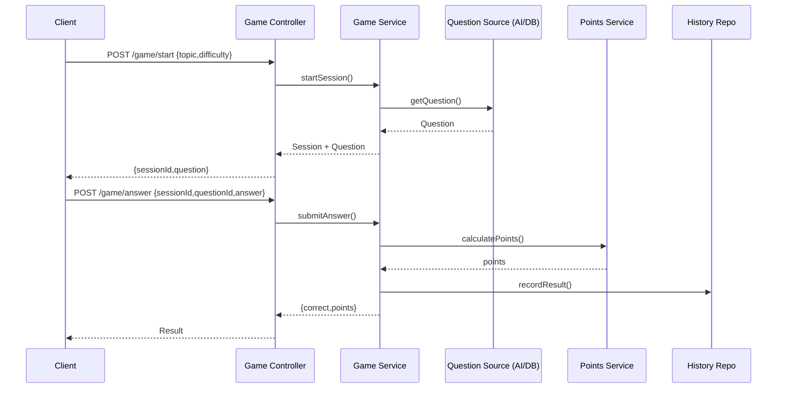

# Feature: Game

תיעוד מודול המשחק (Game / Trivia Flow).

> הערת סנכרון: חלק מהגבולות המוצגים בדיאגרמות (Trivia, Game History, AI, Logger) ממוזגים בפועל בתוך `GameModule` ושירותים משותפים. פירוט: `../DIAGRAMS.md#diagram-sync-status`.

## אחריות
- ניהול מצב סשן משחק
- יצירת שאלה / אחזור ממטמון
- חישוב תוצאות ושיוך נקודות (Delegation ל-Points)
- רישום היסטוריית משחק (אם נדרש)

## תרשים רצף בסיסי


## מבני נתונים (DTO)
```typescript
export class StartGameDto {
  @IsString() @Length(2,60) topic!: string;
  @IsString() @IsIn(['easy','medium','hard']) difficulty!: string;
}

export class SubmitAnswerDto {
  @IsUUID() sessionId!: string;
  @IsUUID() questionId!: string;
  @IsString() @Length(1,200) answer!: string;
}
```

## Service Highlights
```typescript
@Injectable()
export class GameService {
  constructor(
    private readonly questionProvider: QuestionProvider,
    private readonly cache: CacheService,
    private readonly points: PointsService,
    private readonly history: GameHistoryRepository,
  ) {}

  async start(dto: StartGameDto) {
    const q = await this.questionProvider.get(dto.topic, dto.difficulty);
    return { sessionId: uuid(), question: q };
  }

  async submit(dto: SubmitAnswerDto) {
    const isCorrect = await this.questionProvider.verify(dto.questionId, dto.answer);
    const awarded = isCorrect ? this.points.calculate({ difficulty: 'medium', timeMs: 1500 }) : 0;
    if (awarded > 0) await this.history.store(dto.sessionId, awarded, isCorrect);
    return { isCorrect, points: awarded };
  }
}
```

## Cache Strategy
| סוג נתון | Key Pattern | TTL | הערה |
|----------|-------------|-----|------|
| שאלה | q:{id} | 3600s | הפחתת עלות יצירת תוכן |
| Session | gs:{sessionId} | 1800s | מעקב מצב זמני |

## אינטגרציות
- Points Service: חישוב נקודות (Pure Function inside service)
- History Repository: Persistency מאוחדת

## אבטחה
- אימות חובה לכל פעולה (Guard)
- בדיקת בעלות Session (User Id ⇆ Session Owner)

## ביצועים
- Caching לשאלות חוזרות
- הגבלת קצב (Rate Limit) ליצירת סשנים חדשים

