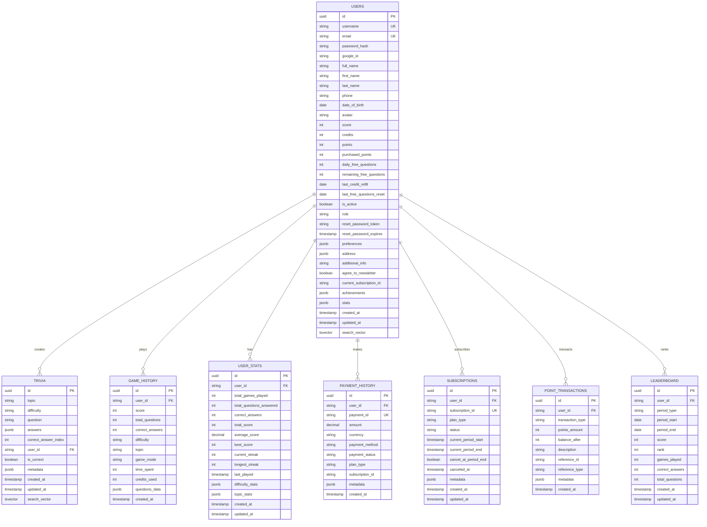

# הגדרת מסד נתונים מאוחד - EveryTriv

## סקירה כללית

מדריך מקיף להגדרת מסד נתונים מאוחד עבור EveryTriv, כולל PostgreSQL ו-Redis, עם הוראות התקנה, קונפיגורציה וניהול. מדריך זה מכסה גם חיבורים, פתרון בעיות וניטור ביצועים.

## דרישות מערכת

- **PostgreSQL**: גרסה 15 ומעלה
- **Redis**: גרסה 7 ומעלה
- **Docker**: (אופציונלי) לפריסה
- **Node.js**: גרסה 18 ומעלה

## הגדרת PostgreSQL

### התקנה עם Docker
```bash
# הפעלת PostgreSQL עם Docker
docker run -d \
  --name everytriv-postgres \
  -e POSTGRES_DB=everytriv \
  -e POSTGRES_USER=everytriv_user \
  -e POSTGRES_PASSWORD=test123 \
  -p 5432:5432 \
  -v postgres_data:/var/lib/postgresql/data \
  postgres:15-alpine
```

### התקנה מקומית
```bash
# Ubuntu/Debian
sudo apt update
sudo apt install postgresql postgresql-contrib

# macOS עם Homebrew
brew install postgresql
brew services start postgresql

# Windows
# הורד והתקן מ-https://www.postgresql.org/download/windows/
```

### הגדרת מסד נתונים
```sql
-- התחברות ל-PostgreSQL
psql -U postgres

-- יצירת משתמש
CREATE USER everytriv_user WITH PASSWORD 'test123';

-- יצירת מסד נתונים
CREATE DATABASE everytriv OWNER everytriv_user;

-- הרשאות
GRANT ALL PRIVILEGES ON DATABASE everytriv TO everytriv_user;
GRANT ALL ON SCHEMA public TO everytriv_user;

-- יצירת הרחבות נדרשות
CREATE EXTENSION IF NOT EXISTS "uuid-ossp";
CREATE EXTENSION IF NOT EXISTS "pg_trgm";
```

## הגדרת Redis

### התקנה עם Docker
```bash
# הפעלת Redis עם Docker
docker run -d \
  --name everytriv-redis \
  -p 6379:6379 \
  -v redis_data:/data \
  redis:7-alpine redis-server --appendonly yes
```

### התקנה מקומית
```bash
# Ubuntu/Debian
sudo apt update
sudo apt install redis-server

# macOS עם Homebrew
brew install redis
brew services start redis

# Windows
# הורד והתקן מ-https://redis.io/download
```

### הגדרת Redis
```bash
# התחברות ל-Redis
redis-cli

# בדיקת חיבור (ללא סיסמה)
PING
```

## סוגי חיבורים

### 1. חיבור ישיר (Direct Connection)
```typescript
import { DataSource } from 'typeorm';

const dataSource = new DataSource({
  type: 'postgres',
  host: 'localhost',
  port: 5432,
  username: 'everytriv_user',
  password: 'test123',
  database: 'everytriv',
  synchronize: false,
  logging: true,
});
```

### 2. חיבור עם Connection Pool
```typescript
import { DataSource } from 'typeorm';

const dataSource = new DataSource({
  type: 'postgres',
  host: 'localhost',
  port: 5432,
  username: 'everytriv_user',
  password: 'test123',
  database: 'everytriv',
  extra: {
    max: 20, // מספר חיבורים מקסימלי
    min: 5,  // מספר חיבורים מינימלי
    acquireTimeoutMillis: 30000,
    createTimeoutMillis: 30000,
    destroyTimeoutMillis: 5000,
    idleTimeoutMillis: 30000,
    reapIntervalMillis: 1000,
    createRetryIntervalMillis: 100,
  },
});
```

### 3. חיבור עם SSL (ייצור)
```typescript
import { DataSource } from 'typeorm';

const dataSource = new DataSource({
  type: 'postgres',
  host: 'your-production-host',
  port: 5432,
  username: 'everytriv_user',
  password: 'test123',
  database: 'everytriv',
  ssl: {
    rejectUnauthorized: false,
    ca: fs.readFileSync('/path/to/ca-certificate.crt'),
    key: fs.readFileSync('/path/to/client-key.pem'),
    cert: fs.readFileSync('/path/to/client-certificate.pem'),
  },
});
```

## קונפיגורציית TypeORM

### data-source.ts
```typescript
import { DataSource } from 'typeorm';

import { AppConfig } from './app.config';

/**
 * TypeORM DataSource for migrations
 *
 * This DataSource is used specifically for running migrations.
 * It should NEVER have synchronize: true to ensure migrations are the only way
 * to modify the database schema.
 *
 * Usage:
 * - pnpm migration:generate src/migrations/MigrationName
 * - pnpm migration:run
 * - pnpm migration:revert
 * - pnpm migration:show
 */
export const AppDataSource = new DataSource({
    type: 'postgres',
  host: AppConfig.database.host,
  port: AppConfig.database.port,
  username: AppConfig.database.username,
  password: AppConfig.database.password,
  database: AppConfig.database.name,
  schema: AppConfig.database.schema,
  entities: [
    __dirname + '/../internal/entities/user.entity.ts',
    __dirname + '/../internal/entities/userStats.entity.ts',
    __dirname + '/../internal/entities/gameHistory.entity.ts',
    __dirname + '/../internal/entities/trivia.entity.ts',
    __dirname + '/../internal/entities/subscription.entity.ts',
    __dirname + '/../internal/entities/paymentHistory.entity.ts',
    __dirname + '/../internal/entities/pointTransaction.entity.ts',
    __dirname + '/../internal/entities/leaderboard.entity.ts',
  ],
    migrations: [__dirname + '/../migrations/*{.ts,.js}'],
  synchronize: AppConfig.database.synchronize,
  logging: AppConfig.database.logging,
  ssl: AppConfig.database.ssl,
    extra: {
    max: AppConfig.database.pool.max,
    min: AppConfig.database.pool.min,
    acquire: AppConfig.database.pool.acquire,
    idle: AppConfig.database.pool.idle,
    },
  });
```

### database.config.ts
```typescript
import { TypeOrmModuleOptions } from '@nestjs/typeorm';

import { AppConfig } from './app.config';

export const DatabaseConfig: TypeOrmModuleOptions = {
  type: 'postgres',
  host: AppConfig.database.host,
  port: AppConfig.database.port,
  username: AppConfig.database.username,
  password: AppConfig.database.password,
  database: AppConfig.database.name,
  schema: AppConfig.database.schema,
  entities: [__dirname + '/../**/*.entity{.ts,.js}'],
  migrations: [__dirname + '/../migrations/*{.ts,.js}'],
  synchronize: AppConfig.database.synchronize,
  logging: AppConfig.database.logging,
  ssl: AppConfig.database.ssl,
  autoLoadEntities: true,
  extra: {
    max: AppConfig.database.pool.max,
    min: AppConfig.database.pool.min,
    acquire: AppConfig.database.pool.acquire,
    idle: AppConfig.database.pool.idle,
  },
};
```

## תרשים ERD - Entity Relationship Diagram



## ישויות מסד הנתונים

### UserEntity
```typescript
import { Column, CreateDateColumn, Entity, Index, OneToMany, PrimaryGeneratedColumn, UpdateDateColumn } from 'typeorm';

import { DEFAULT_USER_PREFERENCES, ServerUserPreferences, UserAddress } from '../types/typeorm-compatibility.types';
import type { BasicValue } from '@shared/types/core/data.types';
import { GameHistoryEntity } from './gameHistory.entity';
import { TriviaEntity } from './trivia.entity';

@Entity('users')
export class UserEntity {
  @PrimaryGeneratedColumn('uuid')
  id: string;

  @Column()
  @Index({ unique: true })
  username: string;

  @Column()
  @Index({ unique: true })
  email: string;

  @Column({ name: 'password_hash', nullable: true })
  passwordHash?: string;

  @Column({ name: 'google_id', nullable: true })
  googleId?: string;

  @Column({ name: 'full_name', nullable: true })
  fullName?: string;

  @Column({ name: 'first_name', nullable: true })
  firstName?: string;

  @Column({ name: 'last_name', nullable: true })
  lastName?: string;

  @Column({ nullable: true })
  phone?: string;

  @Column({ name: 'date_of_birth', type: 'date', nullable: true })
  dateOfBirth?: Date;

  @Column({ nullable: true })
  avatar?: string;

  @Column('int', { default: 0 })
  score: number = 0;

  @Column('int', { default: 100 })
  credits: number = 100;

  @Column('int', { default: 0 })
  points: number = 0;

  @Column({ name: 'purchased_points', type: 'int', default: 0 })
  purchasedPoints: number = 0;

  @Column({ name: 'daily_free_questions', type: 'int', default: 20 })
  dailyFreeQuestions: number = 20;

  @Column({ name: 'remaining_free_questions', type: 'int', default: 20 })
  remainingFreeQuestions: number = 20;

  @Column({ name: 'last_credit_refill', type: 'date', nullable: true })
  lastCreditRefill?: Date;

  @Column({ name: 'last_free_questions_reset', type: 'date', nullable: true })
  lastFreeQuestionsReset?: Date;

  @Column({ name: 'is_active', default: true })
  isActive: boolean = true;

  @Column({ default: 'user' })
  role: 'admin' | 'user' | 'guest' = 'user';

  @Column({ name: 'reset_password_token', nullable: true })
  resetPasswordToken?: string;

  @Column({ name: 'reset_password_expires', type: 'timestamp', nullable: true })
  resetPasswordExpires?: Date;

  @Column('jsonb', { default: {} })
  preferences: ServerUserPreferences = DEFAULT_USER_PREFERENCES;

  @Column('jsonb', { default: {} })
  address: UserAddress = {};

  @Column({ name: 'additional_info', nullable: true })
  additionalInfo?: string;

  @Column({ name: 'agree_to_newsletter', default: false })
  agreeToNewsletter: boolean = false;

  @Column({ name: 'current_subscription_id', nullable: true })
  currentSubscriptionId?: string;

  @Column('jsonb', { default: [] })
  achievements: Array<{
    id: string;
    title: string;
    description: string;
    icon: string;
    unlockedAt: Date;
  }>;

  @Column('jsonb', { default: {} })
  stats: Record<string, BasicValue> = {};

  @OneToMany(() => TriviaEntity, trivia => trivia.user)
  triviaHistory: TriviaEntity[];

  @OneToMany(() => GameHistoryEntity, gameHistory => gameHistory.user)
  gameHistory: GameHistoryEntity[];

  @CreateDateColumn({ name: 'created_at' })
  createdAt: Date = new Date();

  @UpdateDateColumn({ name: 'updated_at' })
  updatedAt: Date = new Date();

  @Column('tsvector', { name: 'search_vector', select: false })
  @Index()
  searchVector: string = '';
}
```

### TriviaEntity
```typescript
import {
  Column,
  CreateDateColumn,
  Entity,
  Index,
  JoinColumn,
  ManyToOne,
  PrimaryGeneratedColumn,
  UpdateDateColumn,
} from 'typeorm';

import { UserEntity } from './user.entity';

@Entity('trivia')
export class TriviaEntity {
  @PrimaryGeneratedColumn('uuid')
  id: string = '';

  @Column()
  @Index()
  topic: string = '';

  @Column()
  difficulty: string = '';

  @Column()
  @Index()
  question: string = '';

  @Column('jsonb', { default: [] })
  answers: Array<{
    text: string;
    isCorrect: boolean;
  }> = [];

  @Column({ name: 'correct_answer_index', type: 'int' })
  correctAnswerIndex: number = 0;

  @Column({ name: 'user_id', nullable: true })
  userId: string = '';

  @ManyToOne(() => UserEntity, { nullable: true })
  @JoinColumn({ name: 'user_id' })
  user!: UserEntity;

  @Column({ name: 'is_correct', type: 'boolean', default: false })
  isCorrect: boolean = false;

  @Column('jsonb', { nullable: true })
  metadata: {
    category?: string;
    tags?: string[];
    source?: string;
    difficulty_score?: number;
    custom_difficulty_description?: string;
  } = {};

  @CreateDateColumn({ name: 'created_at' })
  createdAt: Date = new Date();

  @UpdateDateColumn({ name: 'updated_at' })
  updatedAt: Date = new Date();

  @Column({ name: 'search_vector', type: 'tsvector', select: false })
  searchVector: string = '';
}
```

### GameHistoryEntity
```typescript
import { Column, CreateDateColumn, Entity, Index, JoinColumn, ManyToOne, PrimaryGeneratedColumn } from 'typeorm';

// import { GameMode } from '../../../../shared/types'; // Removed as GameMode is a type, not an enum value
import { UserEntity } from './user.entity';

@Entity('game_history')
export class GameHistoryEntity {
  @PrimaryGeneratedColumn('uuid')
  id: string = '';

  @Column({ name: 'user_id', type: 'uuid' })
  @Index()
  userId: string = '';

  @ManyToOne(() => UserEntity, user => user.gameHistory)
  @JoinColumn({ name: 'user_id' })
  user!: UserEntity;

  @Column('int')
  score: number = 0;

  @Column({ name: 'total_questions', type: 'int' })
  totalQuestions: number = 0;

  @Column({ name: 'correct_answers', type: 'int' })
  correctAnswers: number = 0;

  @Column()
  difficulty: string = '';

  @Column({ nullable: true })
  topic?: string;

  @Column({
    name: 'game_mode',
    type: 'varchar',
    default: 'classic',
  })
  gameMode: string = 'classic';

  @Column({ name: 'time_spent', type: 'int', nullable: true })
  timeSpent?: number; // in seconds

  @Column({ name: 'credits_used', type: 'int' })
  creditsUsed: number = 0;

  @Column({ name: 'questions_data', type: 'jsonb', default: [] })
  questionsData: Array<{
    question: string;
    userAnswer: string;
    correctAnswer: string;
    isCorrect: boolean;
    timeSpent?: number;
  }> = [];

  @CreateDateColumn({ name: 'created_at' })
  createdAt: Date = new Date();
}
```

### UserStatsEntity
```typescript
import { Column, CreateDateColumn, Entity, Index, JoinColumn, ManyToOne, PrimaryGeneratedColumn, UpdateDateColumn } from 'typeorm';

import { UserEntity } from './user.entity';

@Entity('user_stats')
export class UserStatsEntity {
  @PrimaryGeneratedColumn('uuid')
  id: string = '';

  @Column({ name: 'user_id', type: 'uuid' })
  @Index()
  userId: string = '';

  @ManyToOne(() => UserEntity, { nullable: false })
  @JoinColumn({ name: 'user_id' })
  user!: UserEntity;

  @Column({ name: 'total_games_played', type: 'int', default: 0 })
  totalGamesPlayed: number = 0;

  @Column({ name: 'total_questions_answered', type: 'int', default: 0 })
  totalQuestionsAnswered: number = 0;

  @Column({ name: 'correct_answers', type: 'int', default: 0 })
  correctAnswers: number = 0;

  @Column({ name: 'total_score', type: 'int', default: 0 })
  totalScore: number = 0;

  @Column({ name: 'average_score', type: 'decimal', precision: 5, scale: 2, default: 0 })
  averageScore: number = 0;

  @Column({ name: 'best_score', type: 'int', default: 0 })
  bestScore: number = 0;

  @Column({ name: 'current_streak', type: 'int', default: 0 })
  currentStreak: number = 0;

  @Column({ name: 'longest_streak', type: 'int', default: 0 })
  longestStreak: number = 0;

  @Column({ name: 'last_played', type: 'timestamp', nullable: true })
  lastPlayed?: Date;

  @Column('jsonb', { default: {} })
  difficultyStats: Record<string, {
    gamesPlayed: number;
    correctAnswers: number;
  totalQuestions: number;
    averageScore: number;
  }> = {};

  @Column('jsonb', { default: {} })
  topicStats: Record<string, {
    gamesPlayed: number;
  correctAnswers: number;
    totalQuestions: number;
    averageScore: number;
  }> = {};

  @CreateDateColumn({ name: 'created_at' })
  createdAt: Date = new Date();

  @UpdateDateColumn({ name: 'updated_at' })
  updatedAt: Date = new Date();
}
```

### PaymentHistoryEntity
```typescript
import { Column, CreateDateColumn, Entity, Index, JoinColumn, ManyToOne, PrimaryGeneratedColumn } from 'typeorm';

import { UserEntity } from './user.entity';

@Entity('payment_history')
export class PaymentHistoryEntity {
  @PrimaryGeneratedColumn('uuid')
  id: string = '';

  @Column({ name: 'user_id', type: 'uuid' })
  @Index()
  userId: string = '';

  @ManyToOne(() => UserEntity, { nullable: false })
  @JoinColumn({ name: 'user_id' })
  user!: UserEntity;

  @Column({ name: 'payment_id', unique: true })
  paymentId: string = '';

  @Column({ name: 'amount', type: 'decimal', precision: 10, scale: 2 })
  amount: number = 0;

  @Column()
  currency: string = 'USD';

  @Column({ name: 'payment_method' })
  paymentMethod: string = '';

  @Column({ name: 'payment_status' })
  paymentStatus: string = '';

  @Column({ name: 'plan_type', nullable: true })
  planType?: string;

  @Column({ name: 'subscription_id', nullable: true })
  subscriptionId?: string;

  @Column('jsonb', { default: {} })
  metadata: Record<string, any> = {};

  @CreateDateColumn({ name: 'created_at' })
  createdAt: Date = new Date();
}
```

### SubscriptionEntity
```typescript
import { Column, CreateDateColumn, Entity, Index, JoinColumn, ManyToOne, PrimaryGeneratedColumn, UpdateDateColumn } from 'typeorm';

import { UserEntity } from './user.entity';

@Entity('subscriptions')
export class SubscriptionEntity {
  @PrimaryGeneratedColumn('uuid')
  id: string = '';

  @Column({ name: 'user_id', type: 'uuid' })
  @Index()
  userId: string = '';

  @ManyToOne(() => UserEntity, { nullable: false })
  @JoinColumn({ name: 'user_id' })
  user!: UserEntity;

  @Column({ name: 'subscription_id', unique: true })
  subscriptionId: string = '';

  @Column({ name: 'plan_type' })
  planType: string = '';

  @Column({ name: 'status' })
  status: string = '';

  @Column({ name: 'current_period_start', type: 'timestamp' })
  currentPeriodStart: Date = new Date();

  @Column({ name: 'current_period_end', type: 'timestamp' })
  currentPeriodEnd: Date = new Date();

  @Column({ name: 'cancel_at_period_end', type: 'boolean', default: false })
  cancelAtPeriodEnd: boolean = false;

  @Column({ name: 'canceled_at', type: 'timestamp', nullable: true })
  canceledAt?: Date;

  @Column('jsonb', { default: {} })
  metadata: Record<string, any> = {};

  @CreateDateColumn({ name: 'created_at' })
  createdAt: Date = new Date();

  @UpdateDateColumn({ name: 'updated_at' })
  updatedAt: Date = new Date();
}
```

### PointTransactionEntity
```typescript
import { Column, CreateDateColumn, Entity, Index, JoinColumn, ManyToOne, PrimaryGeneratedColumn } from 'typeorm';

import { UserEntity } from './user.entity';

@Entity('point_transactions')
export class PointTransactionEntity {
  @PrimaryGeneratedColumn('uuid')
  id: string = '';

  @Column({ name: 'user_id', type: 'uuid' })
  @Index()
  userId: string = '';

  @ManyToOne(() => UserEntity, { nullable: false })
  @JoinColumn({ name: 'user_id' })
  user!: UserEntity;

  @Column({ name: 'transaction_type' })
  transactionType: string = ''; // 'earned', 'spent', 'purchased', 'bonus'

  @Column({ name: 'points_amount', type: 'int' })
  pointsAmount: number = 0;

  @Column({ name: 'balance_after', type: 'int' })
  balanceAfter: number = 0;

  @Column({ name: 'description', nullable: true })
  description?: string;

  @Column({ name: 'reference_id', nullable: true })
  referenceId?: string; // Game ID, Payment ID, etc.

  @Column({ name: 'reference_type', nullable: true })
  referenceType?: string; // 'game', 'payment', 'bonus', etc.

  @Column('jsonb', { default: {} })
  metadata: Record<string, any> = {};

  @CreateDateColumn({ name: 'created_at' })
  createdAt: Date = new Date();
}
```

### LeaderboardEntity
```typescript
import { Column, CreateDateColumn, Entity, Index, JoinColumn, ManyToOne, PrimaryGeneratedColumn, UpdateDateColumn } from 'typeorm';

import { UserEntity } from './user.entity';

@Entity('leaderboard')
export class LeaderboardEntity {
  @PrimaryGeneratedColumn('uuid')
  id: string = '';

  @Column({ name: 'user_id', type: 'uuid' })
  @Index()
  userId: string = '';

  @ManyToOne(() => UserEntity, { nullable: false })
  @JoinColumn({ name: 'user_id' })
  user!: UserEntity;

  @Column({ name: 'period_type' })
  @Index()
  periodType: string = ''; // 'daily', 'weekly', 'monthly', 'all_time'

  @Column({ name: 'period_start', type: 'date' })
  @Index()
  periodStart: Date = new Date();

  @Column({ name: 'period_end', type: 'date' })
  periodEnd: Date = new Date();

  @Column({ name: 'score', type: 'int', default: 0 })
  @Index()
  score: number = 0;

  @Column({ name: 'rank', type: 'int', nullable: true })
  rank?: number;

  @Column({ name: 'games_played', type: 'int', default: 0 })
  gamesPlayed: number = 0;

  @Column({ name: 'correct_answers', type: 'int', default: 0 })
  correctAnswers: number = 0;

  @Column({ name: 'total_questions', type: 'int', default: 0 })
  totalQuestions: number = 0;

  @CreateDateColumn({ name: 'created_at' })
  createdAt: Date = new Date();

  @UpdateDateColumn({ name: 'updated_at' })
  updatedAt: Date = new Date();
}
```

## מיגרציות

### יצירת מיגרציה
```bash
# יצירת מיגרציה חדשה
pnpm run migration:generate -- -n CreateInitialTables

# הרצת מיגרציות
pnpm run migration:run

# ביטול מיגרציה אחרונה
pnpm run migration:revert
```

### דוגמה למיגרציה
```typescript
import { getErrorMessage } from '@shared';
import { MigrationInterface, QueryRunner } from 'typeorm';

export class CreateInitialTables1690000000000 implements MigrationInterface {
  name = 'CreateInitialTables1690000000000';

  public async up(queryRunner: QueryRunner): Promise<void> {
    console.log('Starting migration: CreateInitialTables', {
      migrationName: this.name,
      operation: 'up',
    });

    try {
      // Enable uuid-ossp extension
      console.log('Enabling uuid-ossp extension');
      await queryRunner.query(`CREATE EXTENSION IF NOT EXISTS "uuid-ossp"`);

      // Create users table
      console.log('Creating users table');
      await queryRunner.query(`
        CREATE TABLE "users" (
          "id" uuid NOT NULL DEFAULT uuid_generate_v4(),
          "username" character varying NOT NULL,
          "email" character varying NOT NULL,
          "password_hash" character varying,
          "google_id" character varying,
          "full_name" character varying,
          "first_name" character varying,
          "last_name" character varying,
          "phone" character varying,
          "date_of_birth" date,
          "avatar" character varying,
          "score" integer NOT NULL DEFAULT '0',
          "credits" integer NOT NULL DEFAULT '100',
          "purchased_points" integer NOT NULL DEFAULT '0',
          "daily_free_questions" integer NOT NULL DEFAULT '20',
          "remaining_free_questions" integer NOT NULL DEFAULT '20',
          "last_credit_refill" date,
          "last_free_questions_reset" date,
          "is_active" boolean NOT NULL DEFAULT true,
          "role" character varying NOT NULL DEFAULT 'user',
          "reset_password_token" character varying,
          "reset_password_expires" TIMESTAMP,
          "preferences" jsonb NOT NULL DEFAULT '{}',
          "address" jsonb NOT NULL DEFAULT '{}',
          "additional_info" character varying,
          "agree_to_newsletter" boolean NOT NULL DEFAULT false,
          "current_subscription_id" character varying,
          "stats" jsonb NOT NULL DEFAULT '{"topicsPlayed": {}, "difficultyStats": {}, "totalQuestions": 0, "correctAnswers": 0, "lastPlayed": null, "streaks": {"current": 0, "longest": 0, "lastPlayDate": null}, "pointsHistory": []}',
          "achievements" jsonb NOT NULL DEFAULT '[]',
          "search_vector" tsvector,
          "created_at" TIMESTAMP NOT NULL DEFAULT now(),
          "updated_at" TIMESTAMP NOT NULL DEFAULT now(),
          CONSTRAINT "UQ_fe0bb3f6520ee0469504521e710" UNIQUE ("username"),
          CONSTRAINT "UQ_97672ac88f789774dd47f7c8be3" UNIQUE ("email"),
          CONSTRAINT "PK_a3ffb1c0c8416b9fc6f907b7433" PRIMARY KEY ("id")
        )
      `);

      // Create indexes for users table
      console.log('Creating indexes for users table');
      await queryRunner.query(`CREATE INDEX "IDX_users_email" ON "users" ("email")`);
      await queryRunner.query(`CREATE INDEX "IDX_users_username" ON "users" ("username")`);
      await queryRunner.query(`CREATE INDEX "IDX_users_google_id" ON "users" ("google_id")`);
      await queryRunner.query(`CREATE INDEX "IDX_users_score" ON "users" ("score" DESC)`);
      await queryRunner.query(`CREATE INDEX "IDX_users_created_at" ON "users" ("created_at")`);

      console.log('Migration completed successfully: CreateInitialTables', {
        migrationName: this.name,
        operation: 'up',
        tablesCreated: ['users'],
        indexesCreated: 5,
      });
    } catch (error) {
      console.error('Migration failed: CreateInitialTables', {
        migrationName: this.name,
        operation: 'up',
        error: getErrorMessage(error),
      });
      throw error;
    }
  }

  public async down(queryRunner: QueryRunner): Promise<void> {
    console.log('Starting migration rollback: CreateInitialTables', {
      migrationName: this.name,
      operation: 'down',
    });

    try {
      console.log('Dropping users table');
      await queryRunner.query(`DROP TABLE "users"`);

      console.log('Migration rollback completed: CreateInitialTables', {
        migrationName: this.name,
        operation: 'down',
        tablesDropped: ['users'],
      });
    } catch (error) {
      console.error('Migration rollback failed: CreateInitialTables', {
        migrationName: this.name,
        operation: 'down',
        error: getErrorMessage(error),
      });
      throw error;
    }
  }
}
```

## קונפיגורציית Redis

### Redis Service
```typescript
import { Injectable, OnModuleDestroy } from '@nestjs/common';
import { ConfigService } from '@nestjs/config';
import Redis from 'ioredis';

@Injectable()
export class RedisService implements OnModuleDestroy {
  private readonly redis: Redis;

  constructor(private configService: ConfigService) {
    this.redis = new Redis({
      host: this.configService.get('REDIS_HOST'),
      port: this.configService.get('REDIS_PORT'),
      password: this.configService.get('REDIS_PASSWORD'),
      retryDelayOnFailover: 100,
      maxRetriesPerRequest: 3,
      lazyConnect: true,
    });

    this.redis.on('error', (error) => {
      console.error('Redis connection error:', error);
    });

    this.redis.on('connect', () => {
      console.log('Connected to Redis');
    });
  }

  async get(key: string): Promise<string | null> {
    return await this.redis.get(key);
  }

  async set(key: string, value: string, ttl?: number): Promise<void> {
    if (ttl) {
      await this.redis.setex(key, ttl, value);
    } else {
      await this.redis.set(key, value);
    }
  }

  async del(key: string): Promise<void> {
    await this.redis.del(key);
  }

  async exists(key: string): Promise<boolean> {
    const result = await this.redis.exists(key);
    return result === 1;
  }

  async incr(key: string): Promise<number> {
    return await this.redis.incr(key);
  }

  async expire(key: string, seconds: number): Promise<void> {
    await this.redis.expire(key, seconds);
  }

  async onModuleDestroy() {
    await this.redis.quit();
  }
}
```

## גיבוי ושחזור

### גיבוי מסד נתונים
```bash
# גיבוי מלא
pg_dump -U everytriv_user -d everytriv > backup_$(date +%Y%m%d_%H%M%S).sql

# גיבוי עם דחיסה
pg_dump -U everytriv_user -d everytriv | gzip > backup_$(date +%Y%m%d_%H%M%S).sql.gz

# גיבוי סכמה בלבד
pg_dump -U everytriv_user -d everytriv --schema-only > schema_backup.sql

# גיבוי נתונים בלבד
pg_dump -U everytriv_user -d everytriv --data-only > data_backup.sql
```

### שחזור מסד נתונים
```bash
# שחזור מגיבוי רגיל
psql -U everytriv_user -d everytriv < backup.sql

# שחזור מגיבוי דחוס
gunzip -c backup.sql.gz | psql -U everytriv_user -d everytriv

# שחזור עם יצירת מסד נתונים
createdb -U everytriv_user everytriv_restored
psql -U everytriv_user -d everytriv_restored < backup.sql
```

### גיבוי Redis
```bash
# גיבוי Redis
docker exec everytriv-redis redis-cli BGSAVE

# העתקת קובץ הגיבוי
docker cp everytriv-redis:/data/dump.rdb ./redis_backup_$(date +%Y%m%d_%H%M%S).rdb
```

## ביצועים ואופטימיזציה

### אינדקסים מומלצים
```sql
-- אינדקסים למשתמשים
CREATE INDEX CONCURRENTLY idx_users_email ON users(email);
CREATE INDEX CONCURRENTLY idx_users_username ON users(username);
CREATE INDEX CONCURRENTLY idx_users_created_at ON users(created_at);

-- אינדקסים לשאלות טריוויה
CREATE INDEX CONCURRENTLY idx_trivia_topic_difficulty ON trivia_questions(topic, difficulty);
CREATE INDEX CONCURRENTLY idx_trivia_created_at ON trivia_questions(created_at);
CREATE INDEX CONCURRENTLY idx_trivia_success_rate ON trivia_questions(success_rate);

-- אינדקסים להיסטוריית משחקים
CREATE INDEX CONCURRENTLY idx_game_history_user_created ON game_history(user_id, created_at);
CREATE INDEX CONCURRENTLY idx_game_history_topic_difficulty ON game_history(topic, difficulty);
CREATE INDEX CONCURRENTLY idx_game_history_score ON game_history(score DESC);
```

### הגדרות PostgreSQL
```sql
-- הגדרות ביצועים
ALTER SYSTEM SET shared_buffers = '256MB';
ALTER SYSTEM SET effective_cache_size = '1GB';
ALTER SYSTEM SET maintenance_work_mem = '64MB';
ALTER SYSTEM SET checkpoint_completion_target = 0.9;
ALTER SYSTEM SET wal_buffers = '16MB';
ALTER SYSTEM SET default_statistics_target = 100;

-- הפעלה מחדש
SELECT pg_reload_conf();
```

### הגדרות Redis
```bash
# redis.conf
maxmemory 256mb
maxmemory-policy allkeys-lru
save 900 1
save 300 10
save 60 10000
appendonly yes
appendfsync everysec
```

## בדיקת חיבור

### בדיקת חיבור ידנית
```typescript
import { DataSource } from 'typeorm';

// בדיקת חיבור בסיסית
async function checkDatabaseConnection(dataSource: DataSource): Promise<boolean> {
  try {
    await dataSource.query('SELECT 1');
    console.log('Database connection successful');
      return true;
    } catch (error) {
      console.error('Database connection failed:', error);
      return false;
    }
  }

// קבלת מידע על החיבור
async function getConnectionInfo(dataSource: DataSource) {
  const isConnected = await checkDatabaseConnection(dataSource);
    
    return {
      isConnected,
    host: dataSource.options.host,
    port: dataSource.options.port,
    database: dataSource.options.database,
    driver: dataSource.options.type,
      timestamp: new Date().toISOString(),
    };
  }

// בדיקת סטטיסטיקות חיבור
async function getConnectionStats(dataSource: DataSource) {
  const queryRunner = dataSource.createQueryRunner();
    
    try {
      const result = await queryRunner.query(`
        SELECT 
          count(*) as total_connections,
          count(*) FILTER (WHERE state = 'active') as active_connections,
          count(*) FILTER (WHERE state = 'idle') as idle_connections
        FROM pg_stat_activity 
        WHERE datname = current_database()
      `);
      
      return result[0];
    } finally {
      await queryRunner.release();
  }
}
```

### Health Check Endpoints הקיימים
הפרויקט כולל את ה-endpoints הבאים לבדיקת בריאות המערכת:

```typescript
// GET /health - בדיקת בריאות כללית
{
  "status": "ok",
  "timestamp": "2024-01-01T00:00:00.000Z",
  "version": "v1"
}

// GET /api/ai-providers/health - בדיקת בריאות AI providers
{
  "status": "healthy",
  "availableProviders": 4,
  "totalProviders": 5,
  "timestamp": "2024-01-01T00:00:00.000Z"
}
```

## פתרון בעיות

### שגיאות נפוצות

#### 1. Connection Refused
```bash
# בדיקת סטטוס PostgreSQL
sudo systemctl status postgresql

# בדיקת פורט
netstat -tulpn | grep :5432

# בדיקת הגדרות pg_hba.conf
sudo cat /etc/postgresql/15/main/pg_hba.conf | grep -v '^#'
```

#### 2. Authentication Failed
```sql
-- בדיקת משתמשים
SELECT usename, usesysid FROM pg_user;

-- יצירת משתמש מחדש
CREATE USER everytriv_user WITH PASSWORD 'test123';

-- הרשאות
GRANT ALL PRIVILEGES ON DATABASE everytriv TO everytriv_user;
```

#### 3. Database Does Not Exist
```sql
-- יצירת מסד נתונים
CREATE DATABASE everytriv OWNER everytriv_user;

-- בדיקת מסדי נתונים
\l
```

#### 4. Connection Timeout
```typescript
// הגדלת timeout
const dataSource = new DataSource({
  // ... other options
  extra: {
    connectionTimeoutMillis: 30000, // 30 seconds
    query_timeout: 30000,
    statement_timeout: 30000,
  },
});
```

## Monitoring ו-Logging

### בדיקת בריאות ידנית
```typescript
import { DataSource } from 'typeorm';

// בדיקת בריאות מסד נתונים
async function checkDatabaseHealth(dataSource: DataSource): Promise<boolean> {
  try {
    await dataSource.query('SELECT 1');
    console.log('Database health check passed');
      return true;
    } catch (error) {
      console.error('Database health check failed:', error);
      return false;
    }
  }

// בדיקת בריאות Redis
async function checkRedisHealth(redisService: any): Promise<boolean> {
    try {
    await redisService.get('health_check');
    console.log('Redis health check passed');
      return true;
    } catch (error) {
      console.error('Redis health check failed:', error);
      return false;
    }
  }

// בדיקת בריאות כללית
async function getOverallHealthStatus(dataSource: DataSource, redisService: any) {
  const dbHealthy = await checkDatabaseHealth(dataSource);
  const redisHealthy = await checkRedisHealth(redisService);

    return {
      status: dbHealthy && redisHealthy ? 'healthy' : 'unhealthy',
      timestamp: new Date().toISOString(),
      services: {
        database: dbHealthy ? 'up' : 'down',
        redis: redisHealthy ? 'up' : 'down',
      },
    };
}
```

### מטריקות מסד נתונים
```typescript
import { DataSource } from 'typeorm';

// קבלת מטריקות בסיסיות
async function getDatabaseMetrics(dataSource: DataSource) {
    const [
      userCount,
      questionCount,
      gameCount,
    ] = await Promise.all([
    dataSource.query('SELECT COUNT(*) FROM users'),
    dataSource.query('SELECT COUNT(*) FROM trivia'),
    dataSource.query('SELECT COUNT(*) FROM game_history'),
    ]);

    return {
      users: parseInt(userCount[0].count),
      questions: parseInt(questionCount[0].count),
      games: parseInt(gameCount[0].count),
    };
  }

// מטריקות ביצועים
async function getPerformanceMetrics(dataSource: DataSource) {
  const result = await dataSource.query(`
      SELECT 
        schemaname,
        tablename,
        attname,
        n_distinct,
        correlation
      FROM pg_stats 
      WHERE schemaname = 'public'
      ORDER BY n_distinct DESC
    `);

    return result;
}
```

## Troubleshooting

### בעיות נפוצות

#### 1. חיבור למסד נתונים
```bash
# בדיקת חיבור
psql -h localhost -U everytriv_user -d everytriv

# בדיקת סטטוס
sudo systemctl status postgresql

# בדיקת לוגים
sudo tail -f /var/log/postgresql/postgresql-15-main.log
```

#### 2. בעיות Redis
```bash
# בדיקת חיבור
redis-cli ping

# בדיקת זיכרון
redis-cli info memory

# ניקוי מטמון
redis-cli flushall
```

#### 3. בעיות ביצועים
```sql
-- בדיקת שאילתות איטיות
SELECT query, mean_time, calls, total_time
FROM pg_stat_statements
ORDER BY mean_time DESC
LIMIT 10;

-- בדיקת אינדקסים לא בשימוש
SELECT schemaname, tablename, indexname, idx_scan, idx_tup_read, idx_tup_fetch
FROM pg_stat_user_indexes
WHERE idx_scan = 0
ORDER BY schemaname, tablename;
```
 
