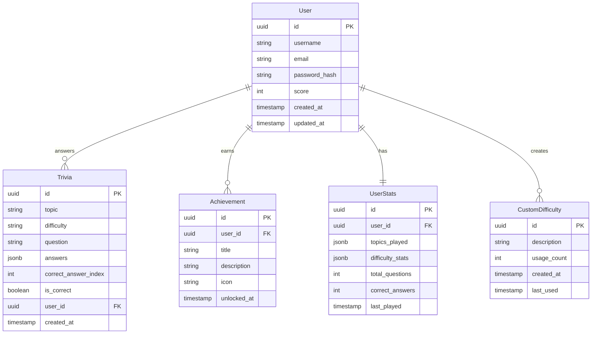
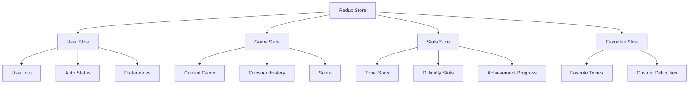
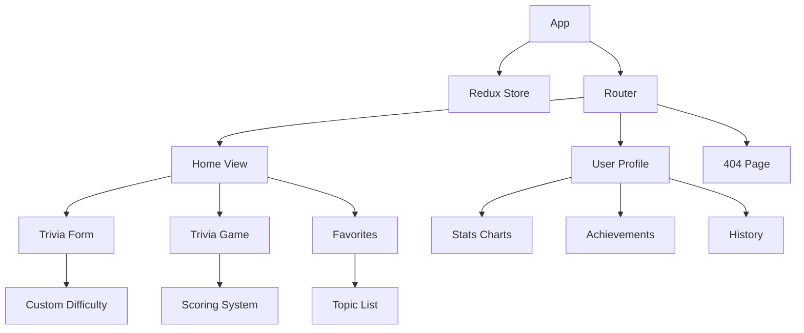
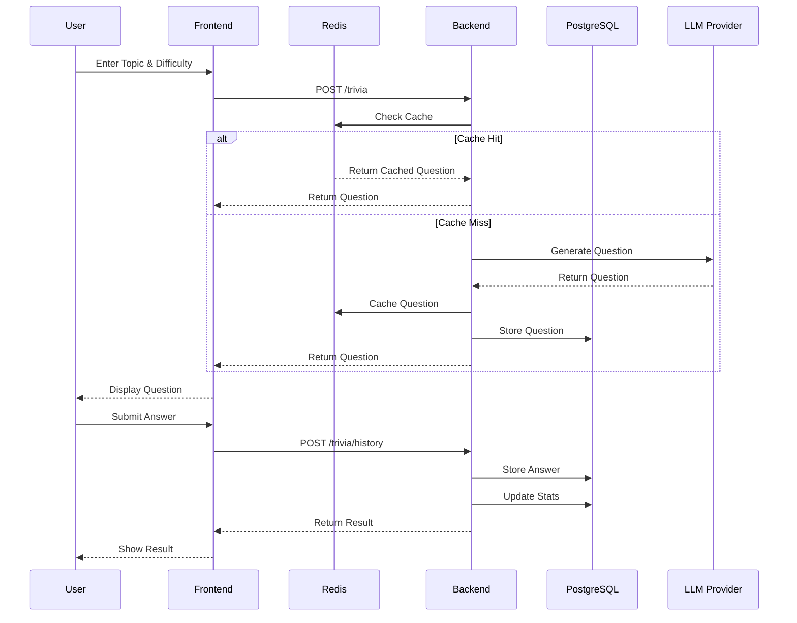

# Entity Diagrams

## Database Schema



## Cache Structure

```mermaid
graph TD
    A[Redis Cache] --> B[Question Cache]
    A --> C[Session Cache]
    A --> D[Rate Limiting]
    A --> E[User Stats Cache]

    B --> F[Key: trivia:{topic}:{difficulty}]
    B --> G[TTL: 1 hour]

    C --> H[Key: session:{userId}]
    C --> I[TTL: 24 hours]

    D --> J[Key: ratelimit:{ip}]
    D --> K[TTL: 15 minutes]

    E --> L[Key: stats:{userId}]
    E --> M[TTL: 30 minutes]
```

## State Management



## Component Dependencies



## Data Flow

