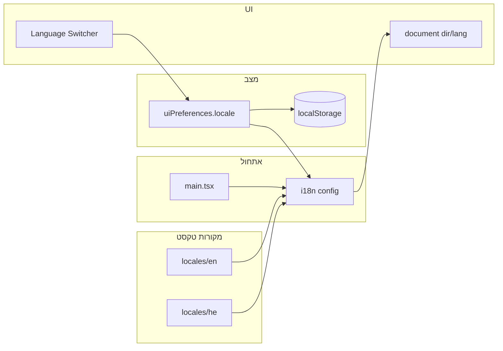

# תכנית הטמעת רב-לשוניות (אנגלית ועברית) – EveryTriv

**זו התכנית המאוחדת והיחידה.** כל שלבי ההטמעה, מניעת באגים, התאמות לעברית, שרת (פרומפטים וולידציה) ומבנה הקבצים מרוכזים כאן. אין להסתמך על קבצי תכנית נפרדים ב-`.cursor/plans/` – המקור הוא מסמך זה.

---

## החלטת שמות (Naming)

- **קובץ תצורת i18n:** `client/src/i18n.ts` – נשאר **i18n** (סטנדרט עם i18next/react-i18next).
- **תיקיית קבצי התרגום:** `client/src/locales/` – **locales** (סטנדרט בתעשייה; locale = שפה+אזור).
  - מבנה: `client/src/locales/en/` ו-`client/src/locales/he/` – קובץ JSON לכל namespace (למשל `common.json`, `nav.json`, `auth.json`).

בכל התכנית: כשמדובר בקבצי התרגום משתמשים ב-**locales** בלבד.

---

## 1. מצב נוכחי

- **ספריות:** `i18next` ו-`react-i18next` ב-`client/package.json` – לא בשימוש.
- **טקסט בממשק:** מחרוזות קשיחות ב-Views וב-**קבועים** ב-`client/src/constants/core/ui/` ו-`client/src/constants/domain/`.
- **RTL:** אין `dir` ברמת דף; רק `direction` בתוך גרפי Recharts.
- **"language" בפרויקט:** מתייחס ל-LanguageTool (אימות איות/דקדוק), לא ל-i18n של הממשק.

---

## 2. ארכיטקטורה

- **ספרייה:** i18next + react-i18next; אתחול ב-client בלבד.
- **שפות:** `en` (ברירת מחדל), `he`.
- **שמירת בחירה:** שדה `locale` ב-Redux (`uiPreferencesSlice`) עם **persist ב-localStorage**.
- **סנכרון:** בעת `setLocale` ובעת rehydrate – `i18n.changeLanguage(locale)`, `document.documentElement.dir`, `document.documentElement.lang`.

---

## 3. שלב 1: תשתית i18n ואתחול

- **קובץ:** `client/src/i18n.ts`: `i18n.use(initReactI18next)`, `resources` מטעינת `client/src/locales/en/` ו-`client/src/locales/he/`, `lng: 'en'`, `fallbackLng: 'en'`, `interpolation: { escapeValue: false }`, `react: { useSuspense: false }`.
- **Namespaces:** common, nav, footer, auth, game, home, validation, loading, payment, admin, statistics, legal, errors.
- **אתחול:** ייבוא `i18n.ts` ב-`client/src/main.tsx` **לפני** `createRoot` ו-`render`.
- **אין צורך ב-I18nextProvider** – i18n הוא singleton גלובלי; רכיבים משתמשים ב-`useTranslation()`.

---

## 4. שלב 2: Redux ו-Persist

- **uiPreferencesSlice:** הוספת `locale: 'en' | 'he'`; reducer `setLocale`.
- **Persist:** הוספת `locale` ל-whitelist של uiPreferences; העדפה ל-localStorage לשפה.
- **סנכרון:** ב-App או ב-useEffect – אחרי rehydrate להחיל `i18n.changeLanguage(locale)` והגדרת `dir`/`lang`; בכל `setLocale` לעדכן i18n ו-dir/lang.
- **טיפוסים:** `UIPreferencesState` – הוספת `locale`.

---

## 5. שלב 3: קבצי תרגום (locales)

- **מיקום:** `client/src/locales/en/` ו-`client/src/locales/he/` – קובץ JSON לכל namespace.
- **מפתחות:** למשל `nav.startGame`, `loading.loadingApp`, `validation.firstNameRequired` עם interpolation (`{{minLength}}`) where needed.
- **איסוף מחרוזות:** מעבר על constants ב-`constants/core/ui/` ו-`constants/domain/` וכל Views/Components.

---

## 6. שלב 4: RTL ו-Layout

- **dir/lang:** `document.documentElement.dir = locale === 'he' ? 'rtl' : 'ltr'`, `document.documentElement.lang`.
- **Tailwind:** המרת `ml-`/`mr-`/`pl-`/`pr-` ל-`ms-`/`me-`/`ps-`/`pe-` ברכיבים רלוונטיים.
- **אייקונים כיווניים:** `rtl:scale-x-[-1]` או החלפת אייקון; ריווח אייקון–טקסט עם `me-`/`ms-` (או `gap`).
- **גרפים:** להשאיר `direction: 'ltr'` לגרף עצמו.

---

## 7. שלב 5: מתג שפה

- **רכיב:** LanguageSwitcher ב-Navigation; לחיצה מעדכנת Redux ו-i18n (או useEffect ב-App שמאזין ל-locale ומעדכן i18n+dir).

---

## 8. שלב 6: החלפת מחרוזות

- Constants לתצוגה: מפתחות תרגום; רכיבים משתמשים ב-`t(key)`.
- LoadingMessages: enum עם ערכי key; `t(LoadingMessages.…)` או Spinner מקבל key ומציג `t(message)`.
- VALIDATION_MESSAGES: `t('validation.…', { … })` או helper שמקבל `t`.
- מעבר שיטתי על Views ו-Components.
- **טיפוסים:** Spinner/FullPageSpinner – לקבל מפתח תרגום ו-`t(message)` בפנים. `NavigationLink` – `labelKey` (או selector שמחזיר תרגום). לעדכן `constants/core/ui/index.ts` ו-barrel exports בהתאם.

### 8.1 התחייבות: אין מחרוזות קשיחות באנגלית ללקוח

- **עקרון:** כל טקסט שמוצג למשתמש (תוויות, כפתורים, הודעות, placeholders, כותרות) יגיע מ-`t(key)` או מתרגום שמקורו ב-locales. לא יישארו מחרוזות באנגלית מקודדות בקוד (string literals) שמוצגות ישירות ללקוח.
- **חריגים:** (1) תוכן דינמי שמגיע מהשרת (למשל שאלה/תשובה שנוצרו ב-LLM) – יוחזר בשפת האתר לפי סעיף 13. (2) הודעות שגיאה מהשרת – ממופות ל-`t('errors.CODE')` ב-client או מוצגות עם `dir="auto"` אם נשארות כטקסט גולמי.
- **אימות:** לפני סגירת ההטמעה – סריקה (למשל grep) למחרוזות באנגלית בתוך JSX/תצוגה ב-`client/src` (views, components, constants שמשמשים לתצוגה), ו-checklist שכל המסכים נבדקו בעברית ללא טקסט אנגלי קשיח.

---

## 9. מניעת באגים במעבר שפות

- **אתחול לפני רינדור:** החלת locale + dir לפני הצגת תוכן (לאחר rehydrate) כדי למנוע flash.
- **מתג שפה:** עדכון Redux → i18n.changeLanguage → dir/lang; אין עדכון dir לפני החלפת השפה.
- **Fallback:** `fallbackLng: 'en'`; בדיקת כיסוי – אין מפתחות חסרים או ריקים.
- **Interpolation:** וידוא ש-`{{var}}` קיים בתרגום העברי ו-order מתאים לדקדוק.
- **Persist:** locale ב-localStorage; אחרי רענון – החלה מיד.
- **טפסים:** רק labels/placeholders/validation מתעדכנים; ערכי שדות לא מאופסים.

---

## 10. התאמות ספציפיות לעברית

- **מספרים:** `toLocaleString(locale)` או `Intl.NumberFormat(locale).format(value)` בכל מקום תצוגה (StatCard, LeaderboardTable, SingleSummaryView, BusinessTabContent, SystemHealthSection, PopularTopicsSection, ConsistencyManagementSection, ManagementActions).
- **תאריכים/זמנים:** הרחבת פונקציות ב-`format.utils.ts` או wrappers עם `Intl.DateTimeFormat(locale, options)`; העברת locale מהקונטקסט; DataTable וכל מקום שמציג תאריך.
- **truncate:** וידוא `title={fullText}` על תוכן מקוצר; בדיקת רוחב עמודות/כרטיסים בעברית.
- **פונטים:** גופן שתומך בעברית; בדיקת overflow בכפתורים/badges.
- **תוכן מעורב:** החלטה על תרגום topics; הודעות שרת – מיפוי קוד ל-`t('errors.CODE')` או `dir="auto"` על הודעות.

---

## 11. בדיקות חובה

- מעבר שפה EN ↔ HE בכל המסכים: אין flash, אין טקסט חסר, אין מפתחות גולמיים.
- רענון דף: השפה נשמרת, dir/lang נכונים מיד.
- טבלאות וגרפים: מספרים ותאריכים בפורמט locale; layout לא שבור ב-RTL.
- טפסים: תוויות ו-placeholders מתחלפים; הודעות ולידציה בשפה הנבחרת.
- כפתורי ניווט (הבא/הקודם, Play Again): סדר ויזואלי נכון ב-RTL; אייקונים לא הפוכים במשמעות.
- **בדיקות אוטומטיות:** Mock ל-`useTranslation` או wrapper ב-Testing Library לרכיבים שתלויים ב-`t()`.
- **תיעוד:** הנחיה אחת איפה מוסיפים מפתח חדש (איזה namespace) ואיך בודקים כיסוי תרגום.

---

## סדר ביצוע מומלץ

1. תשתית: i18n.ts, קבצי locales (en + he) עם namespaces בסיסיים (common, nav, loading).
2. Redux: הוספת locale ל-uiPreferencesSlice + persist (localStorage), סנכרון i18n+dir ב-App/useEffect.
3. מתג שפה ב-Navigation; בדיקה שהחלפת שפה משנה תוכן ו-dir.
4. מעבר שיטתי על constants (nav, footer, loading, validation) והחלפה ב-t().
5. מעבר על Views ו-Components והחלפת מחרוזות; השלמת תרגום עברית.
6. RTL: בדיקת layout (Navigation, Footer, טפסים) ותיקון ms/me/ps/pe ואייקונים.
7. מספרים ותאריכים: locale ב-toLocaleString ו-Intl.DateTimeFormat.
8. שגיאות: מיפוי קודי שגיאה ל-errors.* ב-client.
9. שרת: locale ב-API (פרומפטים + ולידציה) לפי סעיפים 12–13.
10. בדיקות: מעבר שפות, רענון, טבלאות, טפסים, כפתורים; mock ל-useTranslation בטסטים.

---

## 12. שרת: תוכן בשפת האתר (פרומפטים)

- **מטרה:** תוכן שנוצר בשרת (שאלות טריוויה, תשובות) יוחזר **רק** בשפה שנבחרה בממשק (en או he), כדי שהמשתמש יראה שאלות ותשובות באותה שפה כמו ה-UI.
- **API:** בקשות ליצירת שאלות (למשל `POST .../trivia` או endpoint רלוונטי) יקבלו פרמטר **locale** (או **language**) מהקליינט – ערך `en` או `he` לפי השפה הנוכחית ב-Redux. יש להוסיף שדה אופציונלי `locale` ל-`TriviaRequestDto` (ואם צריך גם ל-DTOים אחרים של משחק).
- **פרומפט:** ב-`server/src/features/game/triviaGeneration/providers/prompts/prompts.ts` (ופונקציית `generateTriviaQuestion`) להעביר את השפה המבוקשת (מהפרמטר locale בבקשה) ולהוסיף הוראה מפורשת לפרומפט: "Generate the question and all answers **only in [language]**" – למשל "only in English" או "only in Hebrew". כך ה-LLM יחזיר שאלה ותשובות בשפת האתר בלבד.
- **שרשרת:** GameController → TriviaRequestPipe/GameService → TriviaGenerationService → provider (groq וכו') → `generateTriviaQuestion({ ... params, language: locale })`. יש להבטיח ש-`PromptParams` (או הממשק המקביל) כולל `language: 'en' | 'he'` ושהפרומפט בונה את הטקסט בהתאם.
- **ברירת מחדל:** אם לא נשלח locale, להניח `en` (אנגלית) כדי תאימות לאחור.

---

## 13. מודול הולידציה: תלוי שפה

- **מטרה:** ולידציית הקלט (נושא משחק, תיאור קושי מותאם אישית) תבדוק שהטקסט **בשפה המתאימה** לשפת האתר – מילים תקינות, איות ודקדוק באותה שפה. לא רק "אנגלית בלבד" כמו היום.
- **מצב נוכחי:** `LanguageToolService.checkText` משתמש ב-`language: 'en'` (או `auto` עם detectLanguage) ומוסיף "Please enter in English" כשהשפה המזוהה אינה אנגלית. הולידציה מופעלת ב-`TriviaRequestPipe` (נושא) ו-`CustomDifficultyPipe` (טקסט קושי), וב-endpoint `validate-text`.
- **שינויים נדרשים:**
  - **קבלת locale מהקליינט:** ב-`ValidateTextDto` להוסיף שדה אופציונלי `locale?: 'en' | 'he'`. ב-`TriviaRequestPipe` – locale יגיע מה-payload (להוסיף ל-payload/TriviaRequest את השדה `locale` מהבקשה). ב-`CustomDifficultyPipe` – אם יש גישה ל-context הבקשה (למשל locale ב-body או header), להעביר locale.
  - **שימוש ב-LanguageTool לפי שפה:** ב-`LanguageToolService.checkText` – כאשר מועבר `language: 'he'` או `language: 'en'` (מהלוגיקה או מ-options שמגיעים מה-controller), לשלוח ל-API של LanguageTool את הקוד המתאים (`en` או `he`). ב-`shared/constants` ב-`LANGUAGE_TOOL_CONSTANTS.LANGUAGES` להוסיף `HEBREW: 'he'`.
  - **לוגיקה:** אם locale מהבקשה הוא `he` – לקרוא ל-`checkText` עם `language: 'he'` (ללא detectLanguage שמכריח אנגלית). אם `en` או לא צוין – `language: 'en'` או detectLanguage כרגיל. הודעות השגיאה מהשרת (למשל "Topic language validation failed") יוצגו ב-client מתורגמות (namespace validation/errors).
  - **validate-text:** ב-`GameController.validateText` לקבל את ה-locale מה-body (שדה אופציונלי ב-`ValidateTextDto`) ולהעביר ל-`languageToolService.checkText(..., { language: body.locale ?? 'en', ... })`.
- **סיכום:** נושא וטקסט קושי יאומתו כשפה תואמת לשפת האתר; מילים ואיות ייבדקו באותה שפה; הודעות הולידציה למשתמש מתורגמות ב-client (כבר בתכנית).

---

## 14. קבצים מרכזיים

| אזור | קבצים |
|------|--------|
| i18n | `client/src/i18n.ts`, `client/src/main.tsx` |
| locales | `client/src/locales/en/*.json`, `client/src/locales/he/*.json` |
| Redux | `client/src/redux/slices/uiPreferencesSlice.ts`, `client/src/redux/store.ts`, `client/src/types/core/redux.types.ts` |
| Switcher | LanguageSwitcher (ב-Navigation) |
| Navigation/Footer | `navigation.constants.ts`, `footer.constants.ts`, `Navigation.tsx`, `Footer.tsx` |
| Constants | `validation-messages.constants.ts`, `loading.constants.ts`, `social.constants.ts`, domain constants |
| Views/Components | כל views/ ו-components/ עם טקסט |
| שרת – פרומפטים | `server/.../triviaGeneration/providers/prompts/prompts.ts`, `PromptParams`, TriviaRequestDto, game.controller |
| שרת – ולידציה | `LanguageToolService`, `TriviaRequestPipe`, `CustomDifficultyPipe`, `ValidateTextDto`, `game.controller` (validate-text) |

---

## הערות

- **תוכן legal (Terms, Privacy):** להחליט אם לתרגם ל-JSON/מרקדאון או דף נפרד per language.
- **BASIC_TOPICS (General Knowledge, Science, …):** לכלול ב-namespace (למשל game.topics.generalKnowledge) ולתרגם לעברית.
- **קבצי תכנית ב-`.cursor/plans/`:** אם קיימים קבצים כמו `i18n_english_hebrew_ui_*.plan.md` שם – הם נוצרו בנפרד (תכנית ראשית + תוספת) ואינם מעודכנים. **התכנית המאוחדת והיחידה היא מסמך זה** (`docs/frontend/I18N_IMPLEMENTATION_PLAN.md`). ניתן למחוק את הקבצים ב-`.cursor/plans/` כדי להשאיר מקור אחד.
